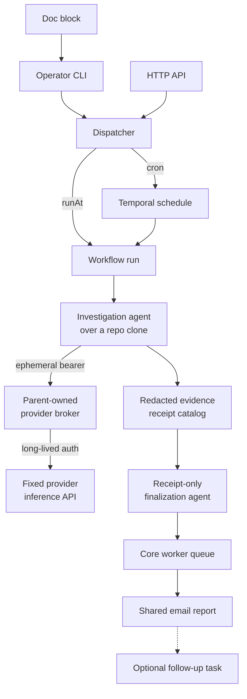

Agent tasks are scheduled Claude or Codex runs that inspect current state and
email a report. They do not run inside an OS-level command sandbox, so the
provider can write inside its throwaway clone. External mutation is constrained
separately through credentials, queues, and Kubernetes authorization.

## What actually constrains the run

The run gets `Bash`, a throwaway clone of the public repository, and an
allowlisted environment. The runtime boundary consists of:

- a hard read-only prompt prefix,
- an ephemeral non-root pod and per-run clone,
- `HOME` redirected into that clone so provider config is also disposable,
- no GitHub credential, so the clone cannot push,
- exactly one provider subscription credential and nothing else from the
  worker's own environment,
- no Postal, S3, ArgoCD, Grafana, Buildkite, Home Assistant, Bugsink, or
  Cloudflare credential,
- a dedicated Kubernetes service account with read-only audit RBAC and no
  `pods/exec` permission,
- a provider-only uid, for the deterministic evidence collectors, whose
  pod-local firewall rejects Temporal gRPC and UI traffic while leaving the
  worker poller connected,
- email delivery dispatched to the core worker queue, outside the agent pod.

What does **not** constrain it is a schema that makes mutation unrepresentable,
or a filesystem that refuses writes. Codex investigation threads run with
`danger-full-access`, because the worker pod cannot provide the namespace
Codex's own sandbox needs. (A finalization thread is the exception: it drops
network, web search, and write access, because it may only reason over evidence
that was already captured.)

The agent itself now runs inside the native provider SDK, as the worker's own
uid, because neither SDK exposes a spawn hook the worker could wrap. The
`setpriv` uid-1001 transition and the firewall rules matched to it therefore
constrain the deterministic evidence collectors rather than the agent; see
`packages/docs/todos/agent-sdk-provider-isolation.md`. The poller runs as root
with every capability dropped except the `SETUID` capability that transition
needs. Privilege escalation is disabled. Before the worker
starts, a short-lived `NET_ADMIN` init container installs owner-matched rules
that reject uid-1001 traffic to Temporal gRPC (`7233`) and the Temporal UI
(`8080`), including their resolved Tailscale ingress addresses on `443`. The
current homelab CNI is Flannel without a NetworkPolicy controller,
so this pod-local firewall is the enforcement mechanism. The separate
agent-worker `NetworkPolicy` documents the same narrower topology for a future
policy-capable CNI; it is not counted as an active control today.

Pod Security Admission has no pod-scoped capability exception. The `temporal`
namespace therefore enforces the `privileged` profile so this explicit
`NET_ADMIN`/`SETUID` design can start, while retaining `baseline` audit and warn
labels for every workload. This does not make the containers privileged: their
security contexts still drop all capabilities and add only the two named above,
with privilege escalation disabled. The synthesized namespace labels and both
container capability sets are tested together so the admission contract cannot
drift away from the runtime boundary. The enforcement value is also copied to
the agent Deployment's pod-template annotation. Changing that admission
contract therefore starts a fresh ReplicaSet after the Namespace update rather
than retaining a rollout failure created under the old policy.

So local filesystem writes are still possible. A sufficiently confused or
prompt-injected run can corrupt only its disposable workdir; it does not receive
credentials that can publish that change or mutate the operational APIs.

Report delivery crosses back into the credentialed core queue. New workflow
histories schedule their email activity there directly. Histories replayed from
before that queue migration must preserve the original agent-queue activity for
Temporal determinism; the activity contains no Postal or S3 credentials and
delegates a fixed `deliverReportWorkflow` to the core queue instead. Both paths
therefore use the shared sender without restoring delivery secrets to the agent
pod.

## Why it is built this way anyway

Novel investigations can still inspect the public repository, Prometheus, the
alert ledger, and the Kubernetes API. The mounted service-account token is the
only operational identity available to the provider, and Kubernetes enforces
its read-only verbs. The environment the agent receives is an allowlist, not a
filtered copy of the worker's: basic process and TLS settings, the read-only
Kubernetes identity, the non-secret evidence endpoints, and the one
subscription credential its own provider needs. A deviating run can spend that
provider's quota, but there is no second credential in its environment to find.

Investigations that need ArgoCD, Buildkite, Home Assistant, or another
authenticated source must become a typed deterministic collector. Stable
recurring checks, including the daily homelab audit, already use that stronger
pattern.

The trusted, source-controlled agents are the exception that proves the rule.
The homelab audit and the Scout season refresh do inherit the worker's
operational credentials, because their prompts are code rather than user input.
Even there the same three categories are removed: the bot's own GitHub
credentials, every report-delivery credential, and every inference credential
other than the one their own provider needs — a Claude agent never sees the
Codex subscription token, and vice versa.

## The blast radius, stated plainly

A deviating or prompt-injected run can spend the selected provider quota, read
the public repository and exposed evidence, query the read-only Kubernetes API,
and alter its disposable clone. It cannot push that clone, send mail directly,
write report state, or use the omitted operational APIs.

This is still not an OS sandbox. Network egress and local process execution are
available except for the blocked Temporal frontend/UI ports, and Kubernetes
data readable by the audit role can be exfiltrated. The boundary limits
authority; it does not make untrusted prompts safe.

Anything that genuinely must change the repo is a
[deterministic scheduled workflow](/reference/temporal-schedules/) instead —
code, reviewed in a PR, not an agent asked nicely.

## Why the output contract is strict

Claude and Codex outputs are treated as versioned provider contracts. The worker
sends each native SDK its supported schema dialect and accepts **only** that
SDK's structured result, validated with Zod.

A successful process without that field is a failure. Prose and fenced JSON are
not fallback formats.

Accepting a fallback would mean a model that ignored the schema still appears to
succeed, and the report quietly degrades from structured findings to
free-writing. Failing loudly is the only way an unattended run can tell you its
contract broke.

Contract validity alone does not establish truth. A v2 run captures and redacts
provider tool events for research context, then separately executes the exact
collectors declared by the authenticated or source-controlled task author.
Command collectors use argv without a shell and validate their output contract;
Prometheus collectors call and validate the typed API directly. Each collector
also has a source-defined predicate: accepted and passing exit codes, typed JSON
path assertions, or numeric Prometheus thresholds. They receive no provider or
delivery credential, and the model cannot set the predicate result.

Finalization receives that explicit catalog and a preliminary assessment. The
independent normalizer requires every deterministic collector receipt for a
check to be captured, successful, semantically evaluated, and cited. A provider
receipt cannot spoof a collector even if it repeats the same command text or
receipt ID. Unknown IDs, failed collectors, unevaluated predicates, unsupported
findings, missing checks, or skipped required checks force a partial or failed
report; they can never produce a clean verdict. When collection succeeds but a
predicate fails, execution can remain complete while the normalizer overrides a
model-authored pass and derives an attention verdict. Historical early-v2 inputs
without collectors or predicates remain replayable but are always partial.
Follow-ups inherit the parent collectors instead of accepting model-authored
replacements.

The model has no verdict or subject field. After evidence validation, the
reporter maps check state and finding severity to a domain verdict, then maps
execution state and verdict to the email subject. A model can describe what it
found, but cannot label its own run clean.

Contract failures log a bounded redacted excerpt, the result subtype and keys,
and the schema fingerprint. The Prometheus counter uses bounded reason labels
only, so cardinality cannot explode from model output.

## Usage is preserved on terminal paths

Native SDK events feed the shared LLM spans and bounded metrics. Tokens and
known cost are recorded before terminal failure classification, so a failed run
that spent tokens still shows up in observability. A run that may already have
applied effects becomes non-retryable instead of being replayed to repair only
its final schema.

With telemetry enabled, each run's prompt and response are recorded as `gen_ai.*`
spans whose bodies are archived to the LLM-observability store before the slim
span is exported. The email is the human-facing output, but it is not the only
copy.

## Related

- [Agent task input](/reference/agent-task-input/) — the full contract
- [Schedule an agent task](/how-to/schedule-an-agent-task/)
- [Why Temporal](/explanation/temporal/overview/)
