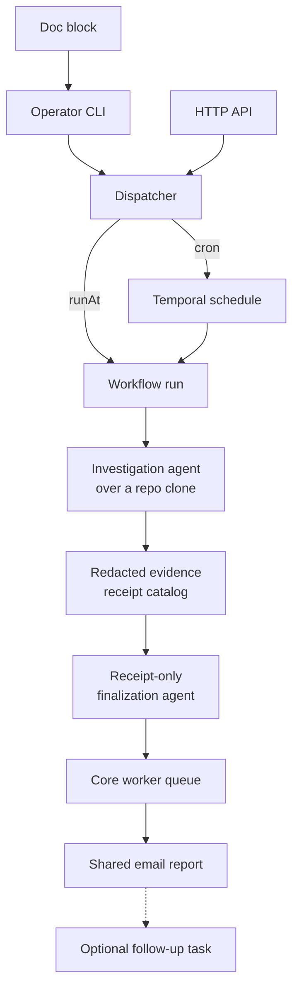

Agent tasks are scheduled Claude or Codex runs that inspect current state and
email a report. They do not run inside an OS-level command sandbox, so the
provider can write inside its throwaway clone. External mutation is constrained
separately through credentials, queues, and Kubernetes authorization.

## What actually constrains the run

The run gets `Bash`, a throwaway clone of the public repository, and an
allowlisted environment. The runtime boundary consists of:

- a hard read-only prompt prefix,
- an ephemeral non-root pod and per-run clone,
- `HOME` redirected into that clone so provider config is also disposable,
- no GitHub credential, so the clone cannot push,
- no Postal, S3, ArgoCD, Grafana, Buildkite, Home Assistant, Bugsink, or
  Cloudflare credential,
- a dedicated Kubernetes service account with read-only audit RBAC and no
  `pods/exec` permission,
- email delivery dispatched to the core worker queue, outside the agent pod.

What does **not** constrain it is a schema that makes mutation unrepresentable,
or a filesystem that refuses writes. Codex runs with
`--sandbox danger-full-access`, because the worker pod cannot provide the
namespace Codex's own sandbox needs.

So local filesystem writes are still possible. A sufficiently confused or
prompt-injected run can corrupt only its disposable workdir; it does not receive
credentials that can publish that change or mutate the operational APIs.

Report delivery crosses back into the credentialed core queue. New workflow
histories schedule their email activity there directly. Histories replayed from
before that queue migration must preserve the original agent-queue activity for
Temporal determinism; the activity contains no Postal or S3 credentials and
delegates a fixed `deliverReportWorkflow` to the core queue instead. Both paths
therefore use the shared sender without restoring delivery secrets to the agent
pod.

## Why it is built this way anyway

Novel investigations can still inspect the public repository, Prometheus, the
alert ledger, and the Kubernetes API. The mounted service-account token is the
only operational identity available to the provider, and Kubernetes enforces
its read-only verbs. Provider auth is selected per run: Claude receives only its
subscription OAuth token, while Codex receives only its API credential.

Investigations that need ArgoCD, Buildkite, Home Assistant, or another
authenticated source must become a typed deterministic collector. Stable
recurring checks, including the daily homelab audit, already use that stronger
pattern.

## The blast radius, stated plainly

A deviating or prompt-injected run can spend the selected provider quota, read
the public repository and exposed evidence, query the read-only Kubernetes API,
and alter its disposable clone. It cannot push that clone, send mail directly,
write report state, or use the omitted operational APIs.

This is still not an OS sandbox. Network egress and local process execution are
available, and Kubernetes data readable by the audit role can be exfiltrated.
The boundary limits authority; it does not make untrusted prompts safe.

Anything that genuinely must change the repo is a
[deterministic scheduled workflow](/reference/temporal-schedules/) instead —
code, reviewed in a PR, not an agent asked nicely.

## Why the output contract is strict

Claude and Codex outputs are treated as versioned provider contracts. The worker
sends each provider its supported schema dialect and validates the structured
result with Zod.

A successful process without that field is a failure. Prose and fenced JSON are
not fallback formats.

Accepting a fallback would mean a model that ignored the schema still appears to
succeed, and the report quietly degrades from structured findings to
free-writing. Failing loudly is the only way an unattended run can tell you its
contract broke.

Contract validity alone does not establish truth. A v2 run first captures and
redacts provider tool events as evidence receipts. Finalization receives only
that catalog and a preliminary assessment. Unknown receipt IDs, failed evidence,
unsupported findings, missing checks, or skipped required checks force a partial
or failed report; they can never produce a clean verdict.

The model has no verdict or subject field. After evidence validation, the
reporter maps check state and finding severity to a domain verdict, then maps
execution state and verdict to the email subject. A model can describe what it
found, but cannot label its own run clean.

Contract failures log a bounded redacted excerpt, the result subtype and keys,
and the schema fingerprint. The Prometheus counter uses bounded reason labels
only, so cardinality cannot explode from model output.

## Cost is traced even on failure

The LLM span, with token cost, is emitted before the exit-code check. A failed
run that spent tokens still shows up in observability.

With telemetry enabled, each run's prompt and response are recorded as `gen_ai.*`
spans whose bodies are archived to the LLM-observability store before the slim
span is exported. The email is the human-facing output, but it is not the only
copy.

## Related

- [Agent task input](/reference/agent-task-input/) — the full contract
- [Schedule an agent task](/how-to/schedule-an-agent-task/)
- [Why Temporal](/explanation/temporal/overview/)
