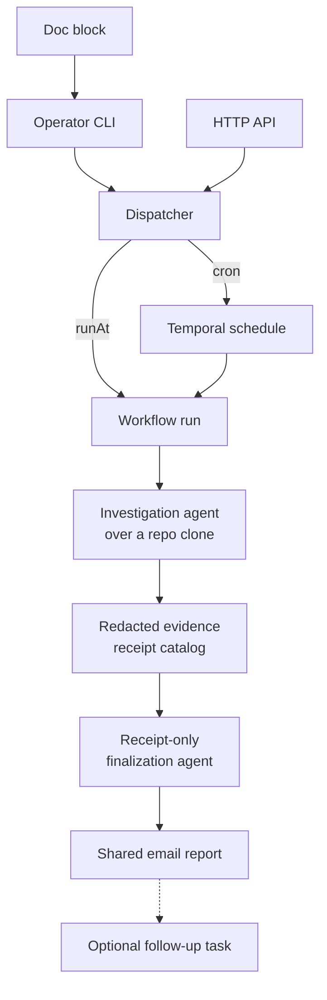

Agent tasks are scheduled Claude or Codex runs that inspect current state and
email a report. They are **report-only by policy, not by sandbox**.

That distinction is the whole content of this page, and it is worth being blunt
about because the comfortable version would be misleading.

## What actually constrains the run

The run gets `Bash` and a write-capable GitHub token. What keeps it from
mutating the repo is:

- a hard read-only prompt prefix,
- an ephemeral non-root pod,
- a throwaway per-run clone.

What does **not** constrain it is a schema that makes mutation unrepresentable,
or a filesystem that refuses writes. Codex runs with
`--sandbox danger-full-access`, because the worker pod cannot provide the
namespace Codex's own sandbox needs.

So the barrier is policy. A sufficiently confused or prompt-injected run could
write.

## Why it is built this way anyway

Novel operational investigations need credentials to inspect their declared
evidence sources. Grafana, Alerts, ArgoCD, Bugsink, Cloudflare, and the mounted
service-account token can therefore be readable when they are present in the
worker environment. Stable recurring checks, including the daily homelab audit,
use deterministic collectors instead of this generic boundary.

An agent scoped tightly enough to be provably harmless would also be scoped too
tightly to audit anything.

The GitHub App key is stripped and replaced with a fresh installation token. For
Claude, the Anthropic API key is dropped so the run bills the subscription.
Postal sender/recipient credentials and authenticated ingress tokens are always
stripped; only the shared report sender can deliver operational email. Other
operational credentials are inherited so declared evidence can be collected.

## The blast radius, stated plainly

A deviating or prompt-injected run's blast radius is those credentials.

The containment is that the pod is ephemeral and non-root and the clone is
throwaway. Those controls reduce local persistence, but an agent that violates
policy could still use inherited credentials against an external API. It is a
meaningful reduction in blast radius, and it is not a sandbox.

Anything that genuinely must change the repo is a
[deterministic scheduled workflow](/reference/temporal-schedules/) instead —
code, reviewed in a PR, not an agent asked nicely.

## Why the output contract is strict

Claude and Codex outputs are treated as versioned provider contracts. The worker
sends each provider its supported schema dialect and validates the structured
result with Zod.

A successful process without that field is a failure. Prose and fenced JSON are
not fallback formats.

Accepting a fallback would mean a model that ignored the schema still appears to
succeed, and the report quietly degrades from structured findings to
free-writing. Failing loudly is the only way an unattended run can tell you its
contract broke.

Contract validity alone does not establish truth. A v2 run first captures and
redacts provider tool events as evidence receipts. Finalization receives only
that catalog and a preliminary assessment. Unknown receipt IDs, failed evidence,
unsupported findings, missing checks, or skipped required checks force a partial
or failed report; they can never produce a clean verdict.

The model has no verdict or subject field. After evidence validation, the
reporter maps check state and finding severity to a domain verdict, then maps
execution state and verdict to the email subject. A model can describe what it
found, but cannot label its own run clean.

Contract failures log a bounded redacted excerpt, the result subtype and keys,
and the schema fingerprint. The Prometheus counter uses bounded reason labels
only, so cardinality cannot explode from model output.

## Cost is traced even on failure

The LLM span, with token cost, is emitted before the exit-code check. A failed
run that spent tokens still shows up in observability.

With telemetry enabled, each run's prompt and response are recorded as `gen_ai.*`
spans whose bodies are archived to the LLM-observability store before the slim
span is exported. The email is the human-facing output, but it is not the only
copy.

## Related

- [Agent task input](/reference/agent-task-input/) — the full contract
- [Schedule an agent task](/how-to/schedule-an-agent-task/)
- [Why Temporal](/explanation/temporal/overview/)
