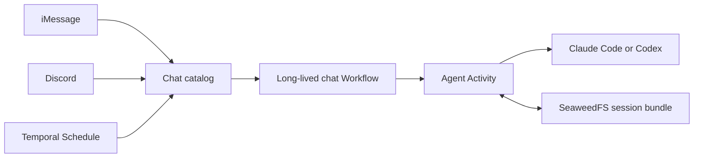

A durable agent chat is one Temporal identity that any transport can continue.

The chat owns turn ordering and provider identity. SeaweedFS owns the provider's
opaque resume files. An ingress owns only its current binding to a chat.

## Conversation identity is not transport identity

An iMessage conversation or Discord channel can select any cataloged chat.
Changing that selection updates one binding; it does not copy or rewrite chat
history. Scheduled chats use the same catalog and can later be selected from an
interactive ingress.

This separation avoids three parallel conversation systems. Transport adapters
normalize message IDs and prompts, then use the shared
[`agent-chat-client.ts`](https://github.com/shepherdjerred/monorepo/blob/main/packages/temporal/src/lib/agent-chat-client.ts)
path.

The dedicated Discord adapter exposes `/agent new`, `/agent continue`, and
`/agent list`. iMessage automation uses the bearer-authenticated gateway routes.
Both can explicitly select any cataloged chat; a successful turn makes that
chat active for the requesting Discord channel, thread, or iMessage
conversation. [The ingress reference](/reference/durable-agent-chat-ingress/)
defines those contracts.

## Temporal owns ordering

Each chat has a stable Workflow ID. Workflow updates serialize turns and return
the completed response to the caller. A bounded recent-turn ledger deduplicates
ordinary transport retries.

The selected provider and model are immutable chat configuration. Continuing a
chat never silently changes Claude to Codex or chooses a newer model. A
different provider is a different chat.

The catalog is also a Workflow. It records chat metadata, turn counts, and the
active binding for each ingress conversation. These are small coordination
records, so they belong in Temporal rather than the provider bundle. The
catalog retains at most 500 chats, 500 bindings, and 1 MB of serialized
state. It retires the least recently updated bindings first and then chats, so
the singleton Workflow cannot grow past Temporal's payload boundary.

## Provider state is durable, workspaces are disposable

Claude Code and Codex retain opaque local files for session resume. The agent
Activity stores only the provider's session slice in the non-expiring,
daily-backed-up `agent-chat-sessions` SeaweedFS bucket. Credentials,
configuration files, and workspace files are excluded.

Every turn starts with an empty workspace at the same deterministic path. The
stable path preserves providers whose resume identity includes the working
directory. Empty contents prevent accidental filesystem state from becoming a
second conversation memory.

Bundle objects are immutable per turn. A manifest records byte counts and
SHA-256 digests. After every file and the manifest are stored, the Activity
returns the exact manifest object key and the Workflow checkpoints it with the
provider session ID. Hydration uses only that checkpoint and rejects provider,
chat, turn, session, workspace, path, key, or digest mismatches.

## Schedules are normal chat turns

Temporal Schedules start a short dispatcher Workflow. Its Activity submits an
update to the long-lived chat through the same client path as an ingress. This
keeps schedule overlap policy separate from chat serialization and avoids a
second agent execution contract.

Recurring chat schedules are declared in source and reconciled with the rest of
the Temporal schedule catalog. This gives removal and drift the same lifecycle
as every other recurring homelab job. The first occurrence catalogs the chat;
it remains available for interactive continuation between later occurrences.

## Failure posture

Agent turns use one Activity attempt because a provider may already have
performed tool effects before a connection or result failure. Automatic replay
would risk repeating those effects.

The chat records a failed turn ID and returns the failure. A retry with the same
ID observes that settled failure. A caller can submit a new turn after deciding
whether repetition is safe.

This is a pragmatic homelab boundary. Provider subprocesses receive one provider
credential and an allowlisted environment. They do not receive SeaweedFS or
delivery credentials. The [agent task boundary](/explanation/temporal/agent-task-boundary/)
describes the surrounding worker isolation and its limits.

## Related

- [Temporal workflow inventory](/reference/temporal-workflows/)
- [Durable agent chat ingress](/reference/durable-agent-chat-ingress/)
- [Temporal schedule mechanics](/reference/temporal-schedules/)
- [Why Temporal](/explanation/temporal/overview/)
