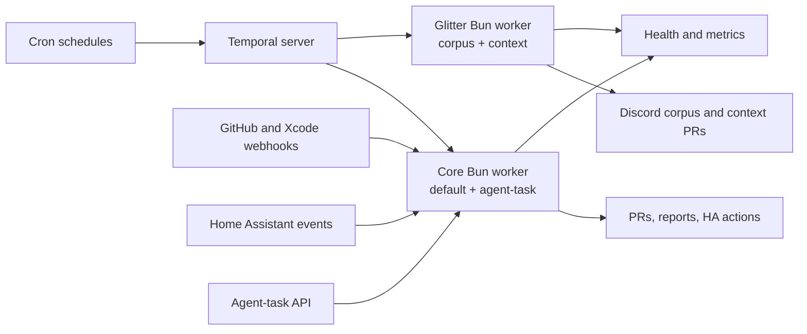

`packages/temporal` is the monorepo's automation hub. Every recurring job, PR
bot, scheduled agent, Glitter refresh, and home-automation routine runs here as
a durable workflow.

## Durability is the point

A cron job that dies halfway through leaves no trace and no way to resume.
Temporal workflows survive worker restarts and server outages, retries and
timeouts are declarative, and schedule catchup windows replay missed runs after
downtime.

That matters more than it sounds for this workload. A morning heating routine
that half-ran is worse than one that did not run, and a repo-upkeep job that
died after pushing a branch but before opening a PR leaves debris someone has to
find.

## Schedules in code, not in a UI

All schedules live in a single array and reconcile at every worker boot.

The alternative — creating schedules in the Temporal UI — means the automation
inventory exists only as accumulated clicks that nobody reviews and no diff
records. Putting it in code makes a PR the change process and makes the full
fleet reviewable in one file.

Pause state is the deliberate exception: it is runtime state, preserved across
reconciliation, because pausing is an operational act rather than a design
change.

## Two processes, four queues

The core deployment owns `default` and `agent-task`. A separate Glitter
deployment owns `glitter-corpus` and `glitter-context`. Both run the same image
and workflow bundle, selected by a strict process role.

The split is about failure isolation, not capacity. Queues isolate concurrency;
**processes** isolate runtime and resource failures. Glitter's work is long,
memory-hungry, and rate-limited against Discord — exactly the profile that would
otherwise starve or destabilise ordinary jobs sharing a process.

Each process serves `/healthz` from Bun's event loop only after its workers
finish startup, and independent startup, readiness, and liveness probes restart a
wedged role without taking down the other one. Metrics are scraped per role.

## Batteries in the image

The worker image bakes `gh`, `claude`, `codex`, `kubectl`, `talosctl`, `tofu`,
and `argocd`, so workflows can operate the homelab and run coding agents as
subprocesses.

This is a real trade: a fatter image and a broader blast radius in exchange for
workflows that can do useful operational work instead of only calling APIs. The
[agent task boundary](/explanation/temporal/agent-task-boundary/) is where that
trade gets examined honestly.

## Self-contained by design

No other package imports it. All integration is at runtime — it consumes
workspace libraries, clones the monorepo to open PRs, and receives webhooks.

The rest of the repo talks to it only through its surfaces, which is what lets
it be deployed and restarted independently of everything it automates.

## Related

- [Workflow families](/explanation/temporal/workflow-families/) — what actually runs
- [Event-driven surfaces](/explanation/temporal/event-surfaces/)
- [Temporal workflow inventory](/reference/temporal-workflows/)
