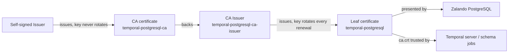

Temporal's PostgreSQL connection has always been encrypted. Until the
certificate described here existed, it could not be _verified_: the Zalando
[postgres-operator](https://github.com/zalando/postgres-operator) issues a
self-signed certificate per cluster whose Subject Alternative Names (SANs) do
not cover the Kubernetes Service or Pod DNS names, so a client had no
certificate it could check the server's hostname against. Every consumer
therefore ran with host verification disabled — TLS bought confidentiality on
the wire, not protection against a spoofed database endpoint.

[`resources/postgres/temporal-db-tls.ts`](https://github.com/shepherdjerred/monorepo/blob/main/packages/homelab/src/cdk8s/src/resources/postgres/temporal-db-tls.ts)
replaces the operator's self-signed certificate with a cert-manager-issued one
whose SANs cover every hostname a client might dial (the cluster service, its
namespaced and FQDN forms, and the single pod's equivalents), so verification
becomes possible. Whether a given client turns verification on is a separate,
per-client decision — see [Rollout status](#rollout-status).

## Why two certificates, not one

The first version of this certificate issued a single self-signed leaf and
had clients trust that same leaf as its own CA. That breaks the moment the
leaf rotates: cert-manager's `rotationPolicy: Always` generates a new private
key — and therefore a new self-signed certificate — on every renewal, but
PostgreSQL and its clients have no coordinated reload or restart wiring. For
some window after a rotation, one side would still be presenting or trusting
the old certificate while the other had already moved to the new one, and the
connection would fail outright rather than degrade.

The fix is the standard two-tier cert-manager pattern: a stable CA that
clients trust, and a leaf that PostgreSQL presents and that can rotate freely
because rotating it never changes what clients trust.

- **`temporal-postgresql-ca`** — a `Certificate` with `isCA: true`, issued by
  the bootstrap self-signed `Issuer`. Its private key does not rotate
  (`rotationPolicy` is left at cert-manager's default, `Never`), and its
  duration is ten years. This is the actual trust anchor.
- **`temporal-postgresql-ca-issuer`** — an `Issuer` of kind `ca`, pointed at
  the CA certificate's secret. cert-manager signs every certificate it issues
  with that CA's key.
- **`temporal-postgresql`** — the leaf `Certificate`, issued by the CA issuer
  above rather than the self-signed issuer directly. Its key rotates on every
  renewal (`rotationPolicy: Always`), which is safe now because rotating it
  never invalidates what a client trusts.

## What ends up in each Secret

cert-manager writes `tls.crt` (leaf certificate) and `tls.key` (leaf private
key) into `temporal-postgresql-tls` as usual, but because the leaf is issued
by a `ca`-typed Issuer, cert-manager also copies the **CA's** certificate into
that same secret as `ca.crt`. That third key is what stays constant across
leaf rotations — it does not change until the CA certificate itself is
reissued, which given its ten-year duration should be a rare, deliberate
event.

This is why every client-trust configuration in this codebase points at
`ca.crt` (`TEMPORAL_POSTGRES_TLS_CA_FILE`), never at `tls.crt`
(`TEMPORAL_POSTGRES_TLS_CERTIFICATE_FILE`, which is only correct for
PostgreSQL's own `certificateFile`/`privateKeyFile` — the leaf it presents to
connecting clients). Trusting `tls.crt` anywhere is the exact bug this design
avoids: it would work until the first leaf rotation, then fail with no code
change to explain why.

## Verification

- The leaf's `dnsNames` list every hostname a client might use to reach the
  cluster: the bare service name, its namespaced and fully-qualified forms,
  and the equivalent pod-DNS forms for the single StatefulSet replica
  (`temporal-postgresql-0.temporal-postgresql...`). A client that dials any of
  these and validates the presented leaf against the trusted `ca.crt` gets a
  real hostname check, not a bypass.
- The Zalando `Postgresql` resource
  ([`resources/postgres/temporal-db.ts`](https://github.com/shepherdjerred/monorepo/blob/main/packages/homelab/src/cdk8s/src/resources/postgres/temporal-db.ts))
  configures `spec.tls` to present the leaf and to trust `ca.crt` from the
  same secret for its own inbound verification needs (`caSecretName` /
  `caFile`).

## Recovery

The CA certificate is the single point of failure for this whole chain: if
`temporal-postgresql-ca`'s secret is deleted or its key needs to be rotated
for cause, every downstream consumer of `ca.crt` has to pick up the new CA
certificate before verification will succeed again against a freshly issued
leaf. Because the leaf is reissued from whatever the CA issuer currently
points at, cert-manager will happily mint a leaf trusted by nobody if the CA
secret is regenerated without also rolling the clients that cached the old
`ca.crt`. There is no automatic reload wiring on either side (PostgreSQL or
Temporal) — a manual restart of both is part of recovering from a CA
regeneration, the same operational gap that motivated the stable-CA design in
the first place.

## Rollout status

This certificate chain is a prerequisite, not a switch: cutting PostgreSQL
over to a verifiable certificate and actually turning on host verification in
a client are deliberately separate changes, staged so a verification bug in
the client can be rolled back without touching the database's certificate at
all.

- **PostgreSQL side (this change):** issues the certificate chain and
  configures the Zalando cluster to present it. Deploying this alone changes
  nothing for existing clients — they keep connecting exactly as before.
- **Temporal server side:** a follow-up change mounts
  `temporal-postgresql-tls` into the Temporal server deployment and switches
  it from `POSTGRES_TLS_DISABLE_HOST_VERIFICATION` /
  `SQL_TLS_DISABLE_HOST_VERIFICATION` to real verification against `ca.crt`,
  as part of the broader Temporal server version upgrade. That change must not
  ship until cert-manager reports the certificate `Ready`, the PostgreSQL
  cluster has rolled onto it successfully, and the live certificate's SANs
  have been verified against a real connection.

## Related

- [Connect to a homelab database](/how-to/connect-to-a-homelab-database/)
- [Why Temporal](/explanation/temporal/overview/)
