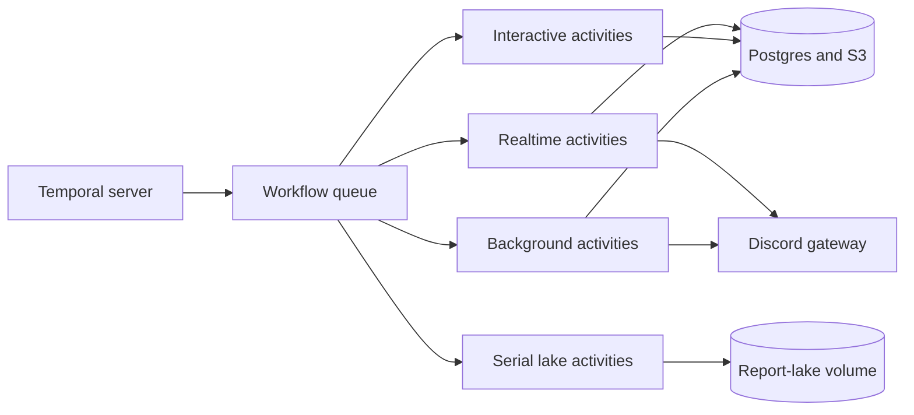

Scout embeds its Temporal Workers because durable orchestration needs the same
Discord gateway, database, credentials, and report-lake volume as the backend.

This topology avoids a second Discord client and a private control API. It also
means old and new Worker versions cannot coexist during Scout's `Recreate`
deployment, so Workflow changes use replay-safe patches instead of Worker
Versioning.

## Temporal owns execution, not Scout data

Temporal is authoritative for whether durable work is pending, running,
cancelled, or complete. Postgres remains authoritative for reports, players,
quotas, and the product-facing status projection.

Workflow histories contain identifiers, revisions, phases, statuses, and
counters. Prompts, report results, Discord payloads, images, and partial model
output stay in Postgres or S3.

This split keeps replay deterministic and limits sensitive data in Temporal
history. It also lets effect claims remain transactional beside the product
records they protect.

## One orchestration queue, four effect queues

Every stage has one Workflow task queue. The Workflow bundle is registered
once, which prevents queue-specific Workers from drifting into different
orchestration capabilities.

Activities use separate realtime, interactive, background, and lake queues.
The separation preserves responsive polling under slow model work. It also
serializes every mutation of the report-lake volume.

The Workers share one Temporal connection inside the
[`scout-for-lol`](https://github.com/shepherdjerred/monorepo/tree/main/packages/scout-for-lol)
backend. A Temporal outage degrades this component without taking down HTTP or
Discord. Scout does not silently return durable work to its legacy scheduler,
because two owners would make duplicate effects possible.

## Replay compatibility follows the deployment topology

Temporal normally prefers Worker Versioning. Scout cannot use it while one
`Recreate` replica embeds every Worker, because compatible Worker versions
cannot overlap during a deployment.

Potentially open Workflows therefore protect command or control-flow changes
with replay patches. Sanitized histories exercise those patches before
promotion. Continue-As-New bounds long histories, but it is not a compatibility
escape hatch for the history that already exists.

Independently deploying the Workers would make Worker Versioning practical. It
would also require a durable boundary for Discord access and careful ownership
of the report-lake volume, so the extra topology is not free.

## Schedules are durable ownership records

Fixed Scout work is declared with the rest of the
[Temporal schedule fleet](/reference/temporal-schedules/). Each user report
will own one strictly marked Schedule, while Postgres owns the report
definition and revision.

Schedules begin paused when a legacy owner still exists. A feature-family
cutover transfers ownership explicitly; a Temporal outage never activates the
legacy owner automatically.

## Related

- [Why Temporal](/explanation/temporal/overview/)
- [Temporal schedule mechanics](/reference/temporal-schedules/)
- [Scout's report lake](/explanation/scout-report-lake/)
