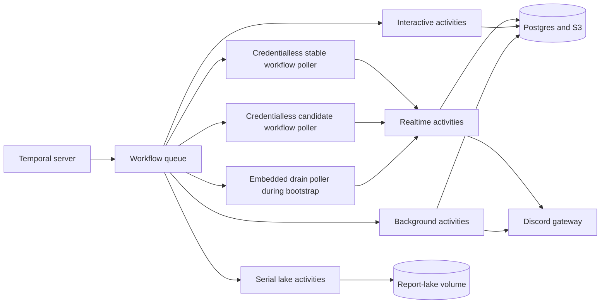

Scout's deterministic Workflow code needs only a Temporal connection. Its
Activities need the Discord gateway, database, credentials, and report-lake
volume, so those effectful Workers stay in the backend.

Workflow-only pods can therefore be credentialless and independently
versioned without introducing a second Discord client or a private control API.
The split is staged: beta first registers a capable stable version, then a
distinct candidate. The embedded poller drains old unversioned histories; it
cannot serve as a Worker Deployment rollback version. It is removed only after
replay, a version-targeted canary, ramp, soak, stable-pin promotion, and healthy
versioned pollers. Production follows after beta acceptance.



## Temporal owns execution, not Scout data

Temporal is authoritative for whether durable work is pending, running,
cancelled, or complete. Postgres remains authoritative for reports, players,
quotas, and the product-facing status projection.

Workflow histories contain identifiers, revisions, phases, statuses, and
counters. Prompts, report results, Discord payloads, images, and partial model
output stay in Postgres or S3.

This split keeps replay deterministic and limits sensitive data in Temporal
history. It also lets effect claims remain transactional beside the product
records they protect.

## One orchestration queue, four effect queues

Every stage has one Workflow task queue. The Workflow bundle is registered
once, which prevents queue-specific Workers from drifting into different
orchestration capabilities.

Activities use separate realtime, interactive, background, and lake queues.
The separation preserves responsive polling under slow model work. It also
serializes every mutation of the report-lake volume.

The Activity Workers share one Temporal connection inside the
[`scout-for-lol`](https://github.com/shepherdjerred/monorepo/tree/main/packages/scout-for-lol)
backend. Workflow-only pods have a separate connection and no product
credentials or data volumes. A Temporal outage degrades this component without
taking down HTTP or Discord. Scout does not silently return durable work to its
legacy scheduler, because two schedulers would make duplicate effects possible.

## Replay compatibility follows the deployment topology

The workflow-only role registers an exact image Git SHA under
`scout-beta-workflows` or `scout-prod-workflows` and uses `AUTO_UPGRADE`.
Candidate and stable images can coexist without duplicating Discord or
report-lake ownership because neither version runs Activities.

Potentially open Workflows still protect command or control-flow changes with
replay patches. Retained histories exercise those patches before promotion.
Continue-As-New bounds long histories, but it is not a compatibility escape
hatch for the history that already exists. During the one-time bootstrap, the
unversioned embedded poller remains available until the first stable versioned
poller is healthy.

## Schedules are durable ownership records

Fixed Scout work is declared with the rest of the
[Temporal schedule fleet](/reference/temporal-schedules/). Each enabled report
owns one strictly marked Schedule, while Postgres owns the report definition
and monotonic revision.

A transactional outbox connects those two authorities. Report writes commit
an upsert revision or a deletion tombstone beside the product change. A
singleton reconciler receives an immediate Signal and also runs every minute,
so a failed Signal cannot strand the outbox. It preserves an operator pause,
repairs missing or drifted owned Schedules, deletes only exact ownership
matches, and alerts on unknown prefix or memo mismatches.

Scheduled report actions use `BUFFER_ONE`. The first overdue action claims the
report's persisted local due date and advances it; older buffered actions then
become no-ops. This preserves one run after downtime without replaying every
missed cron occurrence.

Schedules begin paused when a legacy owner still exists. A feature-family
cutover transfers ownership explicitly; a Temporal outage never activates the
legacy owner automatically.

## Workflows match product lifecycles

Post-match discovery starts one independently identified child Workflow per
match and waits until each child is durably started. Initial-history imports
use one quiet entity Workflow per PUUID: it processes one persisted page per
Activity, Continues-As-New before history grows, and accepts a Signal when the
product job is reopened after its cooldown.

Explore and report-AI use one Workflow per turn or edit. A stop request is a
Signal that cancels the Activity scope. Non-cancellable cleanup persists the
terminal projection and releases quota. Before the provider call, the Activity
atomically marks the attempt as ambiguous-or-started. A retry salvages partial
output and interrupts the run instead of issuing a second billable request.

The SSE broker remains a low-latency process transport. Reconnecting clients
load persisted snapshots and terminal outcomes; Workflow history never becomes
the public event store.

## Replay and outage evidence are release gates

Node-hosted Workflow tests cover Signals, cancellation cleanup, child close
policies, Continue-As-New, overlap, staleness, and retries. A real Temporal dev
server test also proves deterministic duplicate starts, portable replay,
Worker restart, Worker-outage catch-up, server restart, per-report Schedule
repair, pause preservation, and deletion tombstones.

Before promotion, operators replay retained beta histories directly against
the candidate bundles:

```bash
cd packages/scout-for-lol/packages/temporal
TEMPORAL_ADDRESS=<beta-address> TEMPORAL_TLS=true \
  bun run replay:histories <scout-beta-workflow-id>...

cd packages/temporal
TEMPORAL_ADDRESS=<beta-address> TEMPORAL_TLS=true \
  bun run replay:scout-histories <weekly-or-bryan-workflow-id>...
```

The commands keep histories in memory and use the pinned Node runtime because
Temporal supports Worker replay internals on Node. Production remains on the
repository's Bun Worker runtime.

## Related

- [Why Temporal](/explanation/temporal/overview/)
- [Temporal schedule mechanics](/reference/temporal-schedules/)
- [Scout's report lake](/explanation/scout-report-lake/)
