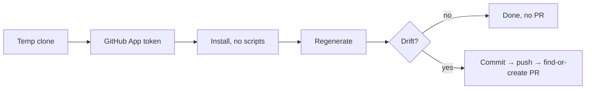

The fleet divides into six families. Most share one pattern; the interesting
parts are where they deviate and why.

For the full list with triggers and outputs, see the
[workflow inventory](/reference/temporal-workflows/).

## The clone-regenerate-PR pattern

Most repo-facing jobs run the same skeleton.

The reliability lives in the details:

- **Short-lived GitHub App tokens** — a 9-minute JWT exchanged for an
  installation token, so commits are attributed to the bot and no PAT exists to
  leak.
- **`--frozen-lockfile --ignore-scripts`** — a bot clone is not a dev checkout
  and must never arm the dev pre-commit suite, which cannot pass inside the
  worker pod. A `disarmGitHooks` call before commit defends the same invariant
  against hooks armed by any other subprocess.
- **Drift is `git status --porcelain` on exact generated paths**, after a
  prettier pass, so formatting noise nets to no diff. Steady state opens nothing.
- **Idempotent PR creation** — force-with-lease to a job-specific branch, then
  update the existing open PR rather than duplicating it.

A rehearsal canary drives these exact helpers inside `bun run verify`, so a
change that would break the nightly bots fails the PR that introduces it.

## Repo upkeep

Four jobs keep committed artifacts in sync with sources CI cannot see: live
cluster state, upstream pins, external catalogs.

`homelab-crd-imports` is the clearest case for why these are schedules rather
than CI gates. Its drift source is ArgoCD syncing operator chart bumps — no repo
PR touches the generator inputs, so CI never sees the change coming.

Two jobs are outliers: `fetcher` only overwrites an S3 manifest, and
`deps-summary` only emails. Neither opens a PR, ever.

## Scout

Five jobs track data Riot ships on its own clock, with three deliberate
deviations from the shared pattern.

**Two auto-merge.** A Data Dragon version bump is mechanical and
snapshot-verified; blocking on review would just delay every patch day.
Image-only diffs are suppressed entirely, because Riot's CDN returns
nondeterministic bytes for unchanged images and would otherwise open a churn PR
every week.

**One is agentic.** Season and act dates exist in no machine-readable feed, so
`scout-season-refresh` runs a Claude subprocess with web search. The guardrails
matter more than the agent: it may touch only allowlisted files, must never run
git, and its `NO_DRIFT`/`DRIFTED` sentinel is advisory — the activity computes
real drift from `git status`. The activity also extracts every current,
upcoming, or changed calendar date and requires the fetched Riot and League wiki
content to state each date; reachable homepages do not count as evidence. The PR
is always human-reviewed.

**One auto-merges conditionally.** `queue-windows` auto-merges `open`/`reopen`
edits, which are additive, but disarms auto-merge for any `close` edit, because
closing retires a live mode. Reversibility decides the review requirement.

`scout-image-gc` carries a scar: it refuses to prune at all if the showcase
exemption manifest fails to fetch, after a run without it deleted 60% of the
showcase's source images.

## Glitter

The most guardrailed workflows in the fleet, on dedicated queues so Discord rate
limits and long LLM runs cannot starve other work. Both schedules were **created
paused** and required explicit approval before their first real run.

Corpus capture is content-addressed and immutable — every page written once
under its sha256, so retries re-read rather than corrupt.

The context refresh is the fleet's most budget-conscious job: a hard
`maxEstimatedCostUsd` cap enforced at preflight, per call, and after each call.
A completion returning without usage data fails non-retryably rather than risk
re-charging. Generation artifacts are cached by content, so a retry reuses paid
work.

## Homelab maintenance

Live maintenance that acts directly on running systems with no PR in the loop.

The one that touches backups is **detection-only by explicit decision**.
`velero-orphan-audit` flags PVC snapshots with no matching live backup and emits
gauges, a JSON summary, and a pointer to the remediation runbook. Auto-pruning
was considered and declined in 2026-06-06: destructive automation aimed at
backups is the one place detection confidence is not enough.

`golink-sync` reconciles only links owned by the worker's own tag identity.
Hand-curated links belong to human owners and are never touched.

`temporal-failure-watch` runs every five minutes and backstops the
hand-maintained Prometheus rules, so **every** workflow type pages on failure —
not only those with a bespoke threshold. It is stateless, and a 15-minute
lookback over a 5-minute cadence means a missed tick cannot open a gap.

## Home automation and PR workflows

Both are covered in more depth elsewhere:
[the reactive side](/explanation/temporal/event-surfaces/) for how events arrive,
and [home automation routines](/reference/home-automation-routines/) for what
each routine does.

## Related

- [Temporal workflow inventory](/reference/temporal-workflows/)
- [Why Temporal](/explanation/temporal/overview/)
