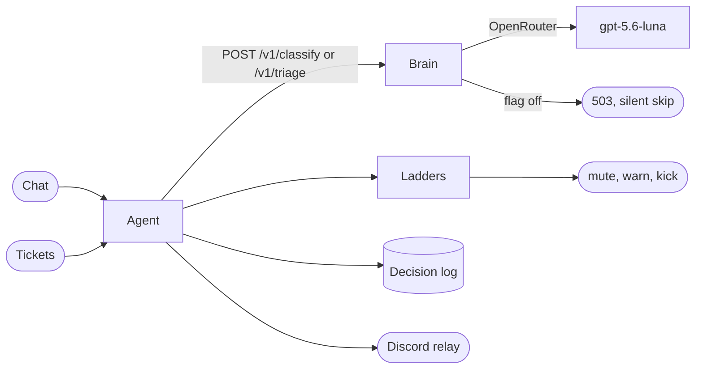

The AI staff is a Paper plugin that enforces chat rules and works tickets, with
a stateless Hono service behind it for the judgments that need a model. The
game owns context and action; the brain owns nothing but the next verdict.

## Judgments cross the wire; state does not

The plugin assembles each case from its own SQLite store: the reporter's
history, prior triage, recent chat. It POSTs the case to the brain and gets
back a verdict with the model and cost attached. The brain keeps no session,
no queue, and no memory of the player.

This split exists because the game server hibernates at zero replicas when
empty. Anything the brain stored would be unreachable half the time, and
anything that called into the game would fail whenever nobody is online.
Server-initiated HTTPS is the only shape that survives hibernation, so the
brain never calls back.

The plugin side lives in `packages/the-storm/plugin/modules/agent`; the service
contract lives in `packages/storm-brain/src/schemas.ts`.

## Shadow mode is a rollout strategy, not a log level

Every decision records whether the agent was watching or acting. Shadow rows
are complete would-have-dones: same ladders, same thresholds, no effects. The
soak gate is reviewer agreement on sampled shadow rows, not uptime.

Shadow also bounds every new flow. The sweep records would-escalate rows
instead of moving tickets. Triage attaches nothing. The queue, the case view,
and Discord all render shadow rows, so reviewers calibrate on the same
surface they will operate later.

## Ladders bound autonomy; bans stay human

A verdict names an offense, never a punishment. Ladders map repeated offenses
to warn, mute, and kick rungs with configured durations, and the top rung
files a review ticket instead of banning. Bans are absent from the action
enum on purpose: the agent escalates to them but can never execute one.

Unknown offense and priority ids fail closed. The flows drop verdicts that
name offenses outside the ladder list rather than guessing, and low
confidence resolves to escalation or silence depending on the flow.

## The sweep runs in-plugin because Temporal cannot reach the game

Stale tickets need re-driving and SLA breaches need escalation. That work is
periodic, and recurring homelab work belongs in Temporal — except when its
state and actuators hibernate with the game server. A Temporal workflow
cannot query tickets or mute players at zero replicas, so the sweep runs on
the plugin's scheduler: a boot sweep for crash recovery plus a configured
interval while awake.

The sweep core is still a pure function over ticket snapshots, so the policy
ports directly into a Temporal activity if ticket state ever moves
out-of-process. Until then, cadence lives in `agent.yml`, every sweep action
lands in the decision log, and quiet sweeps stay out of the logs.

## Known answers never spend a model call

Some tickets are asked every week: the starter kit, the rules, how to report
grief. Those answers live in a catalog in `agent.yml`, matched by keyword
against new tickets without touching the brain. A known question answered
deterministically is cheaper, faster, and exactly reproducible.

Repeat askers get the reply cut once two prior askings are still
remembered, with each asking forgotten after one half-life so last season's
questions never cut. Every answer signs its entry, so a sweep redrive never
answers twice, and staff can force any entry onto any ticket with
`/agent faq`.

## The greeting is staff voice, not a teleport

Essentials already handles arrival mechanics: spawn, the starter kit, the
one-line welcome. The agent's onboarding is the staff voice on top — starter
tips and where to read more — landing a few seconds after joining so it never
buries the arrival messages. Only players the server has never seen are
greeted, so restarts and reinstalls stay quiet.

## Anomaly alerts watch the brain, not the game

Cost and latency anomalies surface through Prometheus, not the plugin. The
brain already exposes request, cost, token, and duration metrics, and a
`PrometheusRule` watches for cost spikes, degraded p95 latency, request
errors, rejected callers, and a down scrape target. They route to the alert
dashboard like every other homelab alert. The plugin stays out of it: it
cannot distinguish its own quiet hours from a brain outage, and metrics can.

## Rows carry their server

Every ticket and decision row names its server, every store reads only its
own server's rows, and Discord ticket posts carry the server in brackets.
Today each server keeps its own SQLite file, so the filter is defense in
depth; the labels are the point. Shared surfaces — one Discord channel, one
brain, one day possibly one database — never mix servers up.

## Strictness is skew detection

Every boundary parses strictly: StrictYaml rejects unknown config keys, the
brain's Zod schemas reject unknown JSON keys, and the plugin's response
parser does the same. Plugin and brain deploy independently, so a field added
on one side must fail loudly on the other instead of silently changing
meaning. The 400s and `BrainException`s are the version-skew alarm.
