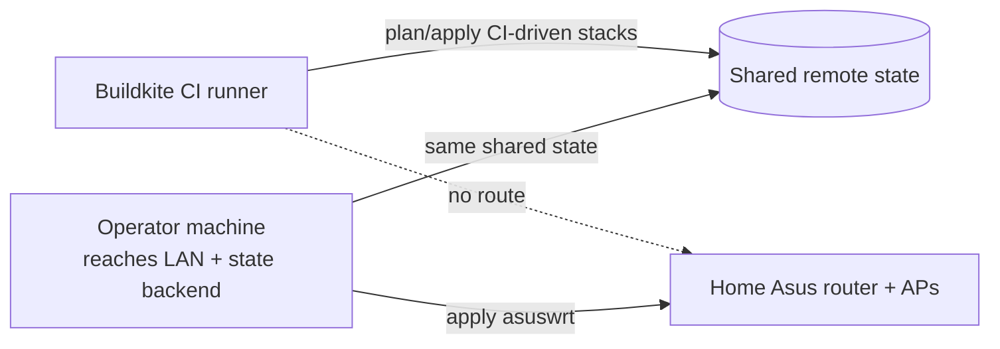

The `asuswrt` OpenTofu stack (`packages/homelab/src/tofu/asuswrt/`) tracks the
home Asus router and its access points as OpenTofu state, using the custom
[`terraform-provider-asuswrt`](https://github.com/shepherdjerred/monorepo/tree/main/packages/terraform-provider-asuswrt).
Unlike the CI-driven stacks, its `apply` is run by hand — yet its state still
lives in the same shared remote backend as everything else. That split — remote
shared state, local-only apply — is the whole point of this page.

## Why this stack is applied by hand

Most `src/tofu/*` stacks are planned on each PR and applied on merge by Buildkite
via the tofu plan/apply allowlists in
[`.buildkite/pipeline.yml`](https://github.com/shepherdjerred/monorepo/blob/main/.buildkite/pipeline.yml)
(a couple of stacks, like `asuswrt` and `argocd`, sit outside those loops for
their own reasons). `asuswrt` is deliberately excluded because the CI runner has
no network route to the home LAN where the router lives — it can reach the shared
state backend but not the devices themselves.

So the `apply` has to run from a machine that can reach **both** the home LAN
(to talk to the router over HTTP) and the shared state backend. The state object
is durable and shared exactly like the CI-applied stacks — only the actor and the
network path differ.



## Operating it

The provider is not published to a registry; install it into the local
filesystem mirror first (`make -C packages/terraform-provider-asuswrt install`).
Then, from `packages/homelab/src/tofu`, drive it with `op run` so the router
login is injected from 1Password at runtime rather than living on disk:

```bash
op run --env-file=.env -- tofu -chdir=asuswrt init
op run --env-file=.env -- ./asuswrt/import.sh   # first time only
op run --env-file=.env -- tofu -chdir=asuswrt plan
op run --env-file=.env -- tofu -chdir=asuswrt apply
```

The stack's own `README.md` (in `packages/homelab/src/tofu/asuswrt/`) has the
per-device details and the import list.

## What is and isn't tracked

Reads and imports are reliable across the devices' firmwares; `plan` converges to
no changes after import. Tracked: system settings, DHCP static leases and
port-forwards (router only — AP mode disables those), and wireless SSID / auth /
crypto / channel / bandwidth / hidden.

Two deliberate gaps, both because a write would be lossy or unverified:

- **`wpa_passphrase` is not managed.** It is write-only (never read back), so
  tracking it would rewrite the PSK on every apply and never show honest drift.
  Manage the WiFi password out of band.
- **The wireless _write_ path is track-only.** Firmware-specific `wl_bw` codes,
  chanspec sideband forms, and SAE `wl_mfp` handling are not fully modeled, so a
  wireless `apply` could reformat a working radio. Import/plan are safe; verify a
  wireless `apply` against hardware before relying on it — tracked in
  `packages/docs/todos/asuswrt-wireless-write-path.md`.
