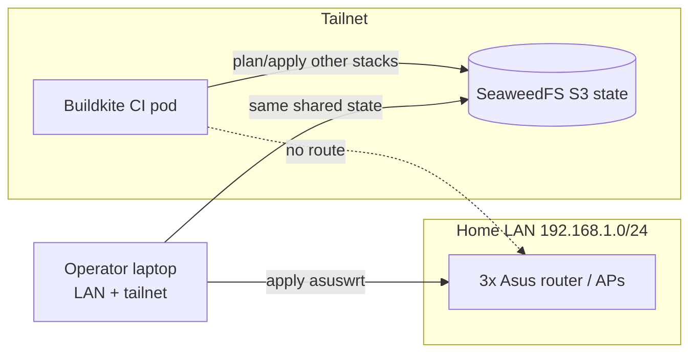

The `asuswrt` OpenTofu stack (`packages/homelab/src/tofu/asuswrt/`) manages the
three home Asus devices — the RT-AX88U Pro router and the RT-AX88U and RT-BE86U
access points — as OpenTofu state, using the custom
[`terraform-provider-asuswrt`](https://github.com/shepherdjerred/monorepo/tree/main/packages/terraform-provider-asuswrt).
It is the **only** Tofu stack in the repo that is applied by hand rather than by
CI, yet its state still lives in the same shared SeaweedFS backend as everything
else. That split — remote shared state, local-only apply — is the whole point of
this page.

## Why this stack is different

Every other `src/tofu/*` stack is planned on each PR and applied on merge by
Buildkite (see the tofu allowlists in
[`.buildkite/pipeline.yml`](https://github.com/shepherdjerred/monorepo/blob/main/.buildkite/pipeline.yml)).
`asuswrt` is deliberately **absent from those allowlists**: CI runs in a
Kubernetes pod with tailnet-only egress and cannot route to the home LAN
(`192.168.1.0/24`) where the routers live. Wiring CI drift-detection would need a
Tailscale subnet router advertising the LAN, which does not exist yet.

So the apply has to happen from a machine that is on **both** networks at once:
the LAN (to reach the routers over HTTP) and the tailnet (to reach the SeaweedFS
S3 state backend). The state object (`asuswrt/terraform.tfstate`) is durable and
shared exactly like the CI-applied stacks — only the actor and the network path
differ.



## Operating it

The provider is not published to a registry; install it into the local
filesystem mirror first (`make -C packages/terraform-provider-asuswrt install`).
Then, from `packages/homelab/src/tofu`, drive it with `op run` so the router
login is injected from the 1Password item **"ASUS Router"**:

```bash
op run --env-file=.env -- tofu -chdir=asuswrt init
op run --env-file=.env -- ./asuswrt/import.sh   # first time only
op run --env-file=.env -- tofu -chdir=asuswrt plan
op run --env-file=.env -- tofu -chdir=asuswrt apply
```

The stack's own `README.md` (in `packages/homelab/src/tofu/asuswrt/`) has the
per-device alias/IP table and the import list.

## What is and isn't tracked

Reads and imports are reliable across both firmwares; `plan` converges to no
changes after import. Tracked: system settings, DHCP static leases and
port-forwards (router only — AP mode disables those), and wireless SSID / auth /
crypto / channel / bandwidth / hidden.

Two deliberate gaps, both because a write would be lossy or unverified:

- **`wpa_passphrase` is not managed.** It is write-only (never read back), so
  tracking it would rewrite the PSK on every apply and never show honest drift.
  Manage the WiFi password out of band.
- **The wireless _write_ path is track-only.** Firmware-specific `wl_bw` codes,
  chanspec sideband forms, and SAE `wl_mfp` handling are not fully modeled, so a
  wireless `apply` could reformat a working radio. Import/plan are safe; verify a
  wireless `apply` against hardware before relying on it — tracked in
  `packages/docs/todos/asuswrt-wireless-write-path.md`.
