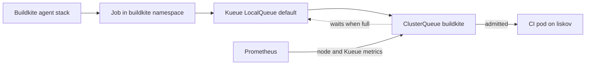

Buildkite CI runs on the dedicated `liskov` worker. Buildkite limits the number
of in-flight jobs to 20, while Kueue decides whether each job's resource
requests fit the shared CI budget before Kubernetes creates its pods.

## System map

## Current contract

The `buildkite` namespace is managed by Kueue. The `buildkite` ClusterQueue
nominal quota is:

- 24 CPU
- 80Gi memory
- 20 pods
- 100Gi ephemeral storage

Jobs that do not fit remain suspended until resources are released. This keeps
resource pressure quiet at admission time: Kubernetes does not repeatedly try
to create pods that cannot fit, and Buildkite's count cap remains an independent
backstop.

Prometheus scrapes Kueue's controller through the selected ServiceMonitor in
`kueue-system`. The monitoring rules alert on sustained queue backlog and on
memory conditions that precede liskov's kubelet eviction behavior.

## Where to look

- Kueue chart and Prometheus ServiceMonitor:
  `packages/homelab/src/cdk8s/src/resources/argo-applications/kueue.ts`.
- Queue resources and the Buildkite pod quota:
  `packages/homelab/src/cdk8s/src/resources/kueue-config.ts`.
- Buildkite namespace and count-based cap:
  `packages/homelab/src/cdk8s/src/resources/argo-applications/buildkite.ts`.
- Node and admission alerts:
  `packages/homelab/src/cdk8s/src/resources/monitoring/monitoring/rules/resource-monitoring-liskov.ts`.
