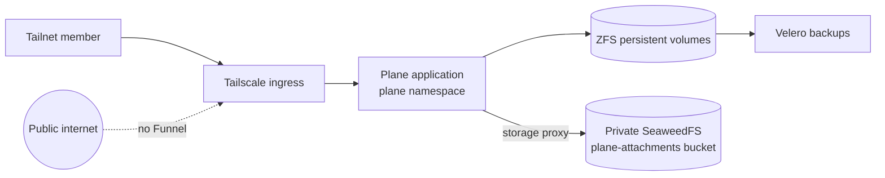

Plane is the homelab's private issue tracker. It is reachable only through the
Tailscale ingress at the tailnet's `plane` MagicDNS name; Funnel is not
configured, so the public internet has no route to it. Argo CD deploys both the
vendor application and the local ingress/secrets chart.

## System map

## Why it is shaped this way

- **Tailnet-only access.** The vendor chart's own ingress stays disabled because
  the cluster's Tailscale ingress supplies the private access boundary. It
  routes Plane's path-based services without creating a public endpoint.
- **State has two recovery paths.** PostgreSQL, Redis, RabbitMQ, and monitor
  state live on ZFS persistent volumes and are explicitly included in the
  Velero inventory. Attachments instead live in the private `plane-attachments`
  SeaweedFS bucket, which is protected from accidental destruction by its
  OpenTofu lifecycle policy.
- **Browsers never receive object-store access.** Plane uses its storage proxy
  and the in-cluster S3 endpoint for attachment uploads. The bucket remains
  private, so clients do not need S3 credentials or direct access.
- **GitOps owns deployment.** A local chart creates the namespace, secrets
  integration, and private ingress; a separate Argo CD application installs the
  pinned Plane vendor chart. Changes flow through Git and Argo CD rather than
  direct Kubernetes mutation.

## Where to look

- Private ingress and 1Password secret integration:
  `packages/homelab/src/cdk8s/src/cdk8s-charts/plane.ts`.
- Vendor chart settings, storage proxy, and Argo CD applications:
  `packages/homelab/src/cdk8s/src/resources/argo-applications/plane.ts`.
- Attachment bucket lifecycle policy:
  `packages/homelab/src/tofu/seaweedfs/buckets.tf`.
- Persistent-volume backup inventory:
  `packages/homelab/src/cdk8s/src/backup-policy/pvc-backup-policy.json`.
