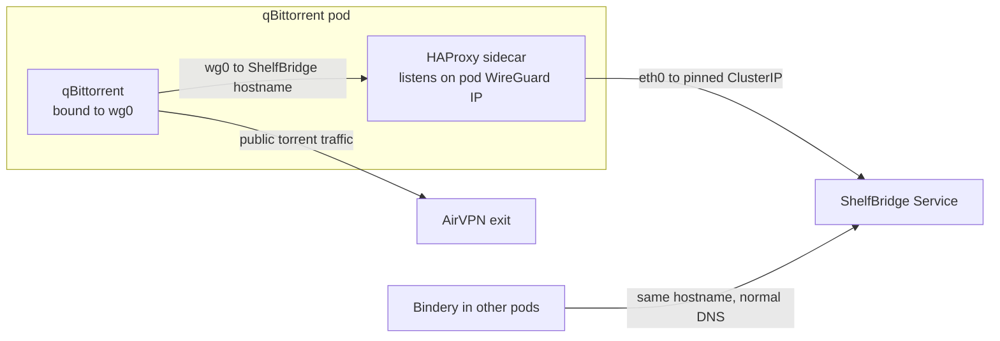

qBittorrent must send every packet through the AirVPN WireGuard device (`wg0`)
so no torrent traffic ever leaks onto the cluster network. But its book
webseeds come from **ShelfBridge**, an in-cluster service reachable only over
the normal pod route (`eth0`). Those two facts conflict: a client pinned to
`wg0` cannot dial a Kubernetes ClusterIP. A fixed-destination HAProxy sidecar in
the qBittorrent pod bridges exactly that one path, and nothing else.

## Data path

## Why it is shaped this way

- **Split-horizon hostname.** `media-shelfbridge-service` resolves two ways. In
  the qBittorrent pod a `hostAlias` maps it to the pod's own WireGuard address,
  where HAProxy listens; everywhere else it resolves normally to ShelfBridge's
  Service. One name, two destinations, so the webseed URLs ShelfBridge hands out
  work unchanged from either side.
- **Fixed-destination, not a proxy.** The HAProxy backend is a single pinned
  ShelfBridge ClusterIP. The relay has no Service and no Ingress and cannot
  forward anywhere else, so it can never become an escape hatch out of the VPN
  boundary. Gluetun keeps its default-deny firewall with only the Kubernetes
  service CIDR allowed outbound.
- **The VPN binding is load-bearing.** `Session\Interface=wg0` and
  `Session\InterfaceName=wg0` are committed, drift-enforced qBittorrent config.
  The relay exists specifically so that binding never has to be relaxed.
- **Readiness tracks the local listener, not the remote backend.** The pod's
  readiness probe watches HAProxy's local health port, so a ShelfBridge outage
  degrades webseeds but does not pull the qBittorrent WebUI or its metrics
  endpoint out of service. HAProxy's `/health` still reports backend
  reachability for diagnosis.
- **Config changes roll the pod.** The HAProxy config is mounted via `subPath`
  (never hot-reloaded) and HAProxy has no in-place reload, so a `config-hash`
  pod-template annotation forces a rollout whenever the relay config changes —
  otherwise the running pod would serve stale config behind a Synced ArgoCD
  application.

## Where to look

- Relay, sidecar, split-horizon alias, and readiness wiring:
  [`packages/homelab/src/cdk8s/src/resources/torrents/qbittorrent.ts`](https://github.com/shepherdjerred/monorepo/blob/main/packages/homelab/src/cdk8s/src/resources/torrents/qbittorrent.ts).
- ShelfBridge service, pinned ClusterIP, and webseed base URL:
  [`packages/homelab/src/cdk8s/src/resources/torrents/shelfbridge.ts`](https://github.com/shepherdjerred/monorepo/blob/main/packages/homelab/src/cdk8s/src/resources/torrents/shelfbridge.ts).
