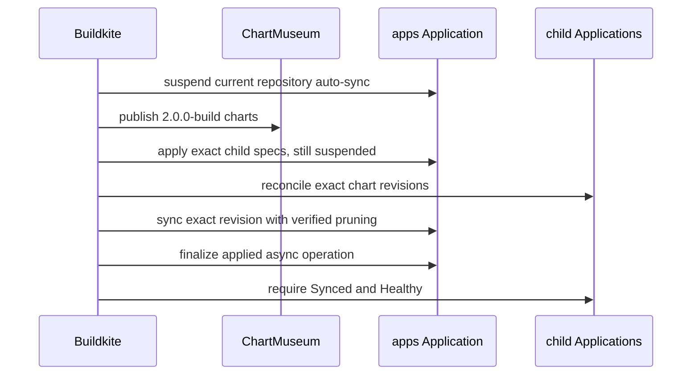

The main Buildkite pipeline is the only writer for repository-backed homelab
releases. It publishes one immutable chart revision, applies that exact child
Application inventory with auto-sync still disabled, and only then reconciles
workloads and restores the root app tree.

The second suspended root apply is deliberate. New child-level safety settings
must exist before those children sync, but enabling floating auto-sync before
every chart is published could expose a partially published release.

Child reconciliation also retries a failed operation recorded against the
current chart revision, even when ArgoCD already reports the application as
Synced and Healthy. That clears a failed apply after a new child-level safety
setting makes the same immutable chart revision safe to retry.

Root pruning does not trust ArgoCD's cached `OutOfSync` or `requiresPruning`
flags. Selective manifest overrides can make those flags temporarily describe
the override rather than the published tree. The release script renders the
exact `apps` revision and treats only live child Applications absent from that
rendered set as prune candidates; each candidate must still opt into cascading
deletion and carry the Argo resources finalizer.

The final root sync is intentionally asynchronous because the root app also
tracks child Applications that may be deferred or independently unhealthy. The
controller still applies the exact revision before waiting on those health
states. `finalize-async-sync` verifies that the requested operation's sync
result is fully applied, refuses failed or mismatched operations, and then
terminates the health wait so a permanently Running root operation cannot block
the next ordered release.

Application image selection uses the newest main commit whose `images` and
`version-commit-back` jobs both passed as its comparison base. A later
version-pin commit can cancel the rest of that build without invalidating its
completed image build, smoke-test, and durable pin-handoff evidence. Changes
after that image-release commit still rebuild their affected closures, while
an unchanged pin-only successor does not rebuild and repin the same application
forever.

The implementation lives in `.buildkite/pipeline.yml` and
`packages/homelab/scripts/argocd.ts`.
