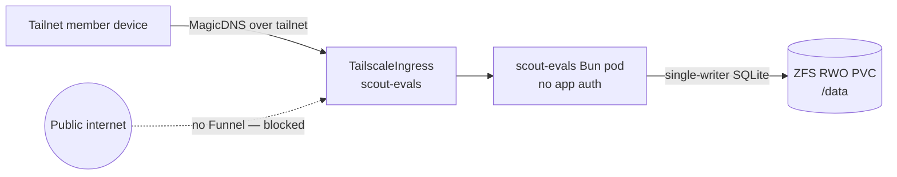

Scout review evals — the post-match review calibration app in
`packages/scout-for-lol/packages/evals` — has **no application-level auth by
design**. It is a single Bun process that serves its built client and a tRPC API
over one WAL-mode SQLite file. Its entire authorization boundary is the
**tailnet-only Tailscale ingress** in front of it: only devices on the tailnet
can reach `https://scout-evals.<tailnet>.ts.net`, and the tailnet membership
_is_ the login. There is no second gate behind it.

## Trust boundary

## Why it is shaped this way

- **Tailnet is the auth layer.** The app binds `0.0.0.0` inside the cluster
  (`SCOUT_EVAL_HOSTNAME`), which is only safe because nothing but the tailnet
  ingress can route to it. Anyone off the tailnet cannot reach it at all, so the
  app itself carries no password, session, or token logic. Removing the tailnet
  boundary would expose an unauthenticated admin surface — never do it.
- **Never Funnel.** Funnel would publish the service to the public internet,
  which would defeat the entire boundary. The ingress is tailnet-only on
  purpose; the call site in `scout-evals.ts` and the app README both call this
  out explicitly.
- **The PVC owns the data.** All datasets — raw source artifacts, processed
  match context, prompts, model settings, generations, and human ratings — live
  in one SQLite file on a read-write-once ZFS NVMe volume mounted at `/data`.
  Because it is single-writer, the Deployment uses the `Recreate` strategy so an
  old and new pod never run concurrently and corrupt the WAL.
- **Read-only root filesystem.** The container runs non-root (uid/gid 1000) with
  a read-only root filesystem and no privilege escalation. Bun's runtime caches
  need a writable `$HOME`, so `HOME` points at a small writable `emptyDir` at
  `/tmp`; durable data still lives only on the `/data` PVC. If this
  unauthenticated service is ever compromised, the attacker cannot rewrite the
  container image contents.

## Operating it

- **Reach it** from any tailnet device at `https://scout-evals.<tailnet>.ts.net`.
  No credentials are prompted — being on the tailnet is the access grant.
- **Guard tailnet membership** the way you would guard a login. Anyone you add to
  the tailnet with routing to this service can read and write every eval dataset.
- **Populate datasets** with the evals CLI (`sync-beta`, `discover`, and the
  ingest commands) as documented in the package README; the hosted instance is
  the durable home for the resulting SQLite database.
