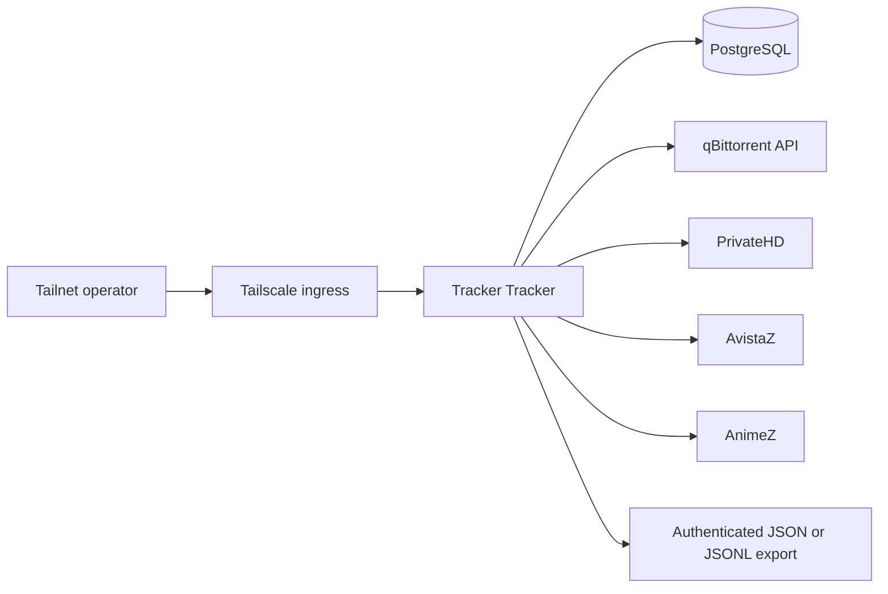

Tracker Tracker gives the homelab one place to collect PrivateHD, AvistaZ, and
AnimeZ account metrics alongside qBittorrent torrent state. It is a private
operator service: credentials stay in 1Password, the app is reached through
Tailscale, and exported snapshots are consumed by scripts rather than by
direct database queries.

## System map

## Why it is shaped this way

- **Private by default.** The service has a Tailscale-only hostname and no
  public Funnel route. Its namespace policy permits only the required
  qBittorrent and PostgreSQL traffic.
- **Backed-up state.** Tracker Tracker's `/data` volume and the managed
  PostgreSQL data claim are included in the homelab's explicit Velero/ZFS
  backup inventory.
- **Tracker-aware collection.** The AvistaZ-family adapter records account
  metrics such as upload, download, ratio, buffer, seeding, leeching, bonus,
  H&R, and reseed values. qBittorrent supplies torrent progress, status,
  client, transfer, ratio, timing, and history fields. Tracker-verified H&R
  `Y/N` per torrent is intentionally outside this v1 boundary.
- **Secret-safe automation.** The Deployment receives only runtime/database
  values from the `tracker-tracker-secrets` 1Password item. An operator-only
  Bun command resolves tracker cookies, tracker login fields, and qBittorrent
  credentials through `op://` references, then sends them through Tracker
  Tracker's authenticated API. Tracker Tracker persists those credentials in
  its encrypted database; they are not placed in the pod environment.

## Where to look

- Kubernetes resources:
  `packages/homelab/src/cdk8s/src/resources/tracker-tracker/`.
- Bootstrap and exporter:
  `packages/homelab/scripts/tracker-tracker.ts`.
- Operator reference template:
  `packages/homelab/tracker-tracker.env.example`.
- Backup inventory:
  `packages/homelab/src/cdk8s/src/backup-policy/pvc-backup-policy.json`.
- Operator commands and environment requirements:
  `packages/homelab/README.md`.
