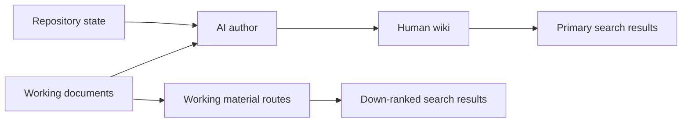

The wiki has two layers. Start with the curated layer. Drop into working
material only when you need provenance or implementation detail.

## Curated pages

Curated pages answer one question quickly. They lead with the system shape,
prefer a diagram over a directory dump, and explain why a choice exists.

## Working material

Only working documents on the explicit public allowlist in
`src/lib/wiki-publication.ts` are available at `/working/…`. Approval is
file-by-file so operational notes and sensitive infrastructure context cannot
enter the public build through broad discovery.

Approved working pages:

- carry a persistent working-material banner;
- are hidden from the sidebar and sitemap;
- include `noindex,follow`;
- have lower Pagefind weight than curated pages;
- link back to their exact source file.

## Authoring contract

Agents should update a nearby curated page when a meaningful system boundary,
workflow, or decision changes. Pages stay terse. Diagrams need an accessible
title and description. Screenshots need useful alt text and should show the
real rendered system.
