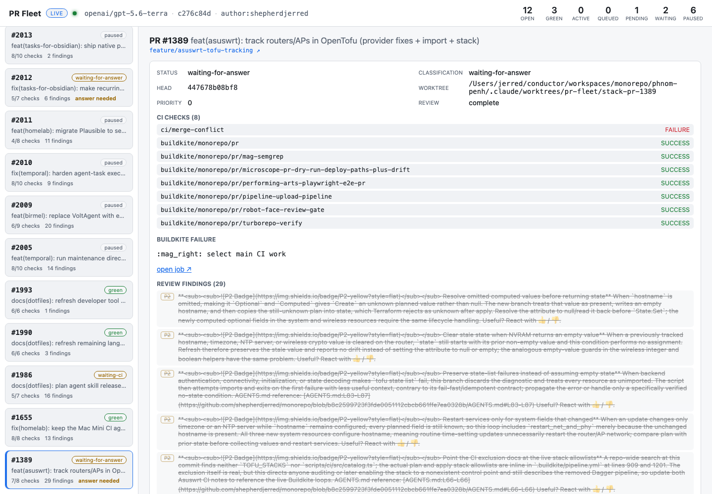

The **PR Fleet Controller** is a standalone tool that watches every open pull
request in the repository and drives each one toward "ready for a human" —
fixing failing checks, resolving review findings, and re-requesting review —
without ever merging, closing, or approving a PR itself. An operator runs it in
the foreground and steers it conversationally; the model does the work inside a
tightly bounded sandbox.

## Running it

```bash
bun run pr:fleet \
  --model <provider>/<model-id> \
  --author shepherdjerred
```

One selected API model powers both the conversational master and every bounded
worker, so the controller is **provider-neutral** — point it at any supported
model. `--author` includes that operator's drafts while excluding bot-authored
PRs. Once running, an operator uses `/status`, `/tick`, `/questions`, `/answer`,
`/help`, `/stop`, or plain free-text steering.

Every run creates a private local evidence bundle under
`${XDG_STATE_HOME:-~/.local/state}/pr-fleet-controller` (or an explicit
`--state-dir`). It contains a hash-chained event timeline, final summary,
Mastra storage, and a DuckDB observability database. The controller fails
before model access or PR mutation if the selected directory is not owned by
the operator with mode `0700`; persisted files use `0600`.

## Watching it live

By default `pr:fleet` also builds and spawns a live web dashboard that streams
the run bundle over SSE on loopback — a fleet overview plus a per-PR transcript
that includes the model's reasoning. Its one control is an answer form inside a
PR that is waiting for operator input. It has no general steering, priority,
pause, merge, or publication controls, and it is torn down when the run
finalizes (after the terminal snapshot and outcome are recorded, so the final
state is visible).
Suppress it with `--no-ui`, pin the port with `--ui-port`, or skip opening a
browser with `--no-open`. Open the dashboard for any run — live or already
finished — standalone:

```bash
bun run pr:fleet:watch [--run <id|dir>]
```

Because the DuckDB observability database is exclusively locked while the run
holds it, the model's reasoning is mirrored live to a best-effort `spans.jsonl`
in the bundle that the dashboard tails alongside the event timeline; the DuckDB
copy remains the durable, verified source.

A live run owns a mode-`0600` Unix control socket inside its private run
directory. Same-origin dashboard answers cross that socket to the controller;
standalone and historical dashboards remain read-only. Answers are bound to the
request's PR and exact head. A moved head, green PR, or closed PR supersedes an
unanswered request automatically.



## What it may and may not do

The authority boundary is the whole point. The controller may:

- read a PR's checks, review threads, and CI evidence;
- edit files, run validation, and publish commits to a PR's own branch;
- ask bounded, evidence-backed questions and suspend only that PR indefinitely;
- re-request review from the configured provider.

It may **never** merge, close, approve, weaken a gate, or touch any branch other
than the one it was dispatched for. That boundary is enforced in code, not just
prompt instructions — the worker's tools simply do not expose those actions.

## How the work is bounded

- **One worker per stack.** Each git-spice stack shares a single worktree, and
  only one worker holds it at a time; siblings queue. A worker is dispatched
  against a specific PR head, and its worktree is synced to that head first.
- **Operator-owned checkouts are adopted best-effort.** The controller
  provisions its own disposable worktree per stack, but Git forbids the same
  branch in two worktrees, so if you already have a PR's branch checked out in
  your own worktree the fleet reuses that checkout in place — otherwise the PR
  would be parked for the whole run. An operator checkout is reused only when it
  holds the **exact** PR being worked, and a matching branch is never reset.
  Instead the worker inventories staged and unstaged patches, metadata-only
  untracked paths, local commits, and remote divergence. Untracked file contents
  are never serialized; bounded subprocess capture marks oversized evidence
  incomplete and blocks mutation or publication. It can continue clearly
  related work, unstage explicit paths without deleting their contents, and
  publish only explicit paths or a captured local commit head. Ambiguous
  ownership, mixed staged work, uncertain history rewrites, or meaningfully
  different valid fixes become a dashboard question; unrelated unstaged files
  stay local. Worker file edits cannot touch Git metadata (`.git`, config,
  hooks), even through a symlink.
- **Leases** serialize the expensive/dangerous steps — setup (dependency
  install + codegen), heavy commands, and the stack-write that publishing needs.
  An operator question is persisted before its worker turn is aborted. Its
  leases, like other cancellation paths, are released only after the worker
  settles, so in-flight Git/subprocess work can never overlap a freshly
  dispatched worker.
- **Head changes cancel the worker.** If someone pushes to a PR while a worker
  is mid-flight, the controller cancels that worker (its checkout is now stale)
  and re-dispatches against the refreshed commit rather than letting it publish
  obsolete work.
- **Restacking follows the branch topology.** Git-spice stacks use git-spice;
  ordinary PR branches use a bounded native rebase and the same
  force-with-lease publication boundary. A conflict returns control to the
  worker instead of discarding inherited content.
- **Review completion is read the same way the canonical gate reads it** —
  including the provider's bot-author skip policy, so bot-authored PRs (Renovate,
  release automation) that a provider never reviews don't sit pending forever.

## The validation sandbox

Worker validation commands run under macOS `sandbox-exec` with a
**deny-by-default** policy. Reads are confined to the assigned worktree plus
specific toolchain directories; the process's own temp dir is readable but the
broader `/private` and home-cache trees are not — a model-controlled command
cannot read `~/.aws`, `~/.ssh`, or arbitrary application caches and echo them
back. Writes are confined to the worktree and temp dirs, network is denied, and
credential-bearing environment variables are stripped from the subprocess. Only
a fixed allowlist of read-only tools (`bun`, `cargo`, `go`, `helm`, `tofu`,
`rg`, …) may run, and command forms that would execute an arbitrary nested
program are rejected. Setup also gives Mise and downstream generators
invocation-scoped cache, state, and shim directories, so they cannot write into
the operator's home cache.

## Inspecting what happened

The run record is designed to answer which evidence the controller saw, which
decision it made, what model and command activity occurred, and how the final
fleet state was reached. Payloads are redacted before persistence. The same
literal-value redactor runs before Mastra's structural sensitive-field filter,
so both the hash-chained events and model/tool spans retain only redacted bodies.

```bash
bun run pr:fleet:inspect --run <run-id-or-directory>
bun run pr:fleet:replay --run <run-id-or-directory>
```

Inspection hides bodies by default; `--show-bodies` is an explicit local
opt-in. Replay performs an offline deterministic audit of event integrity,
lifecycle correlations, question PR/head binding and single-answer lifecycle,
tick snapshots, aggregate counts, and final state. It never contacts a model or
network, runs a command, or writes to a checkout. Both commands accept `--json`.

Bundles are local-only and retained indefinitely in v1. This capture makes
future evaluation work possible, but it does not itself create a dataset,
score a run, call a judge, run an experiment, or add an evaluation gate.

## Where to look next

- Package and exact model tool boundary: `packages/pr-fleet-controller/`
  (see its `README.md`).
- The provider-neutral review abstraction it shares with the Buildkite review
  gate: `@shepherdjerred/code-review`.
