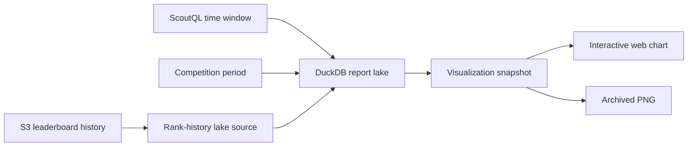

Scout can explore reports and competitions over time without changing official
competition standings. One versioned visualization snapshot drives interactive
web charts and deterministic Discord PNGs, so both surfaces show the same data.

Reports save their timezone in ScoutQL. They support relative or inclusive
calendar windows up to 365 days, automatic or explicit buckets, and optional
equal-length comparisons. New runs archive the exact query and visualization;
older runs continue to use their PNG.

Competitions default to `Official`, the existing competition-to-date result.
`Selected period` intersects the requested dates with the competition lifespan
and recomputes match criteria from lake facts or rank criteria from daily
leaderboard snapshots. Its persisted analysis timezone defaults to UTC.

The snapshot carries evidence and presentation intent: sample sizes, Wilson
intervals, comparison deltas, rolling or cumulative transforms, annotations,
trends, stacking, bump charts, calendar heatmaps, and sparklines. Browser hover,
crosshairs, zoom, and brushing are interaction only; they do not alter archived
results.
