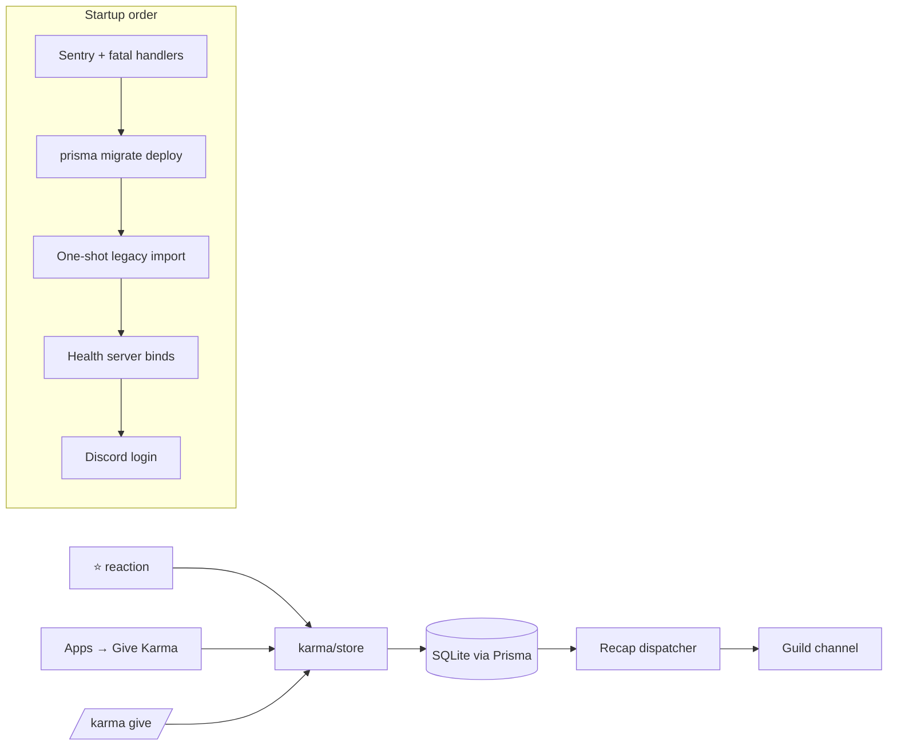

Karma is a per-guild recognition score: people award each other points, usually
with a short written reason. The bot stores every award as one row and derives
everything else — leaderboards, profiles, milestones — by summing that column.

## Startup order is load-bearing

Each step exists because the one before it failed in a specific way.

Sentry and the process-level fatal handlers are armed **first**, before the
database work, because migrations and the import are the riskiest part of boot
— a locked database or a half-applied migration would otherwise be visible only
in container logs. Those handlers must terminate the process: installing an
`unhandledRejection` listener suppresses the runtime's default crash, so a
handler that merely logged would leave a dead bot answering `/live` with 200.

The health server binds **before** the Discord login. Bound the other way
round, probes get connection-refused for the whole login window, and a slow or
rate-limited login burns the startup budget and gets the pod killed.

`/live` reports 503 only after the gateway has been down for more than five
minutes, so ordinary reconnects never recycle the pod but a wedged one does.
`/ready` additionally requires the database, the expected migration, and a
connected gateway — a database blip should make the pod _unready_, not restart
it.

## The legacy import runs itself, once

The bot previously used TypeORM with a `sql.js` database and **no schema
management at all** — the schema survived only because the volume carried the
file forward. Moving to Prisma meant moving the data.

`LEGACY_DATABASE_PATH` drives a one-shot import at startup. It is idempotent
(a target that already has karma short-circuits), it verifies per-person totals
_inside_ the write transaction so a mismatch rolls back rather than committing
unverified data, and it fails startup outright if the path is set but the file
is missing — silently starting on an empty database is indistinguishable from
total karma loss. The legacy file is only ever read, so it remains the rollback
artifact.

See `packages/starlight-karma-bot/src/db/import-legacy.ts`.

## Giving is deliberately low-friction

Usage fell from 216 awards in 2023 to 15 in 2025, and only 17 of 45 members had
ever given any. The bottleneck was never missing commands — it was that giving
required typing one.

| Surface                    | Cost to the giver | Carries a reason |
| -------------------------- | ----------------- | ---------------- |
| React with the karma emoji | One tap           | No               |
| **Apps → Give Karma**      | A modal           | Yes, plus amount |
| `/karma give`              | Typing            | Yes, plus amount |

Amounts are a closed set of 1, 2, or 3. The range is closed on purpose: with no
ceiling, amounts drift upward through ordinary social escalation until the
number stops carrying information, and the usual remedy — a giving budget —
would cost a whole balance-tracking subsystem. A fixed ceiling buys the same
protection for one validation rule.

Reaction awards record the source message, so un-reacting revokes precisely and
re-reacting cannot stack the award.

## The recap posts without being asked

A guild owner points the recap at a channel with `/karma config` (requires
Manage Server). A dispatcher polls once a minute for guilds whose next fire time
has passed, posts the month's top receivers and top givers plus an "on this
day" entry from the archive, then advances the next fire time from the guild's
CRON expression.

It advances that timestamp **even when posting fails**. Otherwise a deleted
channel or a revoked permission turns into a retry every single minute forever.

## Where to look next

- Data model: `packages/starlight-karma-bot/prisma/schema.prisma`
- Pure rules, unit-tested without Discord or a database:
  `src/karma/scoring.ts`, `src/karma/rules.ts`, `src/karma/milestones.ts`
- Deployment, probes, and volume: the karma bot resource under
  `packages/homelab/src/cdk8s/src/resources/`
- Sibling Discord bot with the same Prisma conventions: [Birmel](/birmel/)
