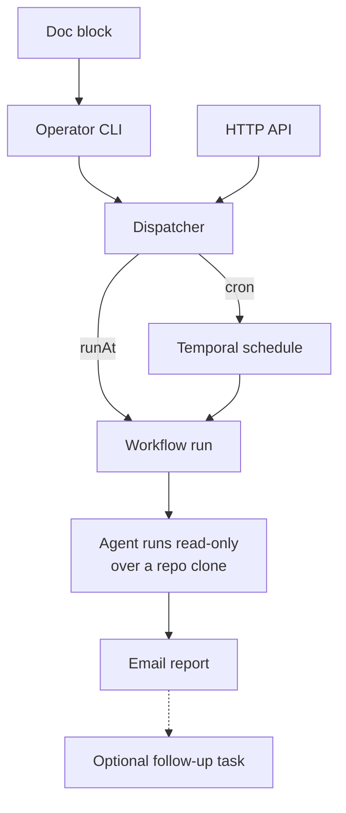

Agent tasks are scheduled LLM runs (Claude or Codex) that inspect current
state and email a Markdown report. They are **report-only by construction**:
the mode field is a single-value enum, so a mutating agent task is not
representable — the schema, not policy, rules it out. Anything that must
change the repo is a deterministic
[scheduled workflow](/temporal/schedules/) instead.

## Three ways in

1. **Doc blocks** — a `<!-- temporal-agent-task { … } -->` HTML comment in any
   `packages/docs/` file, holding the JSON task input. This keeps the
   follow-up next to the context that motivated it.
2. **Operator CLI** —
   `bun run scripts/schedule-agent-task.ts --from-doc <path>` (or `--json` /
   `--stdin`) from `packages/temporal`, against a port-forwarded Temporal.
3. **HTTP API** — `POST /agent-tasks` on `temporal-agent-tasks.sjer.red`,
   bearer-token authenticated with a constant-time compare. This is the only
   public scheduling ingress; the Temporal server itself is never exposed.

All three feed one dispatcher: a `cron` input upserts a Temporal schedule
(stamped with a memo so orphan detection ignores it), a `runAt` input starts a
one-off workflow whose ID is a content hash — resubmitting the same task is a
no-op rather than a duplicate.

## Guardrails

- The prompt is prefixed with hard read-only constraints; the subprocess gets
  90 minutes at most and must heartbeat.
- A task may request **one** follow-up task, and may pause — never delete —
  its own cron, and only when the original task set `allowSelfCancel`.
- Reports are emailed via Postal; nothing is written anywhere else.

The daily homelab audit is the flagship consumer: a scheduled agent task with
a bounded read-only prompt over cluster, DNS, backup, and alert state.

Schema and dispatcher:
[`agent-task.ts`](https://github.com/shepherdjerred/monorepo/blob/main/packages/temporal/src/shared/agent-task.ts),
[`agent-task-scheduler.ts`](https://github.com/shepherdjerred/monorepo/blob/main/packages/temporal/src/lib/agent-task-scheduler.ts).
