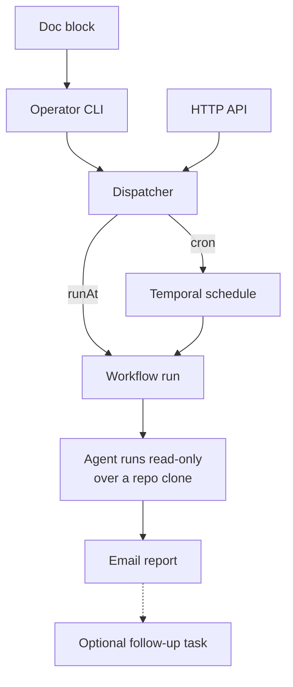

Agent tasks are scheduled LLM runs (Claude or Codex) that inspect current
state and email a Markdown report. They are **report-only by policy, not by
sandbox**: the run still gets `Bash` and a write-capable GitHub token, so what
keeps a task from mutating the repo is the hard read-only prompt, an ephemeral
non-root pod, and a throwaway per-run clone — not a schema that makes mutation
unrepresentable. Anything that must change the repo is a deterministic
[scheduled workflow](/temporal/schedules/) instead.

## Three ways in

1. **Doc blocks** — a `<!-- temporal-agent-task { … } -->` HTML comment in any
   `packages/docs/` file, holding the JSON task input. This keeps the
   follow-up next to the context that motivated it.
2. **Operator CLI** —
   `bun run scripts/schedule-agent-task.ts --from-doc <path>` (or `--json` /
   `--stdin`) from `packages/temporal`, against a port-forwarded Temporal.
3. **HTTP API** — `POST /agent-tasks` on `temporal-agent-tasks.sjer.red`,
   bearer-token authenticated with a constant-time compare. This is the only
   public scheduling ingress; the Temporal server itself is never exposed.

All three feed one dispatcher: a `cron` input upserts a Temporal schedule
(stamped with a memo so orphan detection ignores it), a `runAt` input starts a
one-off workflow whose ID is a content hash. Resubmitting is not a silent
no-op: an active or already-succeeded task ID is rejected — the HTTP API
returns 500 — while a failed or timed-out one starts a fresh run
(`ALLOW_DUPLICATE_FAILED_ONLY` with conflict policy `FAIL`).

## Guardrails

- The prompt is prefixed with hard read-only constraints; the subprocess gets
  90 minutes at most and must heartbeat.
- A task may request **one** follow-up task, and may pause — never delete —
  its own cron, and only when the original task set `allowSelfCancel`.
- Reports are emailed via Postal — the only human-facing output, but not the
  only copy: with telemetry enabled (the homelab default) each run's prompt and
  response are recorded as `gen_ai.*` spans whose bodies are archived to the
  SeaweedFS/S3 LLM-observability store before the slim span is exported.

The daily homelab audit is the flagship consumer: a scheduled agent task with
a bounded read-only prompt over cluster, DNS, backup, and alert state.

## Under the hood

- **Claude tasks** run `claude -p` with a JSON schema forced on the output
  (`--json-schema`, inline), tools limited to `Bash, Read, Grep, Glob,
WebFetch`, on claude-opus-5. **Codex tasks** run `codex exec --sandbox
read-only` with an output schema file. The two providers accept different
  schema dialects, so each gets its own.
- **Env scoping**: the subprocess gets a fresh GitHub installation token as
  `GH_TOKEN`; the GitHub App credentials are stripped, and for Claude the
  Anthropic API key is dropped so the run bills the subscription.
- **One-off submission is conflict-checked**: the workflow ID is the task
  title plus a content hash of the normalized input, submitted with
  `ALLOW_DUPLICATE_FAILED_ONLY` and conflict policy `FAIL` — so resubmitting an
  active or already-succeeded task is rejected (the API returns 500), while a
  failed or timed-out one starts a fresh run. Future-dated tasks defer via
  Temporal's `startDelay`, so the wait doesn't consume the run's execution
  timeout.
- **Cost is traced even on failure**: the LLM span (with token cost) is
  emitted before the exit-code check, so a failed run that spent tokens
  still shows up in observability.
- **Timeouts alarm**: an hourly watcher counts agent-task runs that timed
  out in the last 24 hours into a gauge that alerts above zero.

Schema and dispatcher:
[`agent-task.ts`](https://github.com/shepherdjerred/monorepo/blob/main/packages/temporal/src/shared/agent-task.ts),
[`agent-task-scheduler.ts`](https://github.com/shepherdjerred/monorepo/blob/main/packages/temporal/src/lib/agent-task-scheduler.ts).
