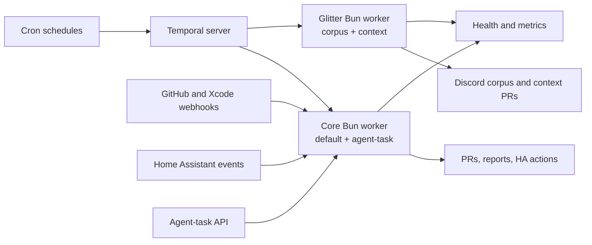

`packages/temporal` is the monorepo's automation hub: one Bun image runs as two
fault-isolated worker roles on the homelab cluster. Every
recurring job, PR bot, scheduled agent, Glitter refresh, and home-automation
routine executes here as a durable workflow.

## Shape

- **Self-contained.** No other package imports it. All integration is at
  runtime: it consumes workspace libraries, clones the monorepo to open PRs,
  and receives webhooks. The rest of the repo talks to it only through its
  surfaces.
- **Two Bun processes, four queues.** The core deployment owns `default` and
  `agent-task`; a separate Glitter deployment owns `glitter-corpus` and
  `glitter-context`. Both run the same image and workflow bundle, selected by
  a strict process role. Queues isolate concurrency; processes isolate runtime
  and resource failures.
- **Self-healing failure boundary.** Each process serves `/healthz` from Bun's
  event loop only after its workers finish startup. Independent startup,
  readiness, and liveness probes restart a wedged role without taking down the
  other one. SDK and application metrics are scraped separately per role.
- **Runs on the homelab.** The `temporal` namespace holds the Temporal server
  (own Postgres), the worker, and a Tailscale-gated instance of the Temporal
  Web UI — the place to inspect runs and pause schedules. All of it is deployed
  from `packages/homelab` via cdk8s + ArgoCD.
- **Batteries in the image.** The worker image bakes `gh`, `claude`, `codex`,
  `kubectl`, `talosctl`, `tofu`, and `argocd` so workflows can operate the
  homelab and run coding agents as subprocesses.

## Why Temporal

Durability is the point: workflows survive worker restarts and server
outages, retries and timeouts are declarative, and schedule catchup windows
replay missed runs after downtime. Schedules live in code and reconcile at
boot, so the system's automation inventory is reviewable in a PR instead of
accumulating as hand-created UI state.

## Surfaces

- [Scheduled automations](/temporal/schedules/) — the ~30-entry cron fleet and
  its reconciliation model.
- [Agent tasks](/temporal/agent-tasks/) — the report-only scheduled agent
  runner and its three entry points.
- [Event-driven surfaces](/temporal/events/) — GitHub PR bots, the Xcode Cloud
  webhook, and the Home Assistant event bridge.
- [Workflow inventory](/temporal/workflows/) — every workflow with a deep
  dive per family: repo upkeep, Scout, Glitter, homelab maintenance, home
  automation, and the PR bots.

Authoritative reference:
[`packages/temporal/AGENTS.md`](https://github.com/shepherdjerred/monorepo/blob/main/packages/temporal/AGENTS.md).
