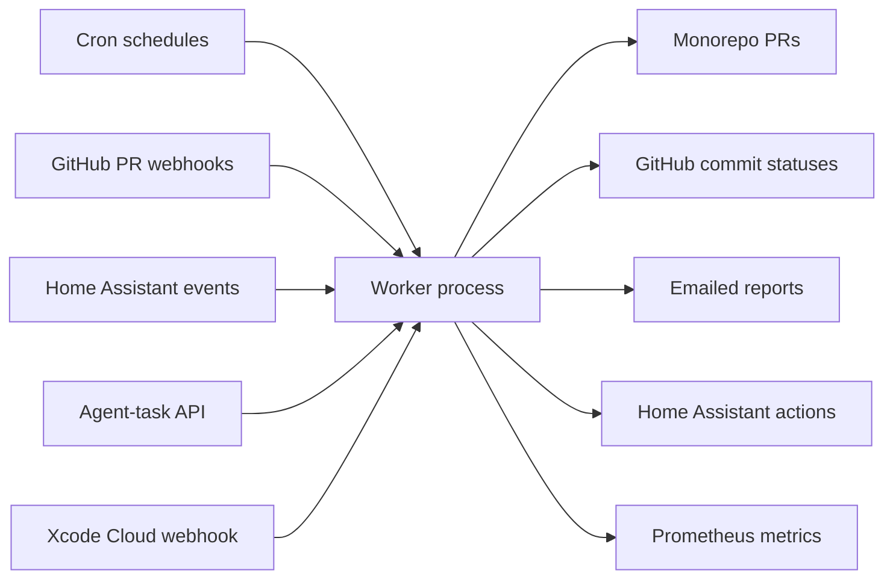

`packages/temporal` is the monorepo's automation hub: a single Bun process
running a fleet of Temporal workers on the homelab cluster. Every recurring
job, PR bot, scheduled agent, and home-automation routine executes here as a
durable workflow.

## Shape

- **Self-contained.** No other package imports it. All integration is at
  runtime: it consumes workspace libraries, clones the monorepo to open PRs,
  and receives webhooks. The rest of the repo talks to it only through its
  surfaces.
- **One process, four queues.** A single deployment (1 replica, `Recreate`)
  runs one worker per task queue — `default`, `agent-task`, `glitter-corpus`,
  `glitter-context` — all sharing one workflow bundle. Queues exist to
  isolate concurrency: long agent subprocesses and rate-limited Discord jobs
  cannot starve fast home-automation workflows.
- **Runs on the homelab.** The `temporal` namespace holds the Temporal server
  (own Postgres), the worker, and a Tailscale-gated instance of the Temporal
  Web UI — the place to inspect runs and pause schedules. All of it is deployed
  from `packages/homelab` via cdk8s + ArgoCD.
- **Batteries in the image.** The worker image bakes `gh`, `claude`, `codex`,
  `kubectl`, `talosctl`, `tofu`, and `argocd` so workflows can operate the
  homelab and run coding agents as subprocesses.

## Why Temporal

Durability is the point: workflows survive worker restarts and server
outages, retries and timeouts are declarative, and schedule catchup windows
replay missed runs after downtime. Schedules live in code and reconcile at
boot, so the system's automation inventory is reviewable in a PR instead of
accumulating as hand-created UI state.

## Surfaces

- [Scheduled automations](/temporal/schedules/) — the ~30-entry cron fleet and
  its reconciliation model.
- [Agent tasks](/temporal/agent-tasks/) — the report-only scheduled agent
  runner and its three entry points.
- [Event-driven surfaces](/temporal/events/) — GitHub PR bots, the Xcode Cloud
  webhook, and the Home Assistant event bridge.

Authoritative reference:
[`packages/temporal/AGENTS.md`](https://github.com/shepherdjerred/monorepo/blob/main/packages/temporal/AGENTS.md).
