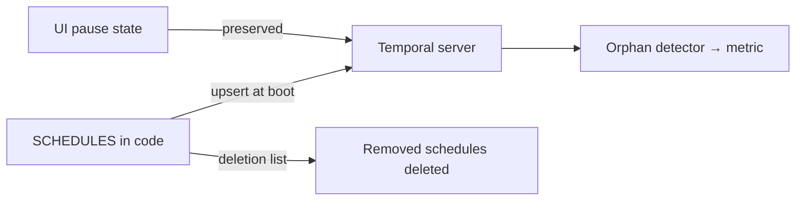

All recurring automation is a single `SCHEDULES` array in
[`register-schedules.ts`](https://github.com/shepherdjerred/monorepo/blob/main/packages/temporal/src/schedules/register-schedules.ts).
Every worker boot upserts the whole fleet — currently ~30 schedules — so the
code is the inventory and a PR is the change process.

## What runs

- **Repo upkeep, PR-creating** — regenerate an artifact, open a PR only on
  drift: cdk8s CRD imports, README project tables, the LLM pricing catalog,
  pokeemerald data tables, Scout's Data Dragon assets / season dates /
  showcase images / queue windows.
- **Homelab maintenance** — ZFS scrub, Bugsink housekeeping, S3 image GC,
  Velero orphan-snapshot audit, DNS audit, golink sync, review-signal
  collection.
- **Scheduled reports** — weekly dependency summary and the daily homelab
  audit (a report-only [agent task](/temporal/agent-tasks/)).
- **Glitter corpus** — daily Discord capture and a weekly context refresh, on
  their own rate-limited queues.
- **Home automation** — vacuum-if-nobody-home three times a day and the
  weekday/weekend good-morning sequence.

## Mechanics worth knowing

- **Wall-clock crons** in `America/Los_Angeles`; overlap policy is `SKIP`
  everywhere — a slow run never stacks a second one.
- **Pause state is runtime state.** Pausing in the Temporal UI survives
  restarts; reconciliation spreads the previous state instead of overwriting
  it. Schedules whose required environment variables are missing are
  auto-paused with a note.
- **Catchup tiers.** Most schedules replay up to an hour after a server
  outage; time-of-day home automation gets only five minutes, because a
  9 a.m. vacuum run should not fire at noon.
- **Deletion is explicit.** Removing a workflow means adding its schedule ID
  to a deletion list; boot deletes it. An orphan detector exports a metric for
  any server-side schedule that code no longer defines, so drift alerts
  instead of lingering.

## Two automation patterns

Mutating automations always land their change as a **reviewable PR**:
regenerate an artifact — or, for a couple of schedules, ask an LLM to derive
the change — then diff and open a PR under a GitHub App token, with a human
approving before anything merges. Most are fully deterministic, but the split
is not strictly LLM-free: `scout-season-refresh` runs Claude to derive season
changes, and `readme-refresh` can call Codex for a new package's summary, each
before opening its PR. Judgment-heavy checks are instead **report-only agent
tasks** that can only email their findings. The real boundary is the PR, not
the model — a schedule never mutates the repo or cluster in place. Details:
[Agent tasks](/temporal/agent-tasks/).
