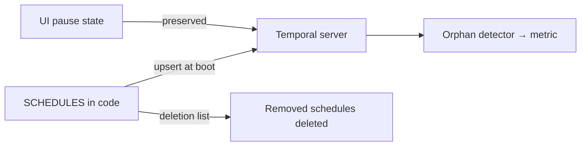

All recurring automation is a single `SCHEDULES` array in
[`register-schedules.ts`](https://github.com/shepherdjerred/monorepo/blob/main/packages/temporal/src/schedules/register-schedules.ts).
Every worker boot upserts the whole fleet — currently ~30 schedules — so the
code is the inventory and a PR is the change process.

## What runs

Each category has a deep-dive page; the
[workflow inventory](/temporal/workflows/) maps every schedule to one.

- **[Repo upkeep](/temporal/workflows/repo-upkeep/), PR-creating** —
  regenerate an artifact, open a PR only on drift: cdk8s CRD imports, README
  project tables, the LLM pricing catalog, pokeemerald data tables, plus
  [Scout's](/temporal/workflows/scout/) Data Dragon assets / season dates /
  showcase images / queue windows.
- **[Homelab maintenance](/temporal/workflows/homelab-maintenance/)** — ZFS
  scrub, Bugsink housekeeping, S3 image GC, Velero orphan-snapshot audit,
  DNS audit, golink sync, review-signal collection.
- **Scheduled reports** — weekly dependency summary and the daily homelab
  audit (a report-only [agent task](/temporal/agent-tasks/)).
- **[Glitter corpus](/temporal/workflows/glitter/)** — daily Discord capture
  and a weekly context refresh, on their own rate-limited queues.
- **[Home automation](/temporal/workflows/home-automation/)** —
  vacuum-if-nobody-home three times a day and the weekday/weekend
  good-morning sequence.

## Mechanics worth knowing

- **Wall-clock crons** in `America/Los_Angeles`; overlap policy is `SKIP`
  everywhere — a slow run never stacks a second one.
- **Pause state is runtime state.** Pausing in the Temporal UI survives
  restarts; reconciliation spreads the previous state instead of overwriting
  it. Schedules whose required environment variables are missing are
  auto-paused with a note.
- **Catchup tiers.** Most schedules replay up to an hour after a server
  outage; time-of-day home automation gets only five minutes, because a
  9 a.m. vacuum run should not fire at noon.
- **Deletion is explicit.** Removing a workflow means adding its schedule ID
  to a deletion list; boot deletes it. An orphan detector exports a metric for
  any server-side schedule that code no longer defines, so drift alerts
  instead of lingering.

## Automation patterns

Schedules fall into three groups by what they touch:

- **Repo-artifact jobs** regenerate a committed artifact and open a PR on
  drift under a GitHub App token. Most await human review, but a few
  additive-only lanes (Scout's Data Dragon refresh, queue-windows)
  `gh pr merge --auto` and land on green checks with no approving review
  required. Most are deterministic, though the split is not strictly LLM-free:
  `scout-season-refresh` runs Claude to derive season changes and
  `readme-refresh` can call Codex for a new package's summary before opening
  its PR.
- **Live-maintenance jobs** act directly on running systems, not the repo: ZFS
  scrub/trim, Bugsink event pruning, S3 image GC, and the Home Assistant
  routines all mutate live state in place, with no PR in the loop.
- **Report-only agent tasks** can only email their findings — they never write
  the repo or the cluster. Details: [Agent tasks](/temporal/agent-tasks/).

So the PR is the review boundary only for repo-artifact jobs; maintenance and
home-automation schedules are trusted to change live systems directly.
