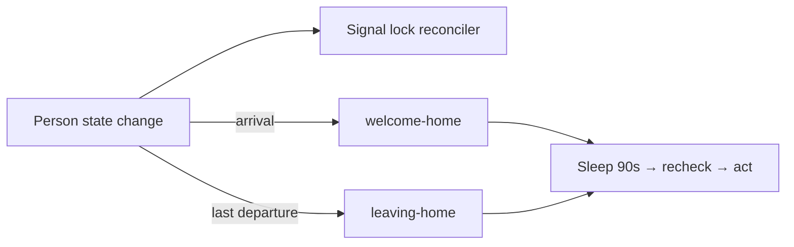

Home automation splits by trigger type: **presence edges** (arrivals and
departures) start event workflows, while **wall-clock routines** (mornings,
vacuums) are [schedules](/temporal/schedules/). The worker holds a websocket
to Home Assistant; person-state changes and the existing iOS shortcut actions
arrive as events. Parameterized sleep actions use the separate Temporal HTTP
webhook described below.

## The presence model

Presence data flaps — a phone at the edge of the home zone can report
leave/arrive several times a minute. Everything presence-driven is built
around a **90-second settle window**:

- Arrival/departure workflows get a workflow ID bucketed to a 90s window, so
  duplicate starts within a window are rejected by the server; the workflow
  body then sleeps 90s and rechecks before acting, exiting quietly if the
  transition was a blip.
- The front-door lock gets stronger treatment — see
  [reconcile-lock](#the-lock-reconciler-reconcile-lock).



## The lock reconciler (`reconcile-lock`)

The deadbolt is the one **audible** side effect in the house, so it is owned
by a single reconciler instead of edge-triggered lock/unlock workflows. Every
presence transition does a `signalWithStart` on the fixed `reconcile-lock`
workflow ID — starting a run if none is active, signalling the one already
running otherwise (`ALLOW_DUPLICATE`, so once a run settles and returns the
next edge starts a fresh run under the same ID; the invariant is one run at a
time, not one instance forever). Each signal restarts a rolling 90-second
quiet window; only when a full window passes with no new edge does it read
**live** occupancy and lock state, and it actuates only when current ≠ desired
(nobody home → locked). The predecessor design ran independent timers per edge
and could audibly unlock-then-lock on a single flap; a single in-flight
reconciler makes that impossible, and deciding from settled live state means a
stale edge can never drive a wrong actuation.

## Good morning (three schedules)

Weekday and weekend variants of three phases — **preheat** (2h15m before
wake), **wake**, and **get-up** (15 minutes later). All skip when nobody is
home. This is three schedules rather than one workflow with sleeps because
each phase fires at its own wall-clock time, is independently pausable in
the Temporal UI, and gets tight catchup semantics (a missed 06:00 preheat
should not fire at noon). Wake also re-asserts heat, so it works standalone
if preheat was paused.

- **Preheat** heats the bathroom floor only when needed — indoor ≤20°C or
  outdoor ≤15°C, with the outdoor reading from Open-Meteo because HA has no
  weather integration — and holds warmth in presence-checked 15-minute
  chunks, aborting if the house empties.
- **Wake** sends the morning notification, starts bedroom music with a
  gentle volume ramp, applies the dim scene, and unconditionally shuts the
  thermostat off after an hour — recovering even a preheat that failed to
  clean up.
- **Get-up** brightens the room and joins the bathroom speaker to the music
  group.

## Vacuum if nobody home (`run-vacuum-if-not-home`)

09:00, 12:00, and 17:00. Runs the vacuum fleet only when everyone is away.
Starts idle/docked units and then verifies they actually began cleaning —
concurrently, because sequential verification would blow the workflow
timeout. An anomalous unit state throws non-retryably rather than letting
the run misreport "all units active."

## Welcome home / leaving home

**Welcome home** (per arrival, debounced): on the first arrival to an empty
house, sends a greeting and docks any running vacuums; on every arrival,
brings up the living-room scene and, after sunset, the entry lights.
**Leaving home** (last departure): notification, all lights off with
per-light verification, and a vacuum run. Neither touches the lock — that is
the reconciler's job alone.

## Good night (`good-night`)

Triggered by an iOS shortcut, once per day. Dims the bedroom if lit and
starts the sleep playlist with a slow nine-step volume ramp. No presence
guard: an explicit user action is its own authorization.

## Parameterized sleep routines

The `sleep-music` and `sleep-ac` workflows are started by the authenticated
Temporal sleep webhook. The iOS Shortcut sends `duration_hours`; Temporal
rounds it to minutes, validates the 1–1440-minute range, and restarts the fixed
workflow ID when a new invocation arrives. Home Assistant is only the downstream
service target for the workflow activities.

- **Sleep music** defaults to 180 minutes, sets the bedroom speaker to 10%,
  plays the existing sleep favorite, and stops playback at the deadline.
- **Sleep AC** defaults to 120 minutes, sets `climate.bedroom` to 24°C in
  cooling mode, and turns it off at the deadline.
- Durations from 1–1440 rounded minutes are accepted. A Shortcut can ask for
  hours and send the value directly to Temporal; the webhook performs the
  conversion.

This keeps the long timer and device orchestration in Temporal, where the timer
survives worker restarts, while leaving only input collection in the Shortcut.

### Shortcut construction

For each routine, create a Shortcut with these actions:

1. **Ask for Input** — Number, prompt “How many hours?”
2. **Get Contents of URL** — use `POST`, the matching URL below, and add an
   `Authorization: Bearer <SleepWebhookToken>` header plus
   `Content-Type: application/json`.

```json
{
  "duration_hours": "<ShortcutInput>"
}
```

Use `https://temporal-sleep.sjer.red/sleep/music` for music. For AC, use
`https://temporal-sleep.sjer.red/sleep/ac` with the same request body:

```json
{
  "duration_hours": "<ShortcutInput>"
}
```

Name each Shortcut for its intended
Siri phrase, such as “Sleep music” or “Sleep AC”.

Sources: [`src/workflows/ha/`](https://github.com/shepherdjerred/monorepo/tree/main/packages/temporal/src/workflows/ha),
presence model in [`src/shared/presence.ts`](https://github.com/shepherdjerred/monorepo/blob/main/packages/temporal/src/shared/presence.ts),
event wiring in [`src/event-bridge/`](https://github.com/shepherdjerred/monorepo/tree/main/packages/temporal/src/event-bridge).
