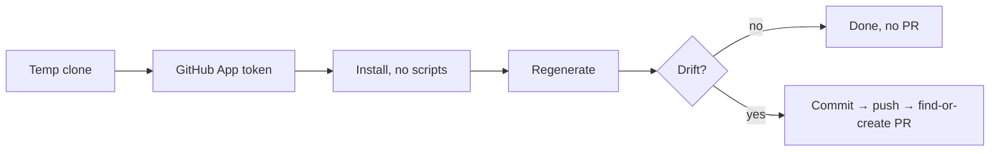

Six scheduled workflows run here, but they don't all do the same job. Four
keep committed, generated artifacts in sync with sources the repo cannot see
from CI — live cluster state, upstream pins, external catalogs — opening a PR
on drift via the shared clone-regenerate-PR pattern below. The other two are
outliers: `fetcher` only overwrites an S3 manifest (no commit, no PR), and
`deps-summary` only emails a summary. Most are pure functions of their inputs;
`deps-summary` always calls an LLM to summarize, and `readme-refresh` calls
one only when a new package needs its first summary.

## The shared pattern

Every PR-creating job here runs the same activity skeleton
([`bot-clone.ts`](https://github.com/shepherdjerred/monorepo/blob/main/packages/temporal/src/activities/bot-clone.ts)):

The details are where the reliability lives:

- **Short-lived GitHub App tokens** (9-minute JWT → installation token), so
  commits are attributed to the bot and no PAT exists to leak.
- **`bun install --frozen-lockfile --ignore-scripts`** with a per-run cache.
  `--ignore-scripts` is load-bearing: the root `prepare` script arms lefthook,
  and hook-armed commits inside the worker pod failed silently for weeks
  before this was found. A `disarmGitHooks` call right before commit defends
  the same invariant from the other side.
- **Drift = `git status --porcelain` on exact generated paths**, after a
  prettier pass so formatting noise nets to no-diff. Steady state opens
  nothing.
- **Idempotent PR creation**: push `--force-with-lease` to a job-specific
  branch, then update the existing open PR if one exists rather than
  duplicating it.
- A rehearsal canary (`scripts/rehearse-bot-clone.ts`) drives these exact
  helpers inside `bun run verify`, so a change that would break the nightly
  bots fails the PR that introduces it.

## Skill Capped manifest mirror (`fetcher`)

Daily 05:00. Reads the Better Skill Capped content-manifest URL from
Firestore and mirrors the manifest to S3. The fetch and upload happen in a
single activity because the multi-MB body cannot cross an activity boundary
(Temporal caps payloads at 2 MiB). No drift logic — it always overwrites.

## Dependency summary email (`deps-summary`)

Monday 09:00. Parses a week of `git log` over the homelab `versions.ts`
(changes keyed by their Renovate annotations), pulls GitHub release notes for
each bump, has gpt-5.6-sol summarize them, and emails the result via Postal.
Read-only: no PR, ever.

## README refresh (`readme-refresh`)

Monday 08:00. Reruns `cog` over the three project-listing READMEs. Needs a
full-history (blobless) clone because cog orders projects by first-commit
date. Per-package `_summary.md` files are cached, so steady-state runs make
no LLM calls at all. Replaced a Buildkite script that ran on every merge.

## LLM catalog refresh (`llm-catalog-refresh`)

Monday 09:00. Runs the deterministic `sync-from-upstreams.ts` script in
`packages/llm-models`, cross-checking pricing/context data against models.dev
and LiteLLM; the script's report becomes the PR body.

## Homelab CRD imports (`homelab-crd-imports`)

Daily 05:30. Regenerates the committed cdk8s CRD imports **from the live
cluster** (read-only ClusterRole). This is a schedule rather than a CI gate
because the drift source is ArgoCD syncing operator chart bumps — no repo PR
touches the generator inputs, so CI never sees the change coming.

## Pokeemerald data (`dpp-pokeemerald-data`)

Daily 04:30. Regenerates species/map tables from the pinned upstream SHA.
Exists to open the regen PR the morning after Renovate bumps the pin —
hosted Renovate cannot run generators itself.

Schedule definitions: [`register-schedules.ts`](https://github.com/shepherdjerred/monorepo/blob/main/packages/temporal/src/schedules/register-schedules.ts).
See also [Scout workflows](/temporal/workflows/scout/), which reuse this
pattern with two auto-merge twists.
