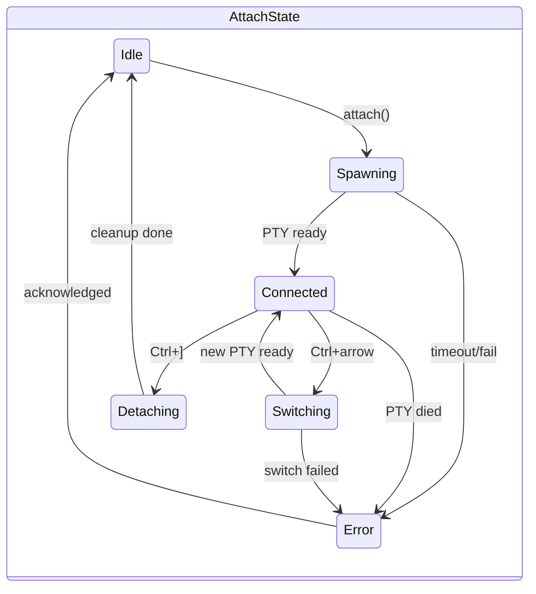

# Production-Ready Session Attachment

## Architecture




## File Structure

```javascript
src/tui/
├── mod.rs                    # Main loop (modify)
├── app.rs                    # App state (modify)
├── events.rs                 # Event handling (modify)
├── ui.rs                     # Rendering dispatch (modify)
├── pty/
│   ├── mod.rs               # PTY module exports
│   ├── session.rs           # PtySession: spawn, read, write, resize
│   ├── buffer.rs            # UTF-8 buffering for partial reads
│   └── config.rs            # Configurable timeouts, limits
├── terminal/
│   ├── mod.rs               # Terminal emulation exports
│   ├── renderer.rs          # vt100 -> ratatui conversion
│   └── mouse.rs             # Mouse event encoding/decoding
├── attach/
│   ├── mod.rs               # Attach state machine
│   ├── state.rs             # AttachState enum and transitions
│   └── controller.rs        # Orchestrates attach/detach/switch
└── components/
    ├── attached_view.rs     # Renders terminal + status bar
    └── transition.rs        # Loading/switching overlays
```


## Dependencies

```toml
# PTY
portable-pty = "0.8"

# Terminal emulation
vt100 = "0.15"

# Testing
proptest = "1.0"        # Property-based testing
insta = "1.0"           # Snapshot testing
```


## Phase 1: Core Infrastructure (Days 1-3)

### 1.1 PTY Session Management (`pty/session.rs`)

```rust
pub struct PtySession {
    child: Box<dyn portable_pty::Child>,
    reader: Box<dyn std::io::Read + Send>,
    writer: Box<dyn std::io::Write + Send>,
    size: PtySize,
}

impl PtySession {
    pub async fn spawn(cmd: Vec<String>, size: PtySize) -> Result<Self>;
    pub async fn read(&mut self, buf: &mut [u8]) -> Result<usize>;
    pub fn write(&mut self, data: &[u8]) -> Result<()>;
    pub fn resize(&mut self, size: PtySize) -> Result<()>;
    pub fn try_wait(&mut self) -> Result<Option<ExitStatus>>;
}

impl Drop for PtySession {
    // Ensure child is killed and resources freed
}
```


### 1.2 UTF-8 Buffer (`pty/buffer.rs`)

Handle partial UTF-8 sequences at read boundaries.

### 1.3 Configuration (`pty/config.rs`)

```rust
pub struct AttachConfig {
    pub detach_key: KeyCombo,           // Default: Ctrl+]
    pub switch_prev_key: KeyCombo,      // Default: Ctrl+Left
    pub switch_next_key: KeyCombo,      // Default: Ctrl+Right
    pub scrollback_lines: usize,        // Default: 10000
    pub render_fps: u32,                // Default: 60
    pub spawn_timeout: Duration,        // Default: 5s
    pub teardown_timeout: Duration,     // Default: 500ms
}
```


## Phase 2: Terminal Rendering (Days 4-5)

### 2.1 vt100 to Ratatui Renderer (`terminal/renderer.rs`)

```rust
pub fn render_terminal(
    parser: &vt100::Parser,
    frame: &mut Frame,
    area: Rect,
) {
    // Convert vt100 screen buffer to ratatui Paragraph
    // Handle: colors, bold, italic, underline, inverse
    // Handle: cursor position and visibility
}
```


### 2.2 Mouse Support (`terminal/mouse.rs`)

- Detect mouse mode from vt100 parser
- Encode mouse events in SGR format
- Forward to PTY

## Phase 3: State Machine & Control (Days 6-7)

### 3.1 Attach State (`attach/state.rs`)

```rust
pub enum AttachState {
    Idle,
    Spawning {
        session_id: String,
        started: Instant,
        cancel: CancellationToken,
    },
    Connected {
        session_id: String,
        session_index: usize,
        pty: PtySession,
        parser: vt100::Parser,
        last_ctrl_bracket: Option<Instant>, // For double-tap escape
    },
    Switching {
        from_session: String,
        to_session: String,
        old_pty: Option<PtySession>, // Being torn down
    },
    Detaching {
        session_id: String,
    },
    Error {
        message: String,
        recoverable: bool,
        acknowledged: bool,
    },
}
```


### 3.2 Controller (`attach/controller.rs`)

```rust
impl AttachController {
    pub async fn attach(&mut self, session_id: &str) -> Result<()>;
    pub async fn detach(&mut self) -> Result<()>;
    pub async fn switch_next(&mut self) -> Result<()>;
    pub async fn switch_prev(&mut self) -> Result<()>;
    pub fn handle_input(&mut self, event: KeyEvent) -> InputResult;
    pub fn handle_pty_output(&mut self, data: &[u8]);
    pub fn handle_resize(&mut self, size: PtySize);
    pub fn tick(&mut self) -> Option<StateTransition>; // Check timeouts
}
```


## Phase 4: Integration (Days 8-9)

### 4.1 Main Loop Changes (`mod.rs`)

- Dual event sources: terminal events + PTY output
- Use `tokio::select!` for concurrent handling
- Render throttling at configured FPS

### 4.2 UI Integration (`ui.rs`, `components/attached_view.rs`)

- Status bar: `[session-name] Backend | Ctrl+] detach | Ctrl+←/→ switch`
- Transition overlays for attach/switch
- Error display with dismiss action

## Phase 5: Edge Cases & Hardening (Days 10-11)

### 5.1 Timeout Handling

| Operation | Timeout | On Timeout ||-----------|---------|------------|| PTY spawn | 5s | Error state, user can retry || PTY teardown | 500ms | Force kill, continue || Session switch total | 2s | Abort switch, stay on current || API calls | 2s | Show warning, continue |

### 5.2 Double Ctrl+] Escape

```rust
fn handle_ctrl_bracket(&mut self) -> Action {
    let now = Instant::now();
    if let Some(last) = self.last_ctrl_bracket {
        if now.duration_since(last) < Duration::from_millis(500) {
            self.last_ctrl_bracket = None;
            return Action::SendLiteral(CTRL_BRACKET);
        }
    }
    self.last_ctrl_bracket = Some(now);
    Action::Detach
}
```


### 5.3 Session Disappearance

- On switch: Skip deleted sessions, wrap around
- If all sessions gone: Return to SessionList with message
- If current session dies: Show "Session ended" overlay, auto-return after 2s

## Phase 6: Testing (Days 12-13)

### 6.1 Unit Tests

| Module | Tests ||--------|-------|| `pty/buffer.rs` | Partial UTF-8, empty reads, large reads || `terminal/renderer.rs` | Colors, attributes, cursor, snapshot tests || `attach/state.rs` | All state transitions, invalid transitions rejected || `attach/controller.rs` | Input routing, timeout handling |

### 6.2 Integration Tests

```rust
#[tokio::test]
async fn test_pty_echo_roundtrip() {
    let mut session = PtySession::spawn(vec!["cat".into()], size).await?;
    session.write(b"hello\n")?;
    let mut buf = [0u8; 100];
    let n = session.read(&mut buf).await?;
    assert!(String::from_utf8_lossy(&buf[..n]).contains("hello"));
}

#[tokio::test]
async fn test_pty_resize() {
    let mut session = PtySession::spawn(vec!["bash".into(), "-c".into(), "tput cols".into()], PtySize { cols: 80, rows: 24 }).await?;
    // Read output, verify 80
    session.resize(PtySize { cols: 120, rows: 24 })?;
    // Re-run tput, verify 120
}
```


### 6.3 Stress Tests

```rust
#[tokio::test]
async fn test_rapid_output() {
    // Spawn `yes | head -10000`
    // Verify parser doesn't crash, memory bounded
}

#[tokio::test]
async fn test_rapid_switching() {
    // Create 3 sessions
    // Switch 50 times rapidly
    // Verify clean state at end
}
```


### 6.4 Property Tests

```rust
proptest! {
    #[test]
    fn vt100_never_panics(input: Vec<u8>) {
        let mut parser = vt100::Parser::new(24, 80, 0);
        parser.process(&input); // Should never panic
    }
}
```


## Phase 7: Polish & Documentation (Days 14-15)

### 7.1 Visual Polish

- Smooth attach transition (fade in)
- Session switch shows name briefly
- Error messages are actionable ("Press Enter to retry")

### 7.2 Help Overlay

When `?` pressed in attached mode:

```javascript
┌─ Attached Mode Help ─────────────────┐
│                                      │
│  Ctrl+]        Detach to session list│
│  Ctrl+] Ctrl+] Send literal Ctrl+]   │
│  Ctrl+←        Previous session      │
│  Ctrl+→        Next session          │
│                                      │
│  Press any key to dismiss            │
└──────────────────────────────────────┘
```


### 7.3 Logging

```rust
// Key events logged at DEBUG
tracing::debug!(event = "attach_started", session = %id);
tracing::debug!(event = "pty_spawned", pid = %pid);
tracing::info!(event = "attached", session = %id, backend = ?backend);
tracing::warn!(event = "pty_timeout", session = %id);
tracing::error!(event = "attach_failed", session = %id, error = %e);
```


### 7.4 User Documentation

Add to help screen and README:

- How to attach (Enter)
- How to detach (Ctrl+])
- How to switch (Ctrl+arrows)
- Troubleshooting common issues

## Success Criteria

- [ ] Attach to Zellij session, see Claude Code, interact normally
- [ ] Attach to Docker container, see shell, interact normally
- [ ] Detach with Ctrl+], return to session list
- [ ] Switch sessions with Ctrl+Left/Right
- [ ] Session dies -> graceful return to list