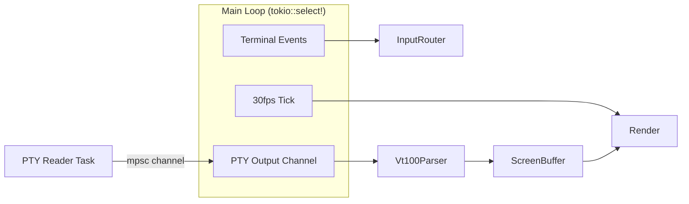

# Session Attachment - Revised Plan

## Key Changes from Previous Plan

1. **Use `pty-process` instead of `portable-pty`** - Native async support via `AsyncPtyMaster`
2. **Use session IDs (UUID) not indices** - Indices shift when sessions are deleted
3. **Incremental delivery** - MVP in 2-3 days, then polish
4. **Simplified state machine** - Skip explicit Spawning/Switching/Detaching states for v1
5. **30 FPS rendering** - Terminal content doesn't need 60 FPS
6. **300ms double-tap window** - Standard timing (vim uses this)

## Dependencies

```toml
[dependencies]
pty-process = { version = "0.4", features = ["async"] }  # Async-native PTY
vt100 = "0.15"                                            # Terminal parser
tokio-util = { version = "0.7", features = ["codec"] }   # Already in deps, need for IO

[dev-dependencies]  
proptest = "1.4"
insta = "1.0"
```


## Architecture




### PTY I/O Pattern

`pty-process` with async feature provides `Pty` which implements `AsyncRead + AsyncWrite`. This works directly with tokio:

```rust
use pty_process::Pty;
use tokio::io::{AsyncReadExt, AsyncWriteExt};

let mut pty = Pty::new()?;
pty.resize(pty_process::Size::new(rows, cols))?;
let mut cmd = pty_process::Command::new("zellij");
cmd.args(["attach", session_name]);
let mut child = cmd.spawn(&pty.pts()?)?;

// Now pty implements AsyncRead + AsyncWrite
let mut buf = [0u8; 4096];
let n = pty.read(&mut buf).await?;  // Async!
pty.write_all(b"input").await?;     // Async!
```


## Incremental Milestones

### MVP (Days 1-2): Basic Attach/Detach

**Goal:** Press Enter to attach, see terminal output, Ctrl+] to detach

- Spawn PTY with attach command
- Forward PTY output to vt100 parser
- Render vt100 screen buffer to ratatui
- Forward keyboard input to PTY
- Ctrl+] detaches back to session list
- Handle PTY exit (EOF)

**No:** Session switching, fancy transitions, error recovery, mouse support

### v1.1 (Day 3): Session Switching

**Goal:** Ctrl+Left/Right switches sessions

- Track current session by UUID (not index)
- Teardown current PTY, spawn new one
- Handle edge cases: session deleted, 0/1 sessions

### v1.2 (Days 4-5): Robustness

**Goal:** Handle all edge cases gracefully

- Spawn timeout (5s)
- Teardown timeout (500ms) with force kill
- Double Ctrl+] escape hatch (300ms window)
- Resize handling with debounce
- UTF-8 buffering for partial sequences

### v1.3 (Days 6-7): Polish

**Goal:** Production UX

- Status bar with session name and hints
- Error messages with actionable text
- Help overlay for attached mode
- Transition feedback (brief "Connecting..." overlay)

### v1.4 (Days 8-10): Testing

**Goal:** Comprehensive test coverage

- Unit tests for all components
- Integration tests with real PTY
- Property tests for parser resilience
- Manual E2E with Zellij and Docker

## File Structure (Simplified)

```javascript
src/tui/
├── mod.rs                    # Main loop with tokio::select!
├── app.rs                    # Add Attached mode, attached state
├── events.rs                 # Add attached mode input handling
├── ui.rs                     # Add attached mode rendering
├── attached/
│   ├── mod.rs               # Module exports
│   ├── pty_handle.rs        # Async PTY wrapper
│   ├── terminal_buffer.rs   # vt100 + UTF-8 buffering
│   └── renderer.rs          # vt100 screen -> ratatui
└── components/
    └── attached_view.rs     # Terminal + status bar rendering
```


## Simplified State (v1)

```rust
// In app.rs
pub enum AppMode {
    SessionList,
    CreateDialog,
    ConfirmDelete,
    Help,
    Attached,  // NEW
}

// Attached state - separate struct, not in enum
pub struct AttachedState {
    pub session_id: Uuid,           // Track by ID, not index
    pub session_name: String,       // For display
    pub pty: Pty,                   // pty_process::Pty (AsyncRead + AsyncWrite)
    pub child: Child,               // pty_process::Child
    pub parser: vt100::Parser,
    pub utf8_buffer: Vec<u8>,       // Incomplete UTF-8 sequences
    pub last_ctrl_bracket: Option<Instant>,  // For double-tap
}
```


## Raw Mode Considerations

The TUI is already in raw mode via crossterm. When attached:

1. **Keyboard:** All keys go to PTY (except Ctrl+], Ctrl+arrows) - works fine
2. **Mouse:** Currently enabled in TUI. When attached:

- Check if vt100 parser indicates mouse mode enabled by attached app
- If yes: encode mouse events and forward to PTY
- If no: ignore mouse events (or forward anyway, app ignores them)

3. **Bracketed paste:** The outer TUI may have this enabled. The inner app (zellij) also uses it.

- Solution: Don't enable bracketed paste in the TUI, let the PTY app handle it
- Or: Track state and proxy correctly (complex)

For MVP: Disable mouse forwarding, re-enable in v1.2.

## Main Loop Sketch

```rust
async fn run_main_loop(terminal: &mut Terminal<...>, app: &mut App) -> Result<()> {
    let mut last_render = Instant::now();
    let render_interval = Duration::from_millis(33); // ~30 FPS
    
    loop {
        // Render if enough time passed
        if last_render.elapsed() >= render_interval {
            terminal.draw(|f| ui::render(f, app))?;
            last_render = Instant::now();
        }

        let timeout = render_interval.saturating_sub(last_render.elapsed());
        
        tokio::select! {
            // Terminal events (keyboard, mouse, resize)
            event = poll_terminal_event(timeout) => {
                if let Some(event) = event? {
                    handle_event(app, event).await?;
                }
            }
            
            // PTY output (only when attached)
            result = read_pty_if_attached(app) => {
                if let Some(data) = result? {
                    handle_pty_output(app, &data);
                }
            }
        }

        if app.should_quit {
            break;
        }
    }
    Ok(())
}

async fn read_pty_if_attached(app: &mut App) -> Result<Option<Vec<u8>>> {
    if let Some(attached) = &mut app.attached_state {
        let mut buf = [0u8; 4096];
        match attached.pty.read(&mut buf).await {
            Ok(0) => {
                // EOF - PTY closed
                app.handle_pty_exit();
                Ok(None)
            }
            Ok(n) => Ok(Some(buf[..n].to_vec())),
            Err(e) => {
                app.handle_pty_error(e);
                Ok(None)
            }
        }
    } else {
        // Not attached, return pending future that never resolves
        std::future::pending().await
    }
}
```


## Success Criteria

- [ ] MVP: Attach with Enter, see output, type, Ctrl+] detach
- [ ] v1.1: Ctrl+Left/Right switches sessions
- [ ] v1.2: All edge cases handled, no panics