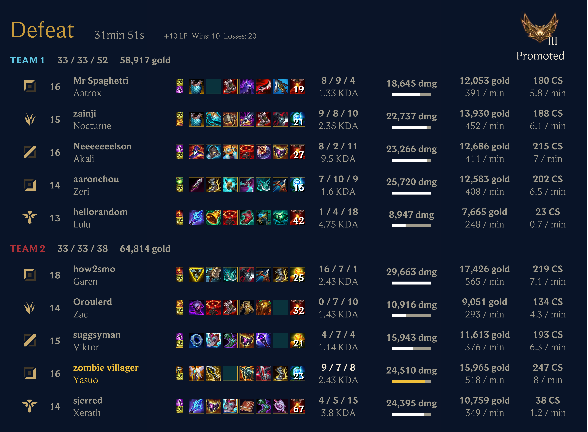

# Scout for League of Legends

A Discord bot that automatically tracks your friends' League of Legends matches, delivering notifications when games end and post-match reports with detailed statistics directly to your Discord server.



## Features

### Detailed Post-Match Reports

Automatically generated reports featuring:

- Complete performance statistics (KDA, damage, gold, CS)
- Champion portraits and item builds
- Team compositions with role indicators
- Ranked progress tracking with LP gains/losses
- Win/loss outcomes and match duration

### Competitions & Leaderboards

Create custom competitions with configurable criteria:

- **Season Support**: Align with League seasons (e.g., 2025 Split 1) or use custom dates
- **Edit Anytime**: Update competition details before they start
- **Multiple Criteria**: Most Wins, Highest Rank, Most Rank Climb, Highest Win Rate, etc.
- **Queue Filtering**: Track specific queues (Solo/Duo, Flex, Arena, ARAM) or all games
- **Leaderboards**: Automatically updated daily
- **Champion-Specific**: Create competitions for specific champions

### Arena Mode Support

Full support for League's Arena mode with detailed reports for current 18-player matches, plus legacy duo Arena reports, including:

- Complete statistics for all six teams of three with team KDA
- Augment icons showing selections throughout the match
- Final placements and performance metrics
- Optimized report layout for better readability

### League Classic Support

Scout treats League Classic as a first-class mode. Classic Rift games use
Riot's `JADE` champion IDs, pinned Classic portraits/loading art/splashes, and
the dedicated Classic loading-screen and report renderers. Normal League
matches continue to use the ordinary champion catalog and assets.

### Multi-Region Support

Track players across all League of Legends regions: NA, EUW, EUNE, KR, BR, LAN, LAS, TR, RU, OCE, JP, PH, SG, TH, TW, VN, ME.

## Getting Started

### 1. Install and configure Scout

Open the [Scout dashboard](https://scout-for-lol.com/app/), sign in with
Discord, add Scout to your server, and configure players and channels there.
The dashboard is the canonical place for setup, filters, queues, competitions,
reports, permissions, and audit history.

### 2. Try the lightweight Discord path

If you prefer to stay in Discord for a simple first test, run `/track` in the
notification channel with a Riot ID, region, and alias. `/list` shows the
current tracked players. Use the dashboard for anything beyond that happy path.

### 3. Enjoy Automatic Updates

Scout automatically checks for matches every minute and posts:

- Notifications when tracked players start matches
- Detailed reports when games end (2-5 minutes after completion)

## Lightweight Discord commands

- `/help` - Show the web-first workflow
- `/setup` - Open the recommended setup path
- `/status` - Check Scout's connection
- `/invite` - Add Scout to another server
- `/docs` - Open the documentation
- `/track` - Track one player in the current channel
- `/list` - List tracked players (read-only)
- `/scout ask` - Ask a private, saved Explore question in allowlisted servers;
  optionally post the frozen answer and chart to the channel

Continue `/scout ask` conversations in the web Explore UI. Discord questions
are one-shot and each command starts a new saved conversation.

## Technical Details

**Built With:**

- TypeScript + Bun runtime
- Discord.js for the bot framework
- Prisma (SQLite) for application state
- tRPC for the backend ↔ web-app API contract
- React + Satori + resvg for report image generation
- DuckDB for the ScoutQL report query engine
- Tauri (Rust) + React for the desktop client
- Zod for runtime validation

**Architecture:**

- Automatic match polling every minute via the Riot API (`twisted`)
- S3 (SeaweedFS) is the canonical store for raw match and prematch JSON
- A local DuckDB Parquet "report lake" derived from S3 powers ScoutQL
  scheduled/user-authored report queries
- Temporal schedules handle recurring maintenance (queue-window drift
  detection, marketing showcase refresh, image GC)
- PostHog for privacy-scoped server-side product analytics
- Docker image built and deployed from CI; beta deploys continuously and prod
  is promoted via a Renovate image-pin PR

See [AGENTS.md](AGENTS.md) for the full architecture, deploy pipeline, and
contributor/agent workflow notes.

**Project Structure:**

```text
packages/
  app/          - Vite + React SPA dashboard (scout-for-lol.com/app/)
  backend/      - Discord bot, tRPC/HTTP server, report lake, cron jobs
  data/         - Shared data models, schemas, and Data Dragon assets
  desktop/      - Tauri desktop client for live game events
  docs-site/    - User documentation site
  evals/        - Post-match review eval datasets and rating app
  frontend/     - Astro marketing site
  report/       - Match report image generation (React + Satori)
  ui/           - Shared React UI components
```

**Development:**

- `mise run check` runs typecheck, lint, format, test, knip, and
  duplication-check across all packages
- Type-safe with strict TypeScript; linting via ESLint + Prettier
- CI runs on Buildkite for every PR and on merge to main (verification,
  Playwright e2e, image build + smoke); lefthook git hooks run staged-file
  checks locally

**Environment:**
The bot requires API tokens for Discord and Riot Games. In test mode (`NODE_ENV=test`), placeholder values are used automatically—no real tokens needed for development.

## Links

- **Website**: [scout-for-lol.com](https://scout-for-lol.com)
- **Documentation**: [scout-for-lol.com/docs](https://scout-for-lol.com/docs/)
- **What's New**: [scout-for-lol.com/whatsnew](https://scout-for-lol.com/whatsnew)
- **Add to Discord**: [Install Scout](https://discord.com/oauth2/authorize?client_id=1182800769188110366&scope=bot%20applications.commands&permissions=2148352)
- **GitHub**: [monorepo package](https://github.com/shepherdjerred/monorepo/tree/main/packages/scout-for-lol)
- **Support**: [GitHub Issues](https://github.com/shepherdjerred/monorepo/issues)

## Privacy & Terms

Scout stores only the minimum data necessary to provide notifications: Riot IDs, aliases, Discord channel information, and match history for competitions. We don't collect personal information beyond what's required for the service.

See [Privacy Policy](https://scout-for-lol.com/privacy) and [Terms of Service](https://scout-for-lol.com/tos) for details.
