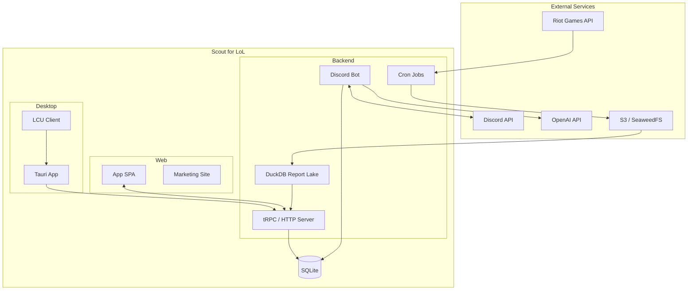

# Scout for LoL - Technical Documentation

Technical documentation for Scout for LoL, a Discord bot and desktop application that monitors League of Legends matches and generates AI-powered match reviews.

## Documentation Index

| Document                                   | Description                                               |
| ------------------------------------------ | --------------------------------------------------------- |
| [Architecture Overview](./architecture.md) | High-level system architecture and component interactions |
| [Backend Service](./backend.md)            | Discord bot, cron jobs, and API integrations              |
| [AI Review System](./ai-review-system.md)  | Match analysis and art generation pipeline                |
| [Desktop Application](./desktop.md)        | Tauri desktop client architecture                         |
| [Database Schema](./database.md)           | Prisma models and data relationships                      |

## Quick Architecture Overview



The backend polls the Riot API for tracked players, stores raw match JSON in
S3 (the canonical match store), and posts notifications and report images to
Discord. Application state (subscriptions, competitions, guilds) lives in
SQLite via Prisma. Scheduled and user-authored ScoutQL reports compile to SQL
executed by embedded DuckDB over a Parquet "report lake" derived from the S3
match objects. The web app SPA talks to the backend over tRPC; the desktop
client forwards live game events to the same backend.

## Tech Stack

| Category      | Technology                       |
| ------------- | -------------------------------- |
| Runtime       | Bun                              |
| Language      | TypeScript (strict mode)         |
| Database      | SQLite + Prisma ORM              |
| Report Lake   | DuckDB over Parquet (ScoutQL)    |
| Bot Framework | Discord.js                       |
| Web API       | tRPC                             |
| Desktop       | Tauri (Rust) + React             |
| Reports       | React + Satori + Resvg           |
| AI            | OpenAI                           |
| External APIs | Riot Games API (twisted)         |
| Storage       | S3 (SeaweedFS) — raw match store |
| Monitoring    | Prometheus + Sentry + PostHog    |

## Package Overview

```text
packages/
├── app/       # Vite + React SPA dashboard (scout-for-lol.com/app/)
├── backend/   # Discord bot, tRPC/HTTP server, report lake, cron jobs
├── data/      # Shared models, schemas, and Data Dragon assets
├── desktop/   # Tauri desktop application
├── docs-site/ # User documentation site
├── evals/     # Post-match review eval datasets and rating app
├── frontend/  # Astro marketing site
├── report/    # Match report image generation
└── ui/        # Shared React UI components
```

## Key Concepts

- **Subscription**: Links a player to a Discord channel for match notifications
- **Competition**: Team-based events with leaderboards and various win criteria
- **Match Report**: PNG image with match stats generated via Satori
- **ScoutQL Report**: Scheduled or user-authored query compiled to SQL and run on the DuckDB report lake
- **AI Review**: LLM analysis of match performance
- **Art Generation**: AI-generated artwork based on match review
