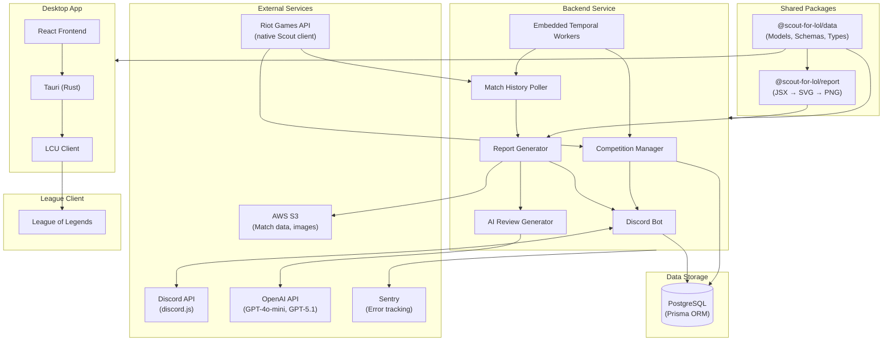
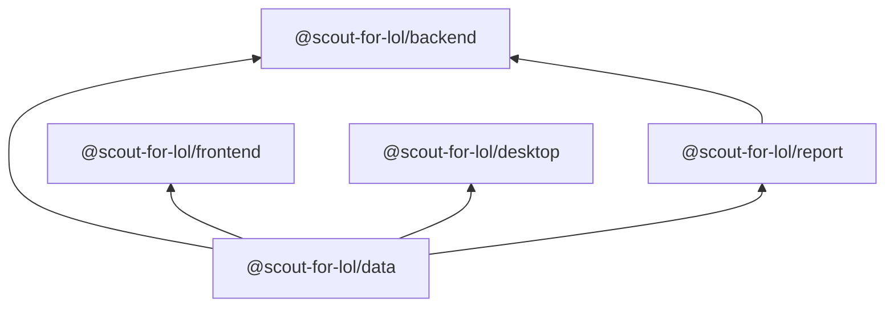
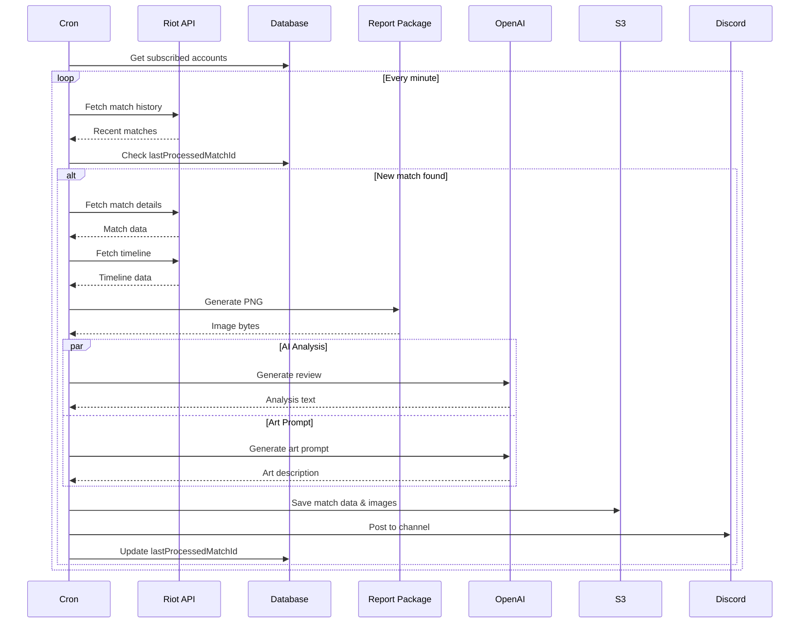
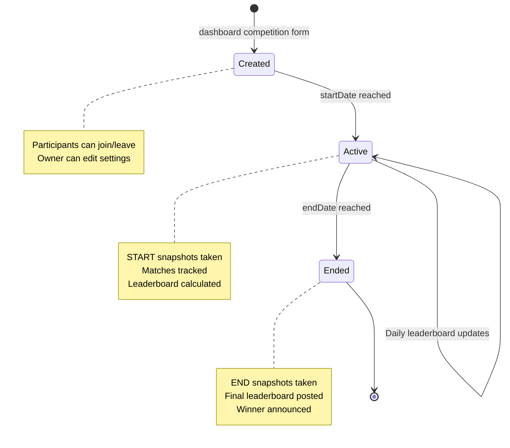
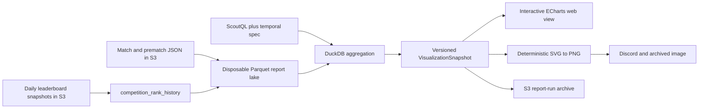
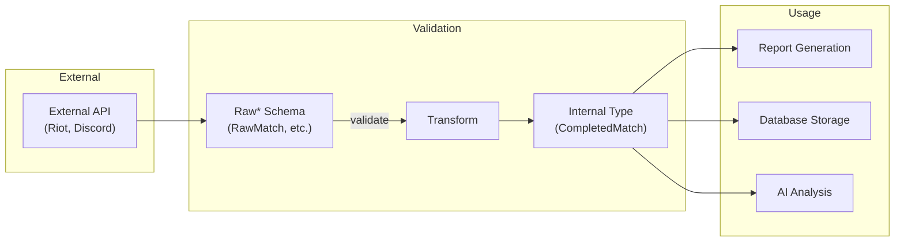
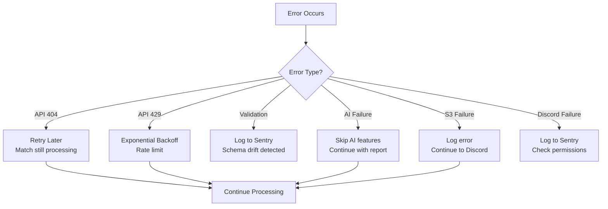
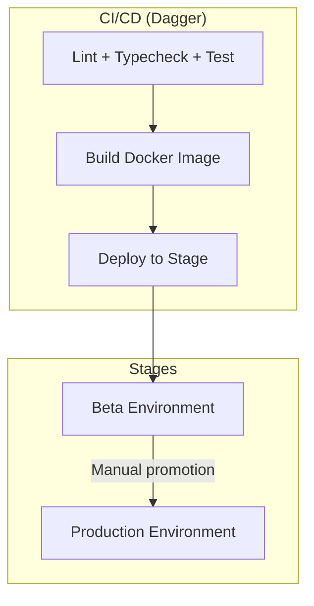

# Architecture Overview

Scout for LoL is a full-stack application built as a Bun monorepo with TypeScript. This document describes the high-level architecture and how components interact.

## System Architecture

## Package Dependency Graph

## Core Data Flow

### Match Report Generation

The primary flow from match detection to Discord notification:

### Competition Lifecycle

### Temporal Reports and Competition Analysis

ScoutQL owns reproducible report time windows. Canonical `ANALYZE`, `BUCKET BY`,
`COMPARE TO`, and `IN TIME ZONE` clauses compile to timezone-aware DuckDB
aggregations over the report lake. Report windows are capped at 365 days;
competition exploration is clamped to the competition lifespan instead.

The database stores report definitions, run metadata, permissions, and the
competition analysis timezone. S3 remains authoritative for raw match facts,
leaderboard history, and archived visualization artifacts; every Parquet lake
source can be rebuilt. Official competition standings remain competition-to-date.
Selected-period analysis recomputes the criterion without mutating that cache.

## Component Responsibilities

### Backend Service

| Component           | Responsibility                                          |
| ------------------- | ------------------------------------------------------- |
| Discord Bot         | Command handling, message posting, embed creation       |
| Match Poller        | Periodic match history checking for subscribed accounts |
| Report Generator    | Orchestrates match data → PNG report pipeline           |
| AI Review           | GPT-4o-mini match analysis, art prompt generation       |
| Competition Manager | Leaderboard calculation, snapshot management            |
| Temporal Workers    | Run durable polling, cleanup, reports, and LLM work     |

### Data Package

| Export           | Purpose                                                 |
| ---------------- | ------------------------------------------------------- |
| Zod Schemas      | Validate external API responses (RawMatch, RawTimeline) |
| Model Types      | Shared TypeScript types (Player, Match, Competition)    |
| Review Utilities | Match data curation, prompt construction                |
| Constants        | Art styles, themes, lane contexts                       |

### Report Package

| Export                    | Purpose                             |
| ------------------------- | ----------------------------------- |
| `matchToSvg()`            | Render CompletedMatch to SVG string |
| `matchToImage()`          | Render CompletedMatch to PNG bytes  |
| `arenaMatchToSvg/Image()` | Arena mode variants                 |
| `svgToPng()`              | Convert SVG string to PNG           |

### Desktop Application

| Module         | Responsibility                                  |
| -------------- | ----------------------------------------------- |
| Tauri Core     | Window management, IPC, system integration      |
| LCU Client     | Connect to League Client Update API             |
| React Frontend | User interface for monitoring and configuration |

## Validation Architecture

All external data flows through Zod validation:

## Error Handling Strategy

## Deployment Architecture

## Environment Configuration

Required environment variables by component:

| Variable                  | Component | Required               |
| ------------------------- | --------- | ---------------------- |
| `DISCORD_TOKEN`           | Backend   | Yes                    |
| `APPLICATION_ID`          | Backend   | Yes                    |
| `RIOT_API_KEY`            | Backend   | Yes                    |
| `DATABASE_URL`            | Backend   | Yes                    |
| `OPENROUTER_API_KEY`      | Backend   | No (disables AI)       |
| `BETTING_PARLAY_AI_MODEL` | Backend   | No (`gpt-5.6-sol`)     |
| `S3_BUCKET_NAME`          | Backend   | No (disables storage)  |
| `SENTRY_DSN`              | Backend   | No (disables tracking) |

### Bryan Bucks parlays

Eligible Solo/Duo and Flex prematch notifications keep the existing ten-minute
outcome market and start one separate five-minute, live/in-play parlay market.
The match-level definition is shared across guilds; stakes, house reserves,
close state, and settlement remain guild-local.

Discord delivery uses a durable `publishing` outbox state: preparation
messages have no buttons, and the recurring prematch task retries activation
after restarts. The five-minute clock begins only when persisted messages are
successfully activated.

Scout first builds an ordered shortlist of exactly 20 match-specific targets:
16 player targets distributed evenly across the tracked subjects and four
game-wide targets. Every selection is SHA-256-ranked from a versioned match seed,
so retries and parallel workers reproduce the same order regardless of source
ordering. Player eligibility combines a universal pool, a reviewed inferred-lane
pool, and Riot champion-tag pools read from the bundled Data Dragon assets.
Champion tags are coarse by design; for example, a Support-tagged champion may
receive a healing target even when its individual kit makes that line dubious.
Zero-heavy participant objective last-hits, multikills, killing sprees, true
damage, and player `timePlayed` remain evaluable for stored criteria but are not
shortlisted.

Global candidates are team win, five history-grounded team-objective counts,
and game duration. Exactly one of 16 hash buckets admits opponent-team pings;
when admitted, one of the 13 ping subtypes is selected deterministically and
occupies one global slot. The versioned generation context stores the exact 20
candidates for audit, and structured model output is rejected unless every
target is in that list and bound to its listed subject or team.

GPT-5.6 Sol then generates a versioned 2–6 leg criteria tree through OpenRouter
with medium reasoning, a 4,096-token initial output limit, a 6,144-token
truncated retry limit, and a shared 60-second deadline. It receives anonymous
lobby and recent-form context plus only the shortlist. The first pass chooses
targets and operators while covering every tracked subject; the second pass
chooses thresholds from measured history. Pricing still replays those thresholds
over the same history snapshot and is never model-authored. The model never
supplies code, paths, settlement expressions, or authoritative result prose.
Settlement evaluates only the persisted canonical tree against the final Riot
`RawMatch`; the evaluator version is unchanged because existing criteria retain
identical meaning. Remakes take precedence and refund both outcome and parlay
markets.

Neither market has a product stake cap. Positive whole-BB positions are bounded
by wallet balance, parlay house liability, and the existing Int32 persistence
domain. Parlay liability is reserved when the position is accepted; total
positions are repriced with integer-ceiling fixed odds on every top-up. Credits
also preserve Int32 headroom for every pending stake and house reserve, so a
later cancellation, remake, or stale-market refund is always representable.

Post-game presentation uses separate `BET WINNERS`, `BET LOSERS`,
`PARLAY WINNERS`, and `PARLAY LOSERS` sections. Winners show net profit and a
nonzero fee where applicable; losers show the stake actually lost. Matching,
predicted sides, house fill, pool totals, and gross-return arithmetic remain on
the pre-game close receipt and are omitted post-game. Outcome and parlay refunds
are summarized separately without listing refunded bettors. All user-facing
whole numbers use fixed comma grouping, while game duration and stored parlay
time fields render as `MM:SS` without wrapping minutes at 60.

Prompt rendering, semantic validation, catalog coverage, and evaluation run in
ordinary offline tests. Run the opt-in production prompt acceptance suite with
`bun --cwd packages/scout-for-lol/packages/backend run test:parlay:live`; it
requires `OPENROUTER_API_KEY` and fails rather than skipping when absent.

### Weekly cross-game parlays

Weekly parlays are a separate aggregate with immutable definitions, guild-local
markets and bets, match contributions, and delivery records. They do not make
match-bound parlay rows nullable. Definitions freeze an array of subjects and
each subject's Scout identity, display alias, Discord identity, and linked Riot
accounts. Runtime queries and Discord selectors accept arrays of definitions
and subjects even though the private beta creates one slot with one subject.

Generation considers linked active guild members in a stable order. It uses
only history after every frozen account had tracking coverage, retains empty
Pacific scoring windows, enforces the feature cooldown and coverage gates, and
rejects the week when no candidate yields a defensibly priced market. The model
chooses shapes from a closed catalog; deterministic threshold search jointly
replays aligned weeks and publishes only the configured empirical probability
band. The immutable definition records the proposal, selected criteria, replay
sample, measured odds, frozen context, and all model/catalog/evaluator versions.

Post-match ingestion appends idempotent definition/match/subject contribution
rows for eligible games whose completion time is inside the half-open scoring
window, including when the Monday start transition or Match-V5 ingestion is
delayed. Final settlement begins at the scoring cutoff but leaves two worst-case
polling intervals for completed games to ingest. Progress and settlement read
only persisted contributions, with the market-row guard serializing the final
append against settlement. Monotonic lower-bound legs can become irreversible;
every leg must be irreversibly true for early YES. NO, equality, upper-bound,
rate, and average outcomes remain final-only. A processing or evaluator failure
voids and refunds, while zero eligible games is an ordinary evaluated result.

One paused-by-default Temporal schedule owns the complete weekly lifecycle. Its
long-running workflow freezes the Pacific timeline, then invokes an authenticated
idempotent beta-only control endpoint for publication, reminder, scoring start,
progress, and final reconciliation. The endpoint is absent without its bearer
credential. A shared 1Password item supplies that credential to the Temporal and
Scout namespaces, with ingress and egress restricted to the core worker and beta
backend. Schedule pause is the operator suspension control; flag revocation stops
creation and stakes but never settlement or refunds.

## Next Steps

- [Backend Service](./backend.md) - Detailed backend architecture
- [AI Review System](./ai-review-system.md) - AI pipeline details
- [Desktop Application](./desktop.md) - Tauri app architecture
- [Database Schema](./database.md) - Data model documentation
