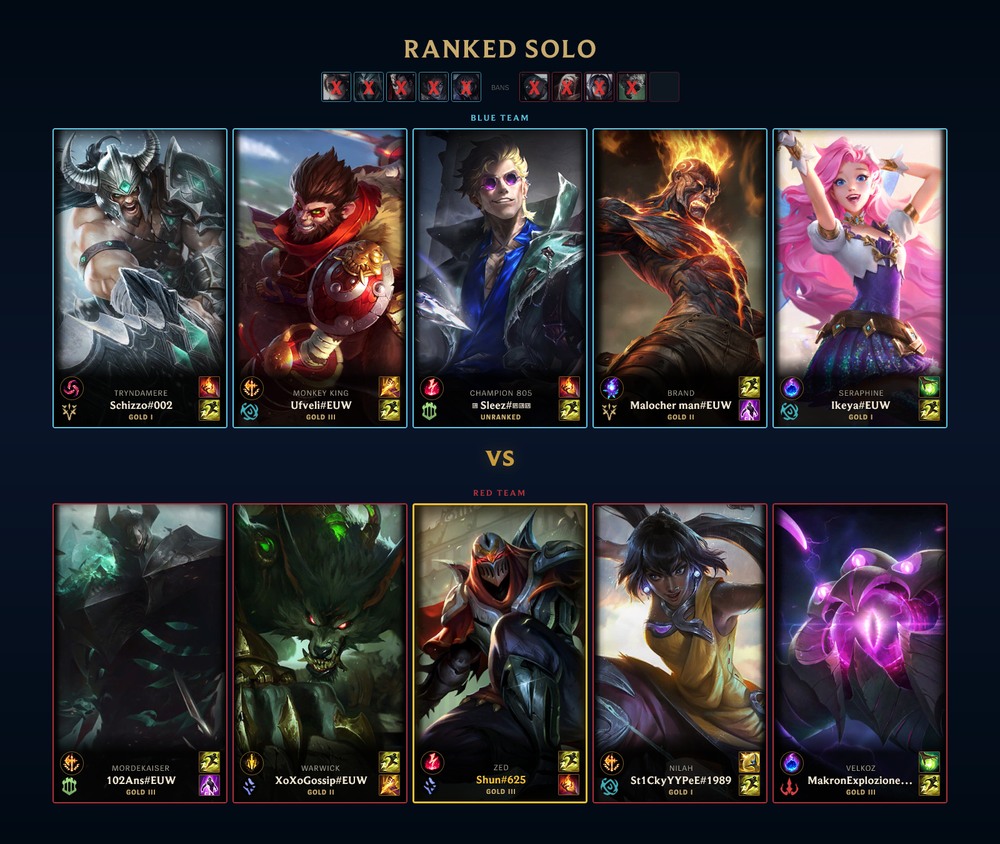
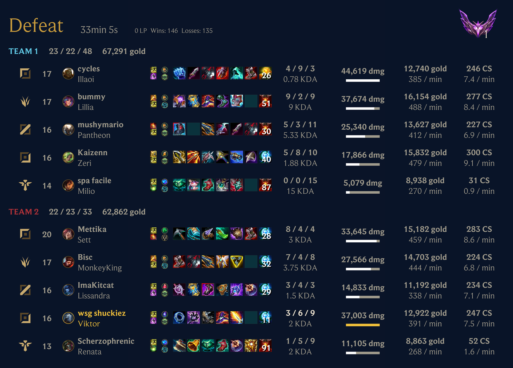

Scout has no privileged connection to League. It cannot be told when a game
starts; it has to look. Almost everything about how Scout behaves — the delays,
the two different notification types, the fact that reports trail notifications
— follows from that one constraint.

## Two loops, not one

Scout runs two independent polling loops against Riot's API.

**Pre-match** runs every 30 seconds and asks whether any tracked account is
currently in a game. When one is, Scout renders the lobby — champions, summoner
spells, and the tracked player's current rank — and posts it.

**Post-match** runs every minute and asks whether any tracked account has
finished a game it has not seen. When one has, Scout fetches the full match,
renders the scoreboard, and posts that.

The two loops are deliberately separate. Pre-match wants to be fast — a card
that arrives after the game ends is useless — while post-match is not urgent and
polls at a rate that is kinder to Riot's rate limits.

This is why the recap arrives when the **game** ends rather than when your
player's participation ends. A player who dies at twenty minutes and closes the
client still waits for their team to finish, because the match data does not
exist until then.

## Why there is a delay at all

Both numbers are the polling interval, not the latency of a push. In the worst
case a game starts a fraction of a second after a pre-match sweep, so the card
is nearly 30 seconds late; typically it is faster.

Making these intervals shorter is not free. Every tracked account in every
server is a call against a shared rate limit, so a tighter loop for one server
degrades every other server. The current intervals are a compromise between
feeling immediate and staying within what Riot allows.

Scout also tracks where each account's history stands, which is what stops a
freshly created subscription from replaying an entire back catalogue of old
games into your channel. During onboarding it snapshots and quietly imports up
to the account's 20 most recent games for Explore, reports, AI review context,
and the player profile. Matches finished before that snapshot enrich history
but never post notifications or trigger automatic post-match side effects.

The import runs only after the live post-match poll and uses a small shared Riot
API budget. Scout pauses live polling for that account until its fixed snapshot
is stored, then hands the newest snapshot match to the normal cursor. A game
that finishes during the import is therefore detected once on the next live
poll instead of being lost or replayed.

## Delivery is decided per subscription

Finding a match and delivering it are separate questions. Once a match is
detected, Scout evaluates it against every subscription for that player:

- a **muted** subscription posts nothing,
- a subscription with a **queue filter** posts only if the queue is on its
  allow-list,
- a subscription with no filter posts everything.

That is how one player's ranked games reach one channel and their ARAM games
reach another, from a single detection.

The allow-list has a consequence worth knowing: a queue Scout does not yet
recognize is not on any allow-list, so filtered subscriptions skip brand-new
game modes until the mapping is added, while unfiltered ones post them
immediately. The alternative — treating unknown queues as matching every filter
— would mean a "ranked only" channel suddenly posting a new limited-time mode,
which is worse.

## Reports read a different store

Notifications work from live API responses. Reports do not.

Every match Scout ingests is also written into a local analytical store, and
reports query that store rather than replaying Riot's API. This is what makes a
query over 30 days of a server's history return in a moment instead of costing
thousands of API calls.

Freshly ingested matches are staged for reads immediately, folded into Parquet
every 15 minutes, and rebuilt nightly from the raw match data Scout keeps. The
rebuild exists so the store can be treated as disposable — derived data that
can always be reconstructed from the raw JSON, which is the real source of
truth. Initial history waits for a fold before it is marked ready so the new
guild identity mapping and its matches become visible together.

The visible consequence: a newly tracked account's imported history may fill in
over several minutes. Normal live matches can be queried from staging as soon
as ingest succeeds.

## Competitions sit in between

Competition standings are recomputed from the same match data, on a
fifteen-minute lifecycle check that also starts competitions, posts interim
standings, and closes them when their window ends.

Competition status is derived from dates rather than stored, which is why fixing
a wrong end date immediately fixes whether the competition is running — there is
no stored state to repair.

## What this means in practice

- Under two minutes without a notification is normal; do not start debugging
  yet.
- A recap that never arrives after a game genuinely ended is a delivery problem
  — mute, filter, or channel permissions — not a detection problem. See
  [Diagnose a missing notification](/docs/how-to/troubleshoot-notifications/).
- A newly tracked account can take a few minutes to populate historical reports.

## Related

- [How players, accounts, and subscriptions
  relate](/docs/explanation/players-accounts-subscriptions/)
- [Schedules and limits](/docs/reference/schedules-and-limits/)
