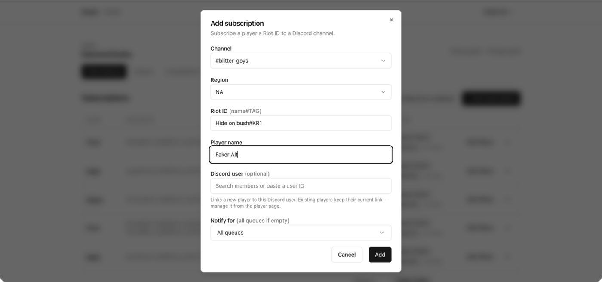
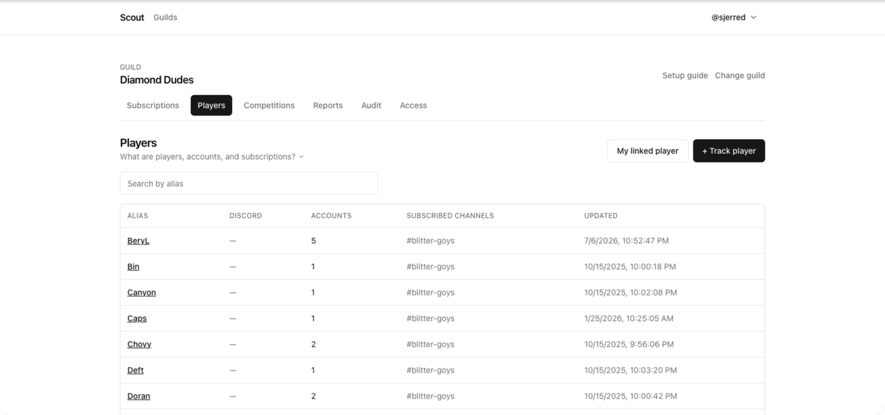

## Add a player from Discord

Run this in the channel that should receive the notifications:

```text
/track riot-id: <name#TAG> region: <region> alias: <short name>
```

`/track` is a single happy path: one account, one channel, no filters. It
creates the player if the alias is new and attaches the Riot account to it.

Use it when you want a player tracked in the channel you are already standing
in. For anything else, use the dashboard.

## Add a player from the dashboard

1. Open **Players** and choose **+ Track player**.
2. Pick the **Channel** the player's matches should post to.
3. Pick the **Region**, enter the **Riot ID** (`name#TAG`), and set a **Player
   name**.
4. Optionally link a **Discord user**, and optionally restrict **Notify for** to
   specific queues.



The whole flow, end to end:


The Discord link applies only when the player is **new** — an existing player
keeps its current link, which you change from the player page instead.

The player name is the alias your server sees — in notifications, leaderboards, report
rows, and competition standings. Pick something people will recognize, not the
in-game name, which can change.

## Put several accounts under one alias

A player who has a main and a smurf should be **one** player with two accounts,
not two players. That way their games aggregate into one leaderboard row.

1. Open **Players** and choose the player.
2. In the accounts section, choose **Add account**.
3. Enter the second Riot ID and its region.



Both accounts now feed the same alias. Any subscription for that player covers
matches on either account.

## Move an account to a different player

If an account ended up on the wrong alias:

1. Open the player that currently holds it.
2. Find the account and choose **Transfer**.
3. Pick the player it should belong to.

The account's match history moves with it — you do not lose past games.

## Rename a player

1. Open the player and choose **Rename**.
2. Enter the new alias.

The alias changes everywhere it is displayed. Existing subscriptions,
competition entries, and report history keep pointing at the same player.

## Remove a player or an account

- To stop following one League account but keep the player, open the player and
  choose **Delete** on that account.
- To remove the player entirely, choose **Delete** on the player itself. This
  removes their subscriptions too.

Removing a player does not remove past notifications from your channels — those
are ordinary Discord messages.

## When you cannot add any more

Scout enforces a per-server ceiling on tracked players and on Riot accounts.
When you are within five slots of either ceiling, Scout warns you as you add;
at the ceiling it refuses and tells you the current count.

Free space by deleting players or accounts you no longer follow. See
[Schedules and limits](/docs/reference/schedules-and-limits/) for what is
capped.

## Related

- [Link a player to their Discord account](/docs/how-to/link-discord-users/) so
  reports can `@mention` them.
- [Merge duplicate players](/docs/how-to/fix-duplicate-players/) if the same
  person was added twice.
- [How players, accounts, and subscriptions
  relate](/docs/explanation/players-accounts-subscriptions/).
