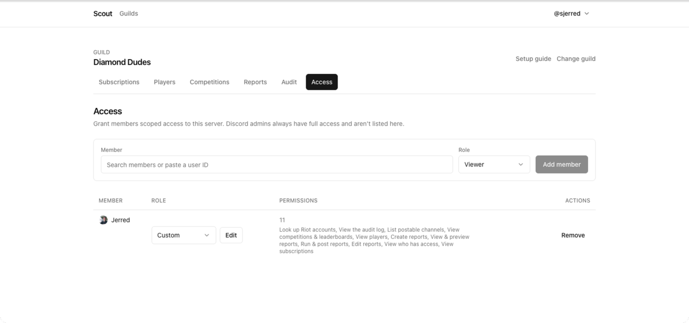

By default, only Discord administrators and the server owner can manage Scout.
Granting Scout access lets you hand out configuration rights **without** handing
out Discord Administrator.

You need the **Roles & access** grant permission to do this — Discord admins
have it inherently.

## Grant access with a role preset

1. Open **Access**.
2. Search for the member, or paste their user ID.
3. Choose a role:
   - **Viewer** — read-only across the dashboard.
   - **Manager** — full day-to-day management, but cannot change who has access.
   - **Admin** — everything, including granting and revoking access.
4. Save.

**Manager** is the right default for someone helping you run the server. It
covers players, subscriptions, competitions, reports, and the audit log, while
keeping the ability to hand out access with you.

## Grant individual permissions instead

Roles are presets, not containers — a grant is stored as one row per permission.
So you can pick scopes by hand when no preset fits.

Grant exactly what the job needs:

- Someone who only runs the weekly report → `reports: read`, `reports: run`.
- Someone who curates the roster → `players` and `accounts` actions, plus
  `subscriptions: read`.
- Someone auditing → `audit: read`.

A hand-picked set shows as **Custom** rather than a role name, with the
individual permissions listed beside it. Every resource
and action is listed in the [permission
reference](/docs/reference/permissions/).

## You cannot grant what you do not have

Scout refuses to let you delegate a permission you do not hold yourself. A
Manager cannot promote anyone to Admin, and cannot grant the roles permission
they lack.

This is what stops access from quietly escalating through the people you
delegate to.

## Check who currently has access

**Access** lists everyone with a grant and what they hold. Review it when
someone changes role in the server, and when a project ends.

:::caution
**Access lists explicit Scout grants only.** Discord administrators and the
server owner already have full access without a grant, and they are deliberately
_not_ shown on this page. Treating it as a complete list of who can change
things will miss them — check the server's Discord roles as well.

Their access comes from Discord, so removing it means changing their Discord
permissions, not their Scout grant.
:::

## Revoke access

1. Open **Access**.
2. Find the person and revoke the role or the individual permissions.

Revocation takes effect on their next request. Anything they created — players,
reports, competitions — stays.

## See what someone did

Open **Audit**. Grants themselves are recorded with the actor, as are the
player, account, and subscription changes someone makes with them.

Competition and report changes are not recorded yet, so the log does not show
who created, edited, or cancelled those. Weigh that when handing out
`competitions` and `reports` permissions.

## Related

- [Permission reference](/docs/reference/permissions/) — every resource and
  action.
- [About Scout's access model](/docs/explanation/access-model/) — why it works
  this way.
