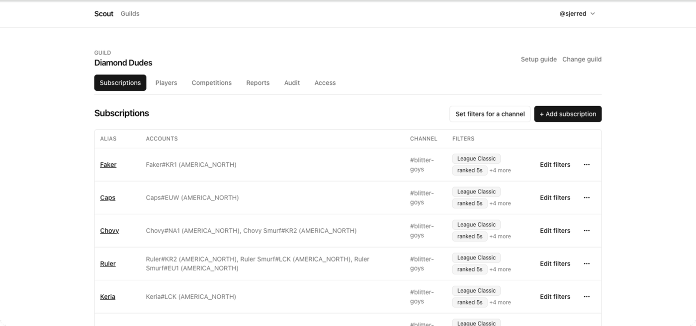
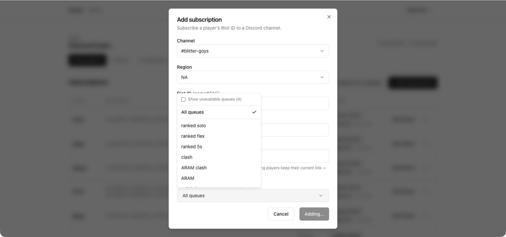

A **subscription** is one player posting into one channel. A player can have
several, each with its own queue filter and mute state — which is how you get
ranked games in one channel and ARAM in another.

## Post one player into an extra channel

1. Open **Subscriptions**.
2. Find the player's row and choose **Add channel**.
3. Pick the channel.

The player now posts to both. The two subscriptions are independent: filtering
or muting one leaves the other alone.

## Restrict a channel to certain queues

By default a subscription posts every queue Scout recognizes.

1. Open **Subscriptions** and choose **Edit filters** on the row you want to
   restrict.
2. Tick the queues that channel should receive.
3. Save.

To apply the same filter to every subscription in one channel at once, use
**Set filters for a channel** at the top of the page instead. You can also set
the filter up front when adding a subscription, under **Notify for**.

The filter is an allow-list: a match posts only if its queue is ticked. Ticking
nothing at all means _no filter_ — every queue posts — which is why the summary
reads **All queues** rather than showing an empty list.

Limited-time queues that are not currently live are hidden from the picker.
Tick **Show unavailable queues** to see and select them ahead of time.

:::caution
A queue filter drops matches whose queue Scout does not yet recognize. When Riot
introduces a brand-new queue, subscriptions with a queue filter will not post it
until the queue is added to Scout, while unfiltered subscriptions post it
immediately. If a new game mode is missing from one channel but arriving in
another, this is why.
:::

## Split ranked and ARAM into separate channels

1. Add a second channel to the player, as above.
2. On the first subscription, filter to `solo` and `flex`.
3. On the second, filter to `aram`.

Each channel now receives only what it asked for.

## Move a subscription to a different channel

1. Open **Subscriptions** and choose **Move** on the row.
2. Pick the destination channel.

Filters and mute state travel with it. Use this rather than delete-and-recreate,
which loses both.

## Mute without deleting

Choose **Mute** on a subscription to stop it posting while keeping the
subscription, its filters, and its history. Choose it again to unmute.

Mute when someone is on a break, or when a channel is being used for something
else that week. Delete only when you genuinely want the subscription gone.

## Remove a subscription

Choose **Remove** on the row. The player stays; only the delivery to that
channel goes away. To remove the player entirely, see [Add and organize tracked
players](/docs/how-to/add-players/).

## If a channel stops receiving anything

Check, in order:

1. The subscription is not muted.
2. Its queue filter actually includes the queue being played.
3. Scout can **View Channel**, **Send Messages**, **Embed Links**, and **Attach
   Files** in that channel.

Full procedure: [Diagnose a missing
notification](/docs/how-to/troubleshoot-notifications/).

## Related

- [Queue types](/docs/reference/queues-and-regions/) — every value the filter
  picker can contain.
- [How Scout finds and reports matches](/docs/explanation/how-scout-works/).
