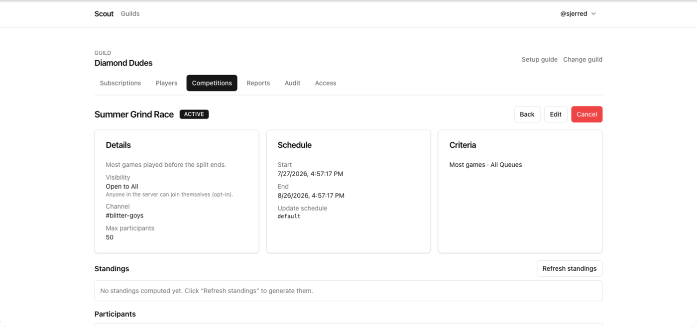

A competition ranks tracked players against each other over a window, posts
updates to a channel while it runs, and announces final standings when it ends.
Scout starts and ends it on its own from the dates you set.

## Choose criteria that measure what you mean

Criteria decide what "winning" is. Picking the wrong one produces a leaderboard
nobody trusts.

- **Most games played** — rewards volume. Good for a server-wide activity push,
  bad if you want to reward playing well.
- **Highest rank** — peak rank reached across Solo/Duo, Flex, or Ranked 5s.
  Choose **Best selected rank** for one winning ladder or **Combined ranks** to
  add the selected ladders' normalized points.
- **Most rank climb** — LP gained across Solo/Duo, Flex, or Ranked 5s. Choose
  the best complete ladder climb or add every complete selected-ladder change.
- **Most wins** — wins in a queue you choose.
- **Most wins on a champion** — wins on one specific champion, optionally
  restricted to a queue. The basis of one-trick challenges.
- **Highest win rate** — needs a minimum game count, which defaults to 10. Never
  run this without a sensible floor or someone wins on a 1-0 record.

Every criteria type and the queues each accepts are listed in the [competition
reference](/docs/reference/competitions/).

Choose **Modern League** or **League Classic** before choosing queues. Modern
and Classic matches never mix. Classic has its own champion catalog and cannot
use rank criteria because Scout has no Classic ladder. Choose **All queues** by
itself, or select any number of compatible queues. Limited-time queues remain
available and are labeled when they are not live.

## Control who takes part

Set **Visibility** when you create it:

- **SERVER_WIDE** — Scout ignores manual selection and enrolls eligible tracked
  players up to the cap.
- **OPEN** — choose any initial tracked players; they become `JOINED`
  immediately, and managers can add more later.
- **INVITE_ONLY** — choose the managed roster up front. Use it for a subset,
  like one team.

Initial selections for `OPEN` and `INVITE_ONLY` are created atomically with the
competition. A duplicate, cross-server, or over-cap selection rejects the whole
request. Participant management after creation still exposes `INVITED` and
`LEFT`; Scout has no member-facing invitation acceptance flow.

You can also cap the field with **Max participants**.

## Set the window

Choose either:

- **Fixed dates** — an explicit start and end.
- **Season** — the competition follows a League season's boundaries.

Use a season for a climb race that should end when the season does; use fixed
dates for anything shorter. A season changes only the dates. Game version and
queues decide which matches count. Fixed dates mean local day start through
local day end in the **Competition timezone**, including on daylight-saving
transitions.

## Configure leaderboard updates

Start and final announcements are mandatory. **Post leaderboard updates**
controls only the standings posted while the competition is active. New competitions
default to daily at 9:00 AM in your browser's timezone; you can disable them,
choose a preset cadence, enter a custom at-most-daily cron expression, and save a
separate schedule timezone.

Selecting initial entrants requires `competitions:invite`. Enabling or
customizing leaderboard delivery requires `competitions:schedule`.

## Let the lifecycle drive it

Scout checks competitions every fifteen minutes and, from that check:

- announces the start when the start date arrives,
- posts final standings and closes it when the end date passes.

The Temporal-owned minute dispatcher selects only enabled, active competitions
whose next fire is due. It advances the next fire after both successful and
failed Discord attempts so one broken channel is not retried every minute.

Status is derived from the dates rather than stored, so correcting a date
immediately corrects whether the competition is upcoming, running, or finished.

## Adjust a running competition

Before the competition starts, **Edit** can change its complete setup. Once it
is active, criteria and dates are locked because changing them would invalidate
snapshots and lifecycle timing. You can still change the title, description,
channel, analysis timezone, and increase the participant cap. Cancel and start
a clean competition if the active scoring model is wrong.



## Force a leaderboard refresh

If standings look stale after games that should have counted, choose **Refresh
standings** on the competition page rather than waiting for the next
fifteen-minute pass.

If the games are missing entirely rather than just late, the problem is
upstream: see [Diagnose a missing
notification](/docs/how-to/troubleshoot-notifications/).

## Cancel one

Open the competition and choose **Cancel**. It stops accruing and stops posting
updates. Cancel rather than delete when you want the record of it to remain.

## Build a leaderboard the criteria cannot express

The built-in criteria are deliberately a short list. For anything else — damage,
vision, CS per minute, teammate groups, champion-specific splits — write a
report instead:

```scoutql
SELECT COUNT(*) AS games, AVG(win::INT) AS win_rate, kda() AS kda
FROM match_participants
WHERE queue = 'solo'
  AND game_creation_at >= CURRENT_TIMESTAMP - INTERVAL 30 DAY
GROUP BY player
HAVING games >= 10
ORDER BY kda DESC
RENDER leaderboard
```

`HAVING games >= 10` is the floor that stops a 1–0 record winning; it is the
same guard the built-in "highest win rate" criteria applies for you.

See [Build your first scheduled report](/docs/tutorials/first-report/).

## Related

- [Competition reference](/docs/reference/competitions/)
- [Run your first competition](/docs/tutorials/first-competition/)
