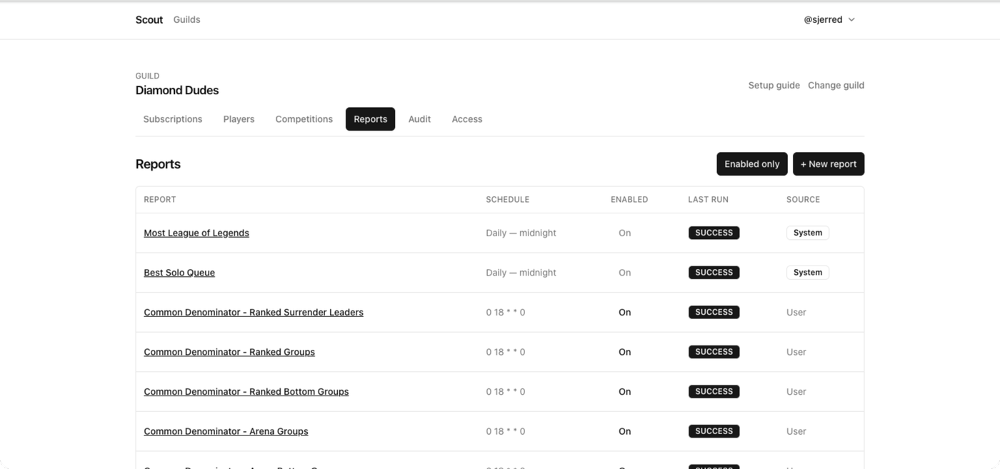

A report is a saved ScoutQL query plus a destination channel and a schedule.
Scout checks for due reports every minute and posts the ones whose time has
come.

## Put a report on a schedule

1. Open **Reports** and create or edit a report.
2. Under **Schedule**, pick a preset:
   - Daily — midnight, 9am, or noon
   - Weekly — Sunday or Monday midnight
   - Monthly — 1st at midnight
3. Set the **timezone**.
4. Save.

The panel previews the next few fire times. Read it before saving — it is the
fastest way to catch a schedule that does not mean what you thought.

## Set the timezone deliberately

A schedule fires in **its own timezone**, not UTC and not the reader's. The
field defaults to the timezone of whichever browser created the report, which is
not necessarily where your members are.

For a server that is mostly in one place, set the report's timezone to that
place so "daily at 9am" means 9am to the people reading it.

## Use a custom schedule

Choose **Custom cron** and enter a standard five-field cron expression. Invalid
expressions are rejected when you save.

Examples:

- `0 20 * * 5` — Fridays at 20:00.
- `0 9 * * 1-5` — weekdays at 09:00.
- `30 22 1 * *` — the 1st of each month at 22:30.

## Run a report on demand

Open the report and choose **Run now**.

Scout executes it immediately and posts to the destination channel exactly as
the schedule would. Manual runs do not shift the schedule — the next scheduled
fire stays where it was.

Use this to sanity-check a new report rather than waiting a week to discover the
query returns nothing.

The list also has an **Enabled only** toggle, and a **Source** column marking
reports Scout manages itself (for example a competition's own leaderboard)
apart from the ones people wrote.

## Read the run history

Each report keeps a history of its runs, recording:

- whether the run was **scheduled** or **manual**,
- its status, when it started, and how long it took,
- how many rows it returned.

A run that succeeds with zero rows means the query is valid but nothing matched
— usually a lookback window that is too short, a queue filter that excludes
everything, or a `HAVING` floor set too high.

## Pause a report

Toggle the report to disabled instead of deleting it. It stops firing and keeps
its query, schedule, and history. Re-enable it when you want it back.

## Change where it posts

Edit the report and choose a different **Channel**. Confirm Scout can post there
— reports render as image attachments, so the channel needs **Attach Files** as
well as **Send Messages**.

## Keep report volume sane

Every scheduled report is a message in someone's feed. A server with fifteen
daily reports gets muted.

- Prefer weekly over daily for anything that is not genuinely daily news.
- Set `mentions = 0` on frequent leaderboards so they stop pinging people. See
  [Link players to their Discord accounts](/docs/how-to/link-discord-users/).
- Post reports to their own channel rather than into general chat.

Scout also caps how many reports a server can have, and how many any one person
can own within it. See [Schedules and
limits](/docs/reference/schedules-and-limits/).

## Related

- [ScoutQL reference](/docs/reference/scoutql/)
- [Turn a report into a chart](/docs/how-to/chart-reports/)
