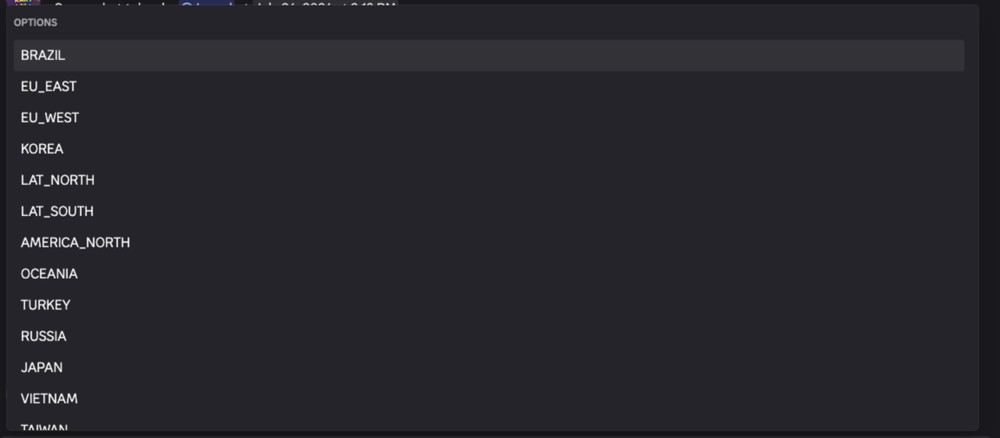
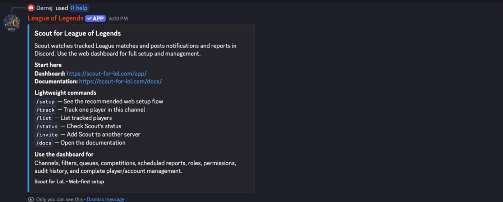

Scout registers seven global slash commands. Every reply is **ephemeral** —
visible only to the person who ran the command. Match notifications and reports
are posted by Scout separately and are visible to the channel.

## Command summary

| Command   | Description                                     | Options         |
| --------- | ----------------------------------------------- | --------------- |
| `/help`   | Get help and view Scout's lightweight commands  | none            |
| `/setup`  | See the recommended Scout setup flow            | none            |
| `/status` | Check Scout's connection status                 | none            |
| `/invite` | Add Scout to another Discord server             | none            |
| `/docs`   | Open Scout's documentation                      | none            |
| `/track`  | Track one League player in this Discord channel | 3, all required |
| `/list`   | List the players Scout tracks for this server   | none            |

## `/track`

Creates a player, a Riot account, and a subscription posting to **the channel
the command was run in**.

| Option    | Type   | Required | Description                                                     |
| --------- | ------ | -------- | --------------------------------------------------------------- |
| `riot-id` | string | yes      | Riot ID including the tag, for example `Faker#KR1`              |
| `region`  | choice | yes      | League region, picked from a dropdown of every supported region |
| `alias`   | string | yes      | Short display name for the player, 1–100 characters             |

Requires the Discord **Administrator** permission, like the `/subscription add`
command it replaces — tracking a player consumes the server's quotas and creates
recurring posts in a channel.

The new subscription is created with **no queue filter**, so it posts every
queue. It cannot set filters, additional channels, or a Discord link; use the
dashboard for those.

Must be run inside a server. Region values are listed in [Queues and
regions](/docs/reference/queues-and-regions/).

### Replies

| Situation                                        | Reply                                                      |
| ------------------------------------------------ | ---------------------------------------------------------- |
| Created                                          | Confirms the alias is now tracked in this channel          |
| Riot account already tracked under another alias | Names the existing alias and how many channels it posts to |
| Already tracked in this channel                  | Says so and links the dashboard                            |
| Server subscription limit reached                | Reports current count and maximum                          |
| Server account limit reached                     | Reports current count and maximum                          |
| Riot ID not found                                | Reports that the Riot ID could not be resolved             |

## `/list`

Returns an embed titled **Scout tracked players**, with one field per
subscription showing the player alias and its destination channel.

Shows at most **25** subscriptions. When more exist, the embed footer says so
and directs you to the dashboard.

Must be run inside a server.

## `/status`

Reports that Scout is online, names the current server, and gives the Discord
gateway latency in milliseconds.

## `/help`

An embed containing the dashboard URL, the documentation URL, the command list,
and a summary of what the dashboard is for.

## `/setup`, `/invite`, `/docs`

Link-only commands:

- `/setup` — the dashboard URL and the recommended setup order.
- `/invite` — an install URL for adding Scout to another server.
- `/docs` — the documentation URL for the stage you are on. On beta this points
  at the beta documentation, not production.

## What is deliberately not a command

Filters, additional channels, queue selection, mute, competitions, reports,
roles, permissions, audit history, merges, transfers, and Discord links are
dashboard-only. See [Why Scout is web-first](/docs/explanation/web-first/).

## Related

- [Dashboard reference](/docs/reference/dashboard/)
- [Add and organize tracked players](/docs/how-to/add-players/)
