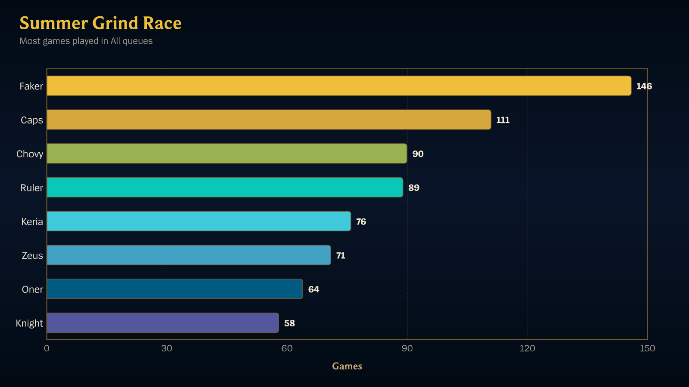

In this tutorial you will create a competition that ranks your tracked players
by how many games they play over a fixed window, add participants to it, and see
the leaderboard Scout posts automatically. You will meet competition
**criteria**, **visibility**, and the **lifecycle** that starts and ends a
competition without anyone pressing a button.

Before you start you need at least two tracked players in your server — if you
do not have them yet, work through [Get your first match
notification](/docs/tutorials/first-notification/) first and track a second
player the same way.

## What you will end up with

A leaderboard that posts itself to your announcement channel:

## 1. Open the competitions section

Go to the [Scout dashboard](/app/), choose your server, and open the
**Competitions** tab. Choose **New competition**.

## 2. Start from a preset

The form offers presets. Choose **Most games — 2-month sprint**.

The preset fills in a title, a description, `MOST_GAMES_PLAYED` criteria across
every queue, and a start and end date sixty days apart. You are going to change
the dates so you do not have to wait two months to see anything.

## 3. Set a short window

Set **Start date** to today and **End date** to three days from now.

A short window is deliberate here: the competition lifecycle only announces a
start and an end when those moments actually arrive, and you want to see that
happen rather than read about it.

## 4. Choose the announcement channel

Pick the channel the leaderboard should post to under **Announcement channel**.
Use the same channel you used for match notifications so everything is in one
place.

## 5. Set visibility

Set **Visibility** to **SERVER_WIDE**.

Scout has three visibilities:

- `SERVER_WIDE` — every tracked player in the server is a participant.
- `OPEN` — marked open to the server, but participants are still added by an
  admin; there is no self-service join yet.
- `INVITE_ONLY` — only people you invite are participants.

`SERVER_WIDE` is the one that needs no further work, which is what you want for
a first run.

## 6. Create it

Choose **Create**. The competition appears in the list with a status derived
from its dates — with a start date of today, it is already running.

## 7. Look at the leaderboard

Open the competition. The detail page shows the participants and the standings.

Standings are computed on request, not continuously. A competition you just
created has none yet, so choose **Refresh standings** to build them from the
same match data that produces your notifications. Refreshing needs the
`competitions:refresh` permission, which a server administrator already has.

Standings are not frozen at creation either: as tracked players finish games,
choose **Refresh standings** again to see the rows move.

## 8. Let the lifecycle run

Scout checks competition lifecycle every fifteen minutes. When your end date
arrives, it closes the competition and posts the final standings to the
announcement channel you chose — nobody has to remember to do it.

Interim standings are not posted automatically today, so open the competition
page and refresh it while the competition runs — or build a [scheduled
report](/docs/tutorials/first-report/) if you want the race in the channel.

## What you did

You created a fixed-window competition from a preset, made every tracked player
a participant with one visibility setting, and handed the announcements to
Scout's lifecycle.

From here:

- Change criteria, invite specific people, or cancel a running competition with
  [Run and manage competitions](/docs/how-to/run-competitions/).
- See every criteria type and queue value in the [competition
  reference](/docs/reference/competitions/).
- Build a custom leaderboard that is not one of the built-in criteria with
  [Build your first scheduled report](/docs/tutorials/first-report/).
