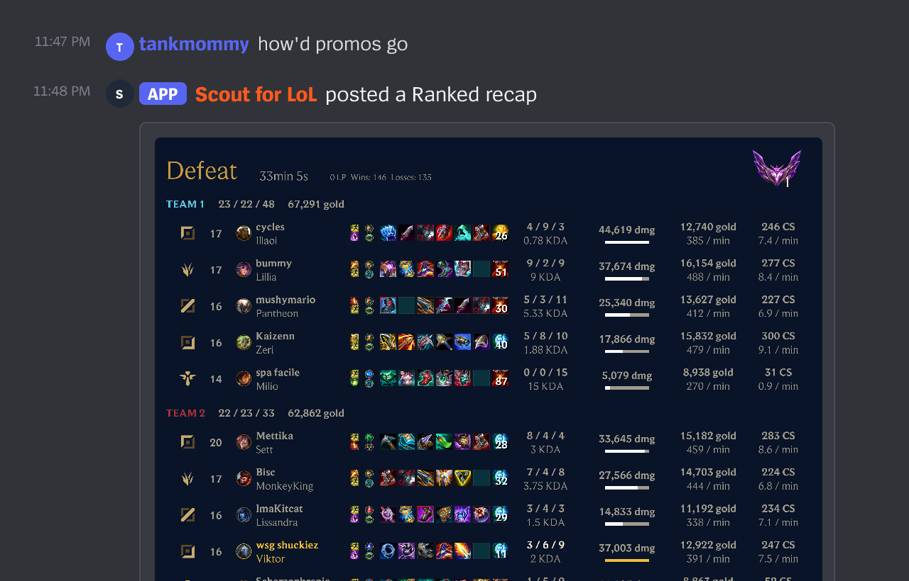
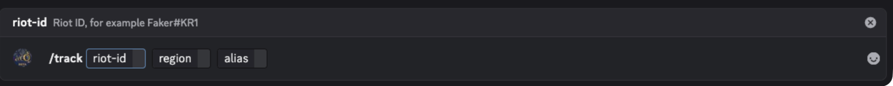
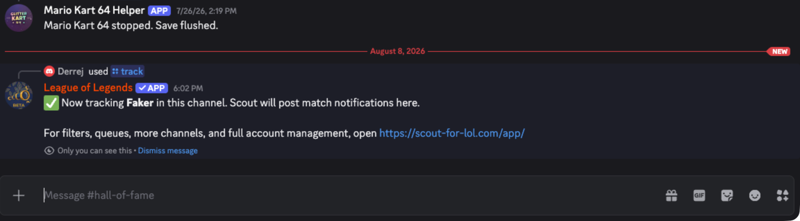
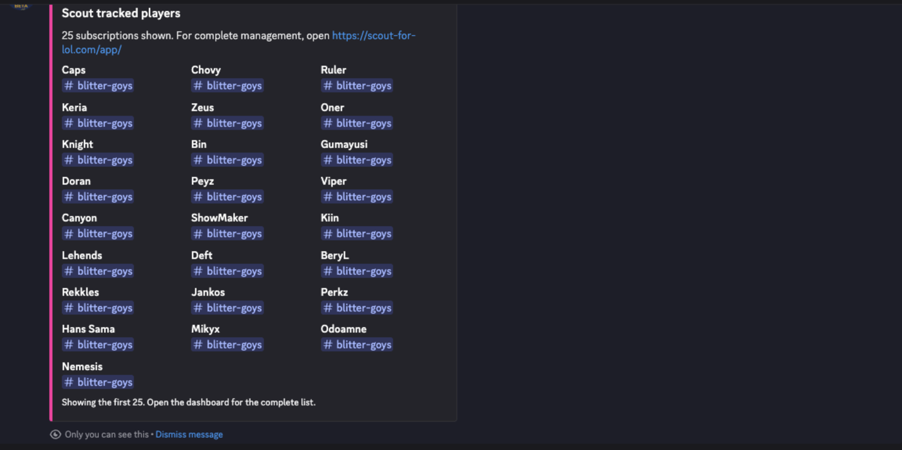

In this tutorial you will add Scout to a Discord server, track one League
player, and watch Scout post a card when that player enters a game and a full
recap when the game ends. Along the way you will meet the three things Scout is
built around — a **player**, a **Riot account**, and a **subscription** — and
you will use both the Discord command surface and the web dashboard.

This takes about ten minutes of setup, plus one game of League.

## What you will end up with

When the tracked player finishes a game, this arrives in your channel:



## 1. Add Scout to your server

You need the **Administrator** permission in the Discord server you are setting
up. Scout gates both `/track` and per-guild dashboard access on it, so Manage
Server alone is not enough to finish this tutorial.

1. Open the [Scout dashboard](/app/).
2. Choose **Sign in with Discord** and approve the sign-in.
3. Choose **Add Scout to a server**.
4. Pick your server, review the permissions, and approve.

Discord returns you to the dashboard. Your server now appears in the picker.

## 2. Pick the channel that will receive notifications

Decide now which channel the match posts should land in. Create one if you want
to keep them out of general chat — `#scout` works well.

Scout needs to be able to **View Channel**, **Send Messages**, **Embed Links**,
and **Attach Files** there. Recap images are uploaded as attachments, so without
Attach Files the recap cannot post.

## 3. Track a player

Go to that channel in Discord and run:

```text
/track riot-id: Faker#KR1 region: KOREA alias: Faker
```

All three options are required:

- `riot-id` is the full Riot ID including the tag, in `name#TAG` form.
- `region` is picked from Discord's dropdown.
- `alias` is the short name Scout will use for this player everywhere.



Scout replies — only to you — with:



Use a player who is actually going to play in the next little while. If that is
you, track your own Riot ID instead of the example.

## 4. Confirm the subscription exists

Still in Discord, run:

```text
/list
```

Scout replies with an embed titled **Scout tracked players** containing the
alias you just used and the channel it posts to. That embed is your
confirmation that the subscription is live.



## 5. Look at the same subscription in the dashboard

Return to the [Scout dashboard](/app/), choose your server, and open the
**Subscriptions** tab.

The row you created with `/track` is here too — same alias, same channel. The
Discord command and the dashboard are two views of one subscription; nothing you
did in chat is stored separately.

Open the **Players** tab. The alias appears as a player, with the Riot account
you entered attached to it. This is the split worth remembering:

- the **player** is the alias your server knows,
- the **Riot account** is one League account belonging to that player,
- the **subscription** is a decision to post that player's matches into one
  channel.

## 6. Wait for a game

Now have the tracked player start a game.

Within about thirty seconds of the game starting, Scout posts a pre-match card
to your channel showing the lobby — who is playing what, and the tracked
player's current rank:


When the game finishes, Scout picks it up within about a minute and posts the
recap image you saw at the top of this tutorial — the full scoreboard for both
teams with items, KDA, damage, gold, and CS.

## 7. Confirm it in the audit log

Back in the dashboard, open the **Audit** tab.

Your `/track` call is recorded there with who ran it and when. Every change to
players, subscriptions, competitions, reports, and access is written here, which
is what makes it safe to hand configuration to more than one person.

## What you did

You installed Scout, created a player, a Riot account, and a subscription with
one command, found the same objects in the dashboard, and received both
notification types Scout sends.

From here:

- Track more players, or add more accounts to the player you created, with
  [Add and organize tracked players](/docs/how-to/add-players/).
- Send different queues to different channels with [Route notifications to the
  right channels](/docs/how-to/route-notifications/).
- Learn what Scout was doing while you waited in [How Scout finds and reports
  matches](/docs/explanation/how-scout-works/).
