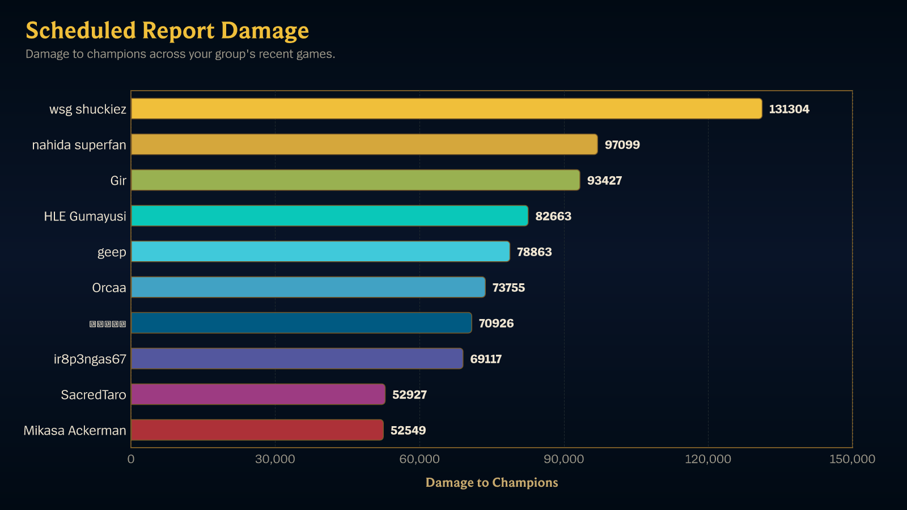
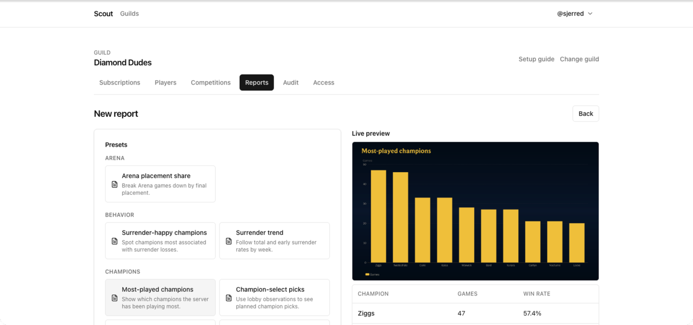
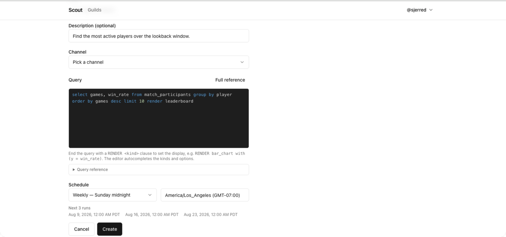

In this tutorial you will write a query in **ScoutQL** — Scout's report query
language — preview it against your server's real match history, turn it into a
chart, and schedule it to post itself to a channel every week. You will meet
`SELECT`, `FROM`, `WHERE`, `GROUP BY`, `ORDER BY`, and `RENDER`.

You need at least one tracked player who has played recently. The queries below
look at the last 30 days, so a server that has just been set up will return
empty rows.

## What you will end up with

A chart that posts itself on a schedule:



## 1. Open the report editor

Go to the [Scout dashboard](/app/), choose your server, open the **Reports**
tab, and choose **New report**.

## 2. Start from a preset

The editor opens with a categorized preset list on the left and a **Live
preview** on the right. Under **Leaderboards**, choose **Most games played**. It
loads this query into the editor:

```scoutql
SELECT COUNT(*) AS games, AVG(win::INT) AS win_rate
FROM match_participants
WHERE game_creation_at >= CURRENT_TIMESTAMP - INTERVAL 30 DAY
GROUP BY player
ORDER BY games DESC
LIMIT 10
RENDER leaderboard
```

Read it once before changing anything:

- `SELECT COUNT(*) AS games, AVG(win::INT) AS win_rate` — the two numbers you
  want per row, each named. `COUNT(*)` counts matches;
  `AVG(win::INT)` averages a win/loss flag, which is a win rate.
- `FROM match_participants` — one row per tracked player per match.
- `WHERE game_creation_at >= CURRENT_TIMESTAMP - INTERVAL 30 DAY` — the last
  30 days. This is an ordinary condition, not a special clause.
- `GROUP BY player` — collapse those rows to one per player.
- `ORDER BY games DESC` — most active first.
- `LIMIT 10` — at most ten rows.
- `RENDER leaderboard` — display it as a ranked list.

The `::INT` in `AVG(win::INT)` is not decoration. `win` is true or false, and
an average of a true/false value is undefined until it is a number — so the
cast is what turns "did they win?" into "how often do they win?".

## 3. Watch the preview

You do not have to run anything. **Live preview** re-runs the query against
your server's match history as you edit and shows the rows it would post, along
with how many were returned and how many were scanned.



This is real data, not a sample — if a player is missing, they have not played
in the window.

## 4. Change what it measures

Replace the two outputs with total damage dealt to champions:

```scoutql
SELECT SUM(total_damage_dealt_to_champions) AS damage
FROM match_participants
WHERE game_creation_at >= CURRENT_TIMESTAMP - INTERVAL 30 DAY
GROUP BY player
ORDER BY damage DESC
LIMIT 10
RENDER leaderboard
```

The preview re-ranks by total damage within a second or so.

Note that the aggregate is written out. There is no shorthand where a bare
column silently becomes a sum — `SUM`, `AVG`, `COUNT`, `MEDIAN` and the rest
are always explicit, so a report never quietly measures something other than
what it says. Every column you can name is in the [source and column
reference](/docs/reference/scoutql-sources/), and everything you can compute
from one is in the [function reference](/docs/reference/scoutql-functions/).

## 5. Turn it into a chart

Change the last line to render a bar chart, and tell it which output to plot:

```scoutql
SELECT SUM(total_damage_dealt_to_champions) AS damage
FROM match_participants
WHERE game_creation_at >= CURRENT_TIMESTAMP - INTERVAL 30 DAY
GROUP BY player
ORDER BY damage DESC
LIMIT 10
RENDER bar_chart WITH (y = damage, orientation = horizontal)
```

The preview now renders the actual chart image Scout will post, with the data
table underneath it. `RENDER` picks the display kind; `WITH (...)` configures
it. `y = damage` works because `damage` is the name you gave the output — a
name the `SELECT` does not produce is rejected rather than plotted as nothing.

Switching presets is the fastest way to see what the other kinds look like —
the preview re-renders each one against your own data:


## 6. Give it a title and a destination

Above the editor, fill in:

- **Title** — `Weekly damage leaders`.
- **Channel** — the channel the report should post to.

## 7. Schedule it

Under **Schedule**, choose the preset **Weekly — Monday midnight**, and check
that the timezone next to it is the one you want. It defaults to your browser's
timezone, and **Next 3 runs** underneath shows exactly when the report will
fire.



## 8. Save it

Choose **Create**. The report appears in the list with its schedule and next run
time.

## 9. Run it once without waiting

Open the report and choose **Run now**.

Scout executes the query and posts the chart to the channel you picked, exactly
as the schedule will. The run is recorded in the report's history with its
status, duration, and row count — and a manual run does not disturb the
schedule.

## What you did

You wrote a ScoutQL query, previewed it against real match data, changed what
it measured, rendered it as a chart, and put it on a weekly schedule.

From here:

- Learn the whole language in the [ScoutQL reference](/docs/reference/scoutql/).
- Work from the [recipe list](/docs/how-to/scoutql-recipes/) — win rates,
  percentiles, trends, histograms.
- See every display kind in [Render kinds and
  options](/docs/reference/scoutql-render/).
- Chart two dimensions at once with [Turn a report into a
  chart](/docs/how-to/chart-reports/).
