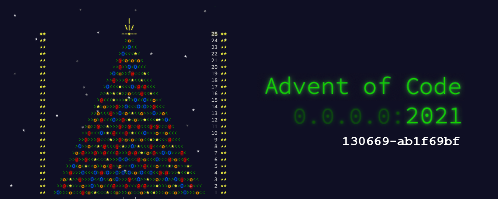

# Advent of Code 2021

My solutions to Advent of Code 2021 written in Haskell.

## Progress

|                     Day                      | Part 1 | Part 2 |
| :------------------------------------------: | :----: | :----: |
| [Day 1](https://adventofcode.com/2021/day/1) |   ⭐   |   ⭐   |
| [Day 2](https://adventofcode.com/2021/day/2) |   ⭐   |   ⭐   |
| [Day 3](https://adventofcode.com/2021/day/3) |   ⭐   |   ⭐   |
| [Day 4](https://adventofcode.com/2021/day/4) |   ⭐   |   ⭐   |
| [Day 5](https://adventofcode.com/2021/day/5) |   ⭐   |   ⭐   |
| [Day 6](https://adventofcode.com/2021/day/6) |   ⭐   |   ⭐   |
| [Day 7](https://adventofcode.com/2021/day/7) |   ⭐   |   ⭐   |
